> 覆盖：Huginn、Ouro、Mixture-of-Recursions、LoopUS、LOTUS、LoopRPT、LoopFormer、Loop the Loopies!
> 版本核对日期：2026-08-04（Asia/Shanghai）
> 阅读原则：数值优先取论文表格；architecture、data recipe、post-training 与 compute budget 分开归因；单篇完整公式、图表、claim–evidence map 与复现建议见各自链接。

## 0. 一份真正有用的 Looped Transformer 汇总应回答什么

只写“共享参数、重复多次、效果更好”是不够的。对每项工作至少要回答十个问题：

1. **它解决什么问题？** 是减少 stored parameters、增加 test-time compute、改造 pretrained LLM，还是监督 latent reasoning？
2. **loop 的对象是什么？** 单层、连续层组、完整 model stack、latent positions，还是 token-dependent 路由？
3. **state 怎样更新？** 原输入是否每轮重新注入，是否有 step embedding、gate、damping、noise 或 time conditioning？
4. **训练和推理是否执行同一种 loop？** 训练深度是否随机，推理能否超出训练深度，是否有 early exit？
5. **梯度怎样穿过 loop？** full BPTT、truncated BPTT、random deep supervision、stop-gradient self-distillation，还是 step-wise RL？
6. **KV cache 怎样维护？** 每轮独立 cache、只缓存活跃 token、共享 K/V，还是只在 reference 实现中选择早期 logits但没有少算？
7. **training recipe 是什么？** 起始 checkpoint、data、tokens、seqlen、optimizer、learning rate schedule、depth curriculum、SFT/RL stage 都要分开。
8. **比较到底 match 了什么？** parameters、tokens、seen tokens、block calls、analytical FLOPs、GPU-hours、optimizer-step wall-clock 或 inference latency不能混称“相同计算”。
9. **性能证据有多强？** 要保留 exact numbers、negative results、ablation、seed/variance、task/scale boundary 和 retained capabilities。
10. **它留下什么可迁移的 insight？** 应区分论文报告、机制复原、综合判断和待验证假设。

后文就按这十个问题组织，而不是按论文发布时间逐篇复述。

## 1. 先给结论：这八项工作共同说明了什么

### 1.1 Paper 时间表

“arXiv v1”是 arXiv 首次提交日期；“分析版本日期”用于复核本文引用的公式和数字。它们都不同于项目页或模型 checkpoint 的发布时间，也不保证是所有渠道中的最早公开时间。例如 MoR 的 [workshop OpenReview](https://openreview.net/forum?id=YtQtGsNr64) 和 LoopFormer 的 [ICLR OpenReview](https://openreview.net/forum?id=RzYXb5YWBs) 都早于各自的 arXiv v1。

| 工作 | 论文与分析版本 | arXiv v1 | 分析版本日期 | 状态 | 在综述中的角色 |
|---|---|---:|---:|---|---|
| Huginn | *Scaling up Test-Time Compute with Latent Reasoning*, v2 | 2025-02-07 | 2025-02-17 | arXiv preprint | recurrent-core pretraining |
| Mixture-of-Recursions | *Learning Dynamic Recursive Depths for Adaptive Token-Level Computation*, v3 | 2025-07-14 | 2025-10-25 | NeurIPS 2025 | token-level dynamic depth |
| Ouro | *Scaling Latent Reasoning via Looped Language Models*, v5 | 2025-10-29 | 2026-07-01 | arXiv preprint | multi-trillion-token model-loop |
| LoopFormer | *Elastic-Depth Looped Transformers for Latent Reasoning via Shortcut Modulation*, v1 | 2026-02-11 | 2026-02-11 | ICLR 2026 | elastic-depth trajectory |
| LoopRPT | *Reinforcement Pre-Training for Looped Language Models*, v1 | 2026-03-20 | 2026-03-20 | arXiv preprint | latent-step reinforcement |
| LoopUS | *Recasting Pretrained LLMs into Looped Latent Refinement Models*, v1 | 2026-05-10 | 2026-05-10 | arXiv preprint | pretrained-model retrofit |
| LOTUS | *Bridging the Gap Between Latent and Explicit Reasoning with Looped Transformers*, v2 | 2026-06-30 | 2026-07-13 | arXiv preprint | parallel latent CoT supervision |
| Loop the Loopies! | *Loop the Loopies!*, v2 | 2026-07-17 | 2026-07-20 | arXiv preprint | layer-loop MoE/system co-design |

### 1.2 Looped Transformer 不是一种结构，而是一组 design axes

“Looped Transformer”至少覆盖六种不同计算图：

```text
core-loop          P → R → R → ... → R → C                 Huginn
model-loop         F → F → ... → F                          Ouro
layer-loop         F1 → F1 → F2 → F2 → ...                  Loopie
token-routed loop  每轮只更新被 router 选中的 token          MoR
retrofit loop      pretrained E → M → ... → M → D           LoopUS
latent workspace   K×c 个 latent positions 并行做 R 轮更新   LOTUS
```

LoopRPT、LoopFormer 主要改变的分别是 **latent-step reward** 与 **trajectory training**，不是再发明一种同层级的 loop 拓扑。

### 1.3 当前最强的结论不是“loop 全面击败 vanilla”

- **Huginn** 证明 3.5B/约 800B-token 的 recurrent-depth LM 可以稳定训练，并在部分任务上随 inference recurrence 改善。
- **Ouro** 把 full-stack loop 扩到 1.4B/2.6B、7.7T tokens，给出目前较强的通用 base/Thinking checkpoint；但 data recipe、SFT 和 architecture 贡献没有完全拆开。
- **Loopie** 在特定 Megatron/hardware stack 上，用 layer-loop 带来的 memory headroom 提升 microbatch，再以实测 optimizer-step wall-clock 做匹配，给出最强的 system co-design 证据。
- **MoR** 的 1.7B appendix 同时包含正面与负面结果：动态 token depth 能形成一些更好的 Pareto 点，但在一套 68.5e18 FLOPs 对照中 vanilla 平均准确率仍更高。
- **LoopFormer** 让多个 compute budgets 都可用，却在当前 1B/25B-token 规模仍略逊于相同执行深度的 non-looped Transformer。

所以最准确的领域结论是：**recurrent depth 已证明可训练、可扩展、可被监督和动态分配；但尚未在统一 data、training FLOPs、wall-clock、post-training 和 serving protocol 下证明普遍优于 vanilla LLM。**

### 1.4 “多做 loop”通常不是单调收益

Huginn 在不同任务上饱和位置不同；Ouro 在训练主要覆盖 $T=4$ 后，推到 $T=6$–$8$ 常退化；LOTUS 的 $R=6$ 模型在 $R=7$ 略降；LoopRPT 的 forced-deeper curve 也不总单调。真正需要学习的不是无限循环，而是：

$$
\text{state update quality}
+\text{depth robustness}
+\text{halting policy}
+\text{runtime scheduler}.
$$

### 1.5 参数效率、计算效率和系统效率是三件事

- 参数共享几乎必然减少 **stored parameters**；
- 多执行一轮几乎必然增加 **block calls 与串行 latency**；
- 是否降低训练或推理 **wall-clock**，取决于 memory、batch size、kernel、parallelism、cache 和调度。

Loopie 的价值正在于它没有把这三件事混在一起：它承认 nominal work 更多，论证的是在其测量栈上 realized step time 可匹配。MoR、Ouro 的动态 depth 若没有 ragged/continuous batching 与 cache-aware kernel，也可能只降低平均理论 FLOPs而不降低真实 latency。

## 2. 统一符号与 loop taxonomy

| 符号 | 含义 | 需要报告的单位/shape |
|---|---|---|
| $L_s$ | stored/physical Transformer depth | 保存的不同 block 数 |
| $R$ 或 $T$ | recurrent visits / loop count | 每个 token、sequence 或 batch 的执行轮数 |
| $L_e$ | effective/unrolled depth | 实际 block calls；不能当 stored depth |
| $h^{(t)}$ | 第 $t$ 轮后的 latent state | 通常为 $B\times S\times d$ |
| $F_\theta$ | 跨轮共享参数的 update | layer、block group 或 full stack |
| $e$ | 每轮可能重新注入的输入表示 | $B\times S\times d$ |
| $g_t$ | halting/router/gate 输出 | scalar、token-wise 或 token-channel-wise |
| $C_{\rm KV}$ | KV cache | 必须说明是否按 layer、loop、token 分开 |

统一状态更新可写成：

$$
h^{(t+1)}=U_{\theta}
\left(h^{(t)},e,t,\Delta t,g_t\right).
$$

不同论文选择了不同的 $U_\theta$、共享范围和 supervision。它们之间很多关系只是**同一框架下的不同实例**，不是数学等价。

### 2.1 结构和 runtime 语义总表

| 工作 | arXiv v1 | loop 单元 | loop 粒度 | 原输入/时间信号 | 读出与停止 | KV/runtime 关键点 |
|---|---:|---|---|---|---|---|
| Huginn | 2025-02-07 | 4-layer recurrent core | sequence 的完整 hidden state | 每轮 input injection；随机初始 state | coda 最终读出；论文另测 zero-shot exit | 每个 recurrence 有完整 causal attention；深度增加仍串行 |
| MoR | 2025-07-14 | 共享 recursion block | token-wise | router score | expert-choice 或 token-choice routing | recursion-wise selective cache 或 first-recursion KV sharing |
| Ouro | 2025-10-29 | 完整 $N$-layer stack | 数学上 token-wise gate，默认实现通常 dense full-loop | 每轮处理 hidden state；每步有 LM/exit head | Q-exit；默认 checkpoint/reference 路径常先算完再选择 | 默认按 loop×layer 分 cache；last-step reuse 是额外近似优化 |
| LoopFormer | 2026-02-11 | $k$ 个 shared blocks | 用户指定全局 budget | normalized time $t$ + step size $\Delta t$ | 无 learned early exit | elastic depth，不等于 adaptive per-token serving |
| LoopRPT | 2026-03-20 | 继承 Ouro | token-level latent step | Gaussian latent rollout、EMA reference | policy 采样 exit step | 训练 exit 与 representation；未给 production scheduler |
| LoopUS | 2026-05-10 | pretrained model 的 middle block | sequence/batch loop；gate 是 token×channel | selective damping | confidence head，最大 8、阈值 0.6 | gate 不省当前轮 FLOPs；batch 同步停止使 saving 打折 |
| LOTUS | 2026-06-30 | padded latent positions 上的 looped backbone | $Kc$ 个 latent positions 并行，整体做 $R$ 轮 | latent block/position identity | loop 后 readout，再生成 answer | 用固定并行 workspace 替代长 CoT 的逐 token decode |
| Loopie | 2026-07-17 | 每个物理 layer 相邻重复 2 次 | layer-local、全 batch固定 | 无 learned halting | 固定 $R=2$ | 主要收益来自 checkpointing/microbatch/parallelism，不是 decode early exit |

## 3. Training recipe 横向对照

### 3.1 从头 pretraining 的四条路线

| 工作 | 规模与起点 | data / tokens | seqlen 与 depth | objective / gradient | optimizer 与系统 | 后续训练 |
|---|---|---|---|---|---|---|
| Huginn | 3.5B，从头训练 | broad public mixture；约 800B，实际 run 约 795B | 4096；平均 recurrence 32，训练时随机采样 | next-token loss；只对最后 8 个 recurrent steps 反传 | Adam variant，warmup 4096 steps 后 constant LR；512 Frontier nodes/4096 MI250X logical GPUs | 无完整常规 SFT/DPO/RLVR |
| Ouro | 1.4B/2.6B，从头；2.6B 在 24→48 层 duplication 后继续训练 | 累计 7.7T，多阶段 broad、CT annealing、LongCT、mid-training | 4K→16K→64K→32K；Stage 1a 8 loops，后降为 4 | 每步 LM + entropy/KL depth objective；另训练 exit gate | AdamW，$\beta=(0.9,0.95)$、wd 0.1、clip 1；各阶段降低 LR | 8.3M-example SFT，2 epochs；有 Ouro-Thinking |
| MoR | 135M–1.7B，从头 | FineWeb-Edu corpus 共约 220B；各 run 实际约 0.5–76.2B，1.7B Table 7 为 18–30B（headline expert-MoR 为 26–27B） | context 2K；$N_r=2$–$4$ | LM loss + router/load-balancing 相关目标 | H100/A100；isoFLOP 与 throughput study | 无现代 SFT/DPO/RLVR |
| Loopie | 6B-A0.6B、20B-A2B MoE，从头 | 文中给 3T+1.26T，但细项又给 2.28T+1.263T≈3.54T，存在内部 token accounting 矛盾 | seqlen 8192；每层固定 loop 2 次 | standard causal LM + MoE auxiliary loss | AdamW，warmup-stable-only；以 Megatron optimizer-step wall-clock选架构 | 约 2T target-only SPT，随后 math/code RL |

这里最值得比较的是四种稳定策略：

- Huginn：**random depth + input injection + random state + truncated BPTT**；
- Ouro：**先探索 8 loops，因不稳定改为 4 loops + staged LR/seqlen/data curriculum**；
- MoR：**router 与 selective KV cache 共同决定 token 是否继续**；
- Loopie：**固定两次 layer-loop，把主要创新放到 architecture–system co-design**。

### 3.2 结构改造与 latent/post-training 的四条路线

| 工作 | starting checkpoint | 训练数据与预算 | 核心 supervision | gradient/trajectory 处理 | 最终能力目标 |
|---|---|---|---|---|---|
| LoopUS | Qwen3 1.7B/4B/8B、Phi-4 14B、TinyLlama 等 | FineWeb-Edu 3B tokens，seqlen 1024 | sampled-depth next-token loss + monotonicity regularizer + confidence loss | 最大 20 loops，每 batch只监督 5 个；其余 no-grad/detach | 用较小 continued-LM budget形成可 early-exit latent refinement |
| LOTUS | Llama-3.2-3B-Instruct 等 explicit-CoT checkpoint | GSM8K-Aug 约 385K，30 epochs | post-loop latent positions 直接预测 gold CoT tokens + answer loss | $K=6,c=25,R=6$；从 explicit CoT逐步替换为 latent blocks | 把 sequential visible CoT 压进并行 latent workspace |
| LoopRPT | Ouro-1.4B/2.6B | OMNI-MATH 共 4,428：4,228 train / 200 validation；3 epochs，8×A100，约 2–4 小时 | latent-step reward、policy gradient、representation loss、entropy/KL | EMA teacher + hard-token selection + 8 noisy rollouts | 改善早期 latent state并学更早退出 |
| LoopFormer | 约 1B NanoGPT-style，从头训练 | 25B-token dedup Pile，seqlen 1024 | full-route CE + shortcut CE + endpoint consistency | 同 batch跑 full 和 random-shortcut trajectory，teacher route stop-gradient | 单 checkpoint 支持多个用户指定 global budgets |

这四项形成一个清楚的 supervision spectrum：

```text
final-token LM
  → sampled intermediate LM                     LoopUS
  → gold reasoning-step readout                  LOTUS
  → latent-step reward / exit policy              LoopRPT
  → cross-budget trajectory consistency           LoopFormer
```

## 4. 性能：哪些数字值得记，哪些比较不能做

### 4.1 核心结果表

| 工作 | 最能代表论文的结果 | 该结果真正支持什么 | 最重要的 confound / negative evidence |
|---|---|---|---|
| Huginn | $r=32$：ARC-C 38.23、HellaSwag 65.21、MMLU 31.38、GSM8K CoT strict/flexible 34.80/42.08；HumanEval 23.17 | 同一 recurrent checkpoint 的任务性能可随 latent depth 增长 | 3.5B/800B 仍弱于训练更充分的现代 LLM；任务会饱和；训练与推理 FLOPs很高 |
| Ouro | 1.4B $T=4$：MMLU 67.35、BBH 71.02、GSM8K 78.92、MATH-500 82.40；2.6B：MMLU 74.60、BBH 80.46、MATH-500 90.85 | multi-trillion-token full-stack loop可得到强 stored-parameter efficiency | 外部模型 data/tokens 不同；论文 Table 7/10 的 1.4B、$T=4$ MMLU 分别为 67.35/67.45，Table 10 depth sweep 到 $T=8$ 降为 64.49；2.6B Thinking 的更深 extrapolation 可大幅退化 |
| MoR | 68.5e18 FLOPs、1.7B配置：vanilla Avg 48.9，MoR $R=2$ 48.4，$R=3$ 46.7；另一低预算表 40.54 vs 40.97 | dynamic token depth在部分 budget allocation 上形成 Pareto点 | 强规模配置并未稳定胜 vanilla；较优低预算点多看约 35% tokens；throughput 假设不等于端到端 serving |
| Loopie | 20B-A2B 在相同测量栈/近似 step time、800B-token head-to-head 中约 600B 后超过 30B-A3B；四档 scaling ladder均领先 | layer-loop + memory/microbatch co-design 可改善 realized training budget利用 | 不是 analytical-FLOP matched；论文未报告多 seed、方差或误差条；最终 Thinking 分数混入 3.5T pretraining、2T SPT、RL 与 decoding |
| LoopUS | 七项平均：Qwen3 1.7B +1.6、4B +1.8、8B +2.2、Phi-4 14B +1.7；adaptive 平均 3.39/8 loops | 3B-token adaptation可让多类 pretrained backbone形成可用 loops | Qwen3-8B MMLU 72.8→71.5、HellaSwag 57.2→56.0；真实 batched latency未充分建立 |
| LOTUS | Llama-3.2-3B：GSM8K $70.0\pm0.9$ vs explicit CoT 71.5；OOD math 63.9 vs 62.1；thought latency 133.0 vs 338.8 ms | gold-CoT direct supervision可让并行 latent workspace接近 explicit CoT，并减少逐 token thought latency | math domain、gold trace、fixed workspace；$R=7$ 从 $R=6$ 的 70.0 降到 69.3；readout不等于 faithful CoT |
| LoopRPT | Ouro-2.6B hard tokens：peak 34.52→38.10，adaptive 34.35→37.24，avg step 3.51→2.28；GSM8K 81.76→85.36 | reward placement可同时改善早期 state质量与退出效率 | 总数据只有 4,428 条（实际训练 4,228）；next-token reward不等于最终 proof正确；无官方 code/model |
| LoopFormer | $(3\otimes8)$：Pile PPL 10.28、Avg 44.81，优于其他 looped baseline但弱于 non-loop 9.49/45.27；FLOP-matched 时 Avg 44.21 | shortcut consistency让不同 budgets下的 trajectory更稳 | 训练约 1.5× FLOPs、1.3× wall-clock；global budget不是 learned adaptive exit |

### 4.2 不应直接放在同一 leaderboard 的结果

以下比较会混淆结论：

- Ouro Base vs Loopie Thinking：后者有 2T SPT + RL，stage 不同；
- Huginn 3.5B/800B vs Ouro 2.6B/7.7T：training tokens 和 data recipe相差近一个数量级；
- LOTUS thought latency vs MoR throughput：一个是 batch size 1 的 latent-CoT compression，一个是动态 token routing serving；
- 任何 “same parameters” 结果直接解释成 “same cost”：共享参数模型通常执行更多 block calls。

## 5. 八篇逐项结论

### 5.1 Huginn：从 pretraining 起学会 recurrent core

完整解析：[Huginn：用 recurrent depth 扩展 latent test-time compute](/topics/looped-transformer/huginn-recurrent-depth/)；论文版本：[arXiv v2](https://arxiv.org/abs/2502.05171v2)。

**模型结构图（分析者复原）**

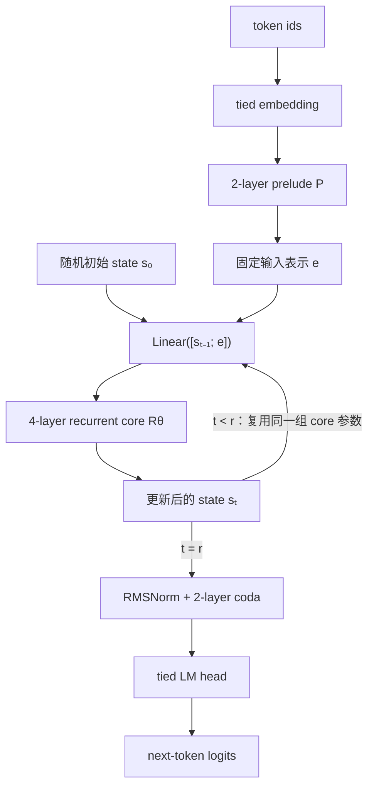

这张图最关键的不是“有一条回边”，而是两条输入同时进入每轮 core：不断变化的 $s_{t-1}$ 和始终不变的 $e$。共享的是 4 个 core layers 在不同 recurrence 的参数；core 内第 1–4 层彼此仍是不同参数。

**训练 recipe 示意图（分析者复原）**

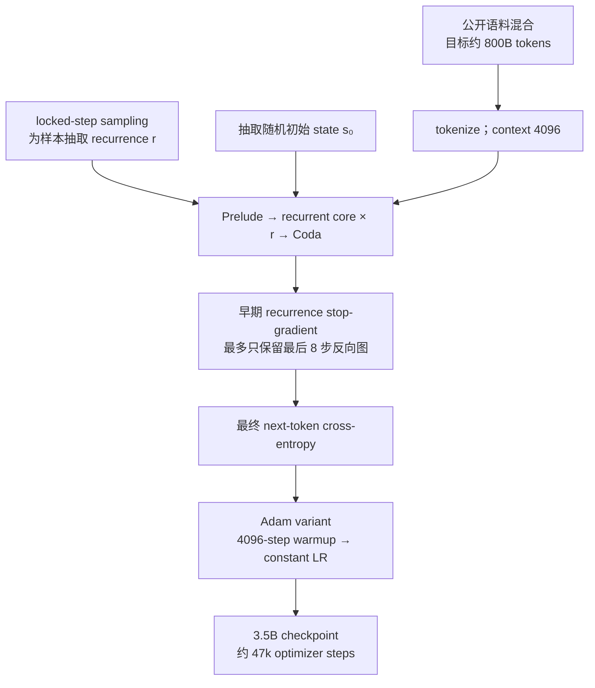

**Loss 怎样计算**

Huginn 没有单独的 halting loss 或中间步监督。对一个 token sequence \(x\) 先抽 recurrence 数 \(r\sim\Lambda\)，只把第 \(r\) 轮后的 state 送过 coda 和 LM head；论文把目标写成（§3.3）：

$$
\mathcal L(\theta)
=\mathbb E_{x\sim\mathcal X}\mathbb E_{r\sim\Lambda}
\left[L\!\left(m_\theta(x,r),x'\right)\right],
$$

其中 \(x'\) 是右移一位的 next-token target。把论文略写的 \(L\) 展开，就是对有效 token 位置做标准 causal cross-entropy：

$$
\mathcal L_{\mathrm{NTP}}(x,r)
=-\frac{1}{|\mathcal M|}
\sum_{i\in\mathcal M}\log p_\theta(x_{i+1}\mid x_{\le i};r).
$$

因此随机 \(r\) 不是额外 loss 项，而是对“有效计算深度”取期望。监督只施加在最终 logits；较早 recurrence 只能经最终 state 间接获得 credit。实现上最多保留最后 8 次 recurrence 的反向图，所以更早 state 会 stop-gradient；但固定输入表示 \(e=P(x)\) 每轮重新注入，prelude 仍可从最后 8 步的所有注入路径收到梯度。

- **具体结构：** 2-layer prelude + 4-layer recurrent core + 2-layer coda，hidden size 5280；只有 core 的对应层跨 recurrence共享。
- **怎样 loop：** $e=P(x)$，随机 $s_0$；每轮把 $e$ 与 $s_{t-1}$ 经过 learned adapter后送入同一 4-layer core；$r=32$ 时有效 block depth为 $2+4\times32+2=132$。
- **training recipe：** 随机 depth、locked-step sampling、input injection、random initial state、只回传最后 8 steps；warmup后 constant LR；4096 MI250X logical GPUs。
- **性能含义：** 它最强的证据是同 checkpoint 的 depth sweep 与 180B-token fixed-depth control，而不是和不同 data recipe 的外部模型横比。
- **核心 insight：** recurrent block必须从训练开始就面对不同 state/depth distribution；把普通 Transformer block在 inference随意重复并不会自动得到 latent reasoning。
- **主要边界：** base LM proof of concept，没有完整 instruction/post-training；更多 recurrence依然支付高串行计算。

进一步看，Huginn 是八篇里最接近“原生 recurrent pretraining”的干净案例：

- **结构细节：** 主模型 hidden size 5280，共 8 个 stored blocks；默认 $r=32$ 时执行深度是 $2+4r+2=132$ 个 block calls。core 使用 dense causal attention，不是只更新某些 token 的稀疏循环。
- **优化机制：** random depth 扩大 state/depth 的训练分布；random state 防止模型依赖固定初始化；每轮 input injection 减轻长期 state 必须无损记住输入的压力；truncated BPTT 则把可训练性换成不完整的长程 credit assignment。
- **推理语义：** coda 默认只读取最终 state；论文的 zero-shot exit 研究说明不同任务有不同最佳深度，但 checkpoint 没有像 Ouro/LoopUS 那样提供成熟的 learned halting policy。
- **证据强度：** 180B-token controlled experiment 中，recurrent 对 fixed-depth baseline 的 ARC-C、HellaSwag、GSM8K strict/flexible 分别高 2.22、11.46、7.20、8.04 points；这比跨 data recipe 的外部 leaderboard 更能支持 architecture claim。
- **复现重点：** 必须记录采样到的 $r$ 分布、每个 batch 的有效 block calls、最后 8 步的 detach 边界及 activation/gradient norm；只写“32 loops”无法复现训练动力学。

### 5.2 Ouro：把 full model stack 做成 7.7T-token LoopLM

完整解析：[Ouro：7.7T-token Looped LM 与 adaptive latent reasoning](/topics/looped-transformer/ouro-looped-language-models/)；论文版本：[arXiv v5](https://arxiv.org/abs/2510.25741v5)。

**模型结构图（分析者复原）**

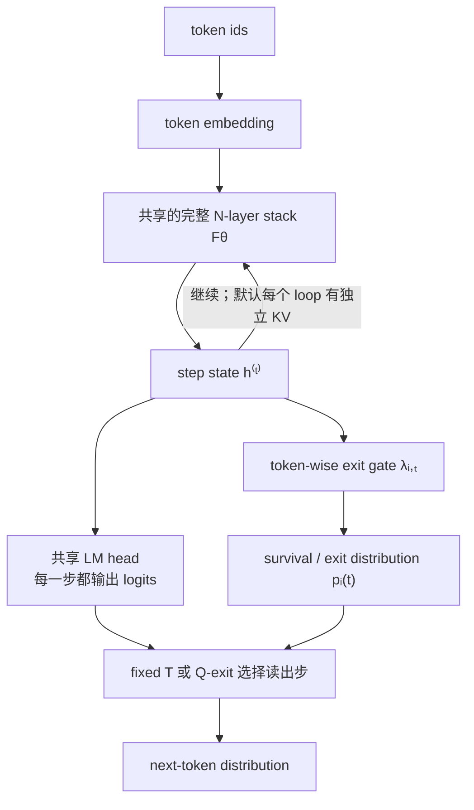

Ouro 的一次 loop 不是 1 个或 4 个 layers，而是完整的 24-layer 或 48-layer stack。因而 1.4B、$T=4$ 对应 96 次 block calls，2.6B、$T=4$ 对应 192 次；stored parameter efficiency 与串行执行成本必须分开讨论。

**训练 recipe 示意图（分析者复原）**

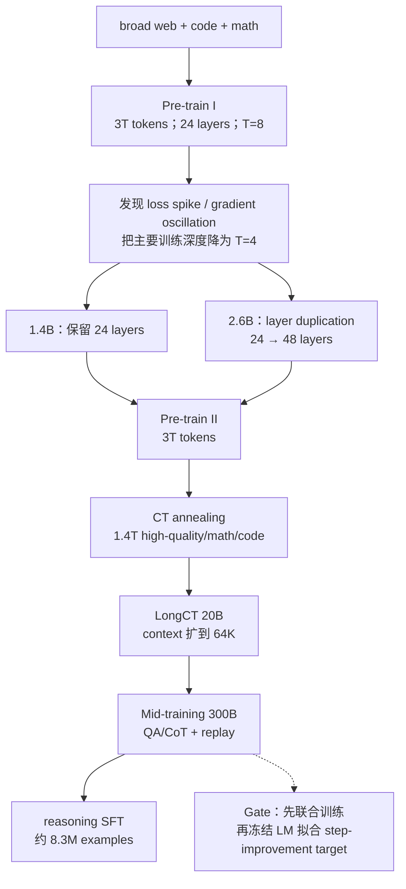

**Loss 怎样计算**

Ouro 的关键区别是每个 recurrent step 都接同一个 LM head。对位置 \(i\) 和步 \(t\)，先计算

$$
\mathcal L_i^{(t)}
=-\log p_\theta(x_{i+1}\mid x_{\le i},h_i^{(t)}).
$$

gate 给出“在本步退出”的条件概率 \(\lambda_{i,t}\)。令 survival probability 为 \(S_{i,t}=\prod_{j=1}^{t}(1-\lambda_{i,j})\)，则

$$
p_i(t)=\lambda_{i,t}S_{i,t-1},
$$

且最后一步吸收尚未退出的全部概率。联合训练最小化各深度 token loss 的期望，并加 entropy regularization（论文 Eq. 2–4）：

$$
\mathcal L_{\mathrm{adaptive}}
=\sum_i\sum_{t=1}^{T_{\max}}p_i(t)\mathcal L_i^{(t)}
-\beta\sum_i H\!\left(p_i\right).
$$

最小化其中的 \(-\beta H\) 会鼓励较高 entropy，避免 gate 一开始就全部塌到某一步。这个阶段语言模型和 gate 都收到梯度；比 Huginn 的“只监督最终步”更直接地要求早期 state 也能预测。

随后 Stage II 冻结语言模型，用 detached 的相邻步 CE 改善量构造 gate target：

$$
I_i^{(t)}=\max\!\left(0,
\mathcal L_{i,\mathrm{stop}}^{(t-1)}
-\mathcal L_{i,\mathrm{stop}}^{(t)}\right),\qquad
w_i^{(t)}=\sigma\!\left(50(I_i^{(t)}-0.005)\right).
$$

gate 再用 binary cross-entropy 拟合“继续计算”的 soft target \(w_i^{(t)}\)。此时 target 和 LM loss 都 stop-gradient，只有 gate 更新。reasoning SFT 本身仍是对回答 target tokens 的 causal CE；它与 gate 校准是两个不同阶段。

- **具体结构：** 1.4B 使用 24-layer stack，2.6B upcycle到 48 layers；完整 stack跨最多 4 个主要 recurrent steps共享。
- **怎样 loop：** 每个 step都产生 next-token logits和 exit probability；survival/exit distribution把各 step loss组合为 expected objective。
- **training recipe：** 早期尝试 8 loops发生不稳定，后续降为 4；4K pretraining → 16K CT annealing → 64K LongCT → 32K mid-training；再做 8.3M examples SFT。
- **性能含义：** 1.4B/2.6B 对 stored parameter count很强，但 7.7T data与 reasoning-heavy SFT本身就是主要能力来源之一。
- **核心 insight：** adaptive depth不是锦上添花；当 $T>4$ 退化时，知道何时停止是模型正确性的组成部分。
- **主要边界：** reference HF forward可先算完所有 loops再按 gate选择输出，因此“token-wise exit”在数学目标中存在，不等于默认部署已经少算。

进一步拆开看，Ouro 同时做了 architecture、optimization、data curriculum 和 post-training，因而结论必须分层归因：

- **结构细节：** 1.4B/2.6B hidden size 都是 2048，分别有 24/48 个 stored layers；每个 loop 后接同一 LM head 和 $2048\to1$ gate。2.6B 的 upcycling 是把部分 recurrent execution depth 展开成独立层，不是 MoE upcycling。
- **训练目标：** 每步都有 next-token loss；exit probabilities 把各步 loss 组合为期望目标，并用 entropy 避免 gate 立即塌缩。随后冻结语言模型，用相邻 step 的 detached loss improvement 构造“继续/退出”target，专门校准 gate。
- **cache 与部署：** 默认精确语义为每个 `loop × physical layer` 一套 KV。论文的 decode-only last-step reuse 可把 cache 近似降到 $1/4$，但 prefill 强行共享会显著掉分；公开 reference path 也没有完成真正的 token compaction。
- **性能与负面证据：** 论文 Table 7 给出 1.4B、$T=4$ 的 MMLU/BBH/GSM8K/MATH-500 为 67.35/71.02/78.92/82.40；Table 10 的独立 depth sweep 则给出 $T=4$ MMLU 67.45、$T=8$ 64.49。两个表的同配置数字有 0.10 point 差异，不能静默拼成同一行实验。2.6B-Thinking 的 AIME 2024 甚至从最佳区间约 70.33 降到 39.00。
- **最可靠结论：** 它证明 full-stack recurrence 能承受 multi-trillion-token staged training，并在训练覆盖的深度区间提供可分配 compute；它没有证明超过训练深度后仍可无限 scaling。
- **复现重点：** 应固定 $T=4$ 先复现 checkpoint，再分别扫 fixed $T$、Q-exit threshold、full-cache/last-step-cache，并把“选早期 logits”与“真实少算”作为两个实验。

### 5.3 Mixture-of-Recursions：让不同 token 使用不同 recurrent depth

完整解析：[Mixture-of-Recursions：token-level dynamic recurrent depth](/topics/looped-transformer/mixture-of-recursions/)；论文版本：[arXiv v3](https://arxiv.org/abs/2507.10524v3)。

**模型结构图（分析者复原）**

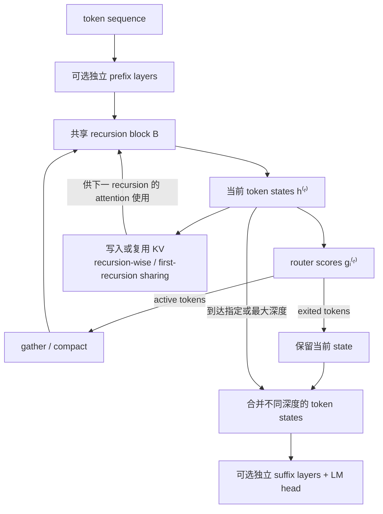

这里的动态性发生在 token 维：同一句话中不同位置可以经过不同次数的 shared block。router 决定计算路径，KV 策略决定未来 token 能看到什么；二者共同定义模型函数，不能把 cache 当成事后无损优化。

**训练 recipe 示意图（分析者复原）**

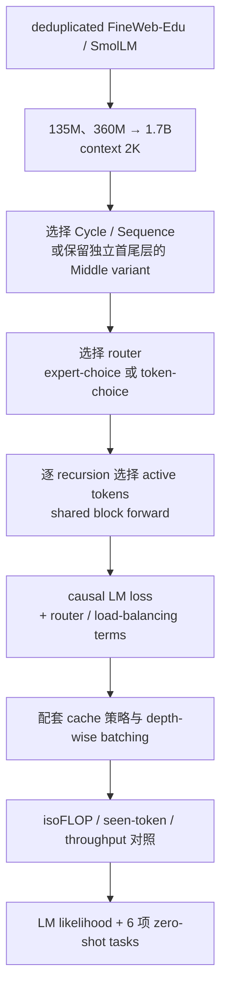

**Loss 怎样计算**

MoR 的主任务仍是标准 causal LM negative log-likelihood：

$$
\mathcal L_{\mathrm{LM}}
=-\frac{1}{|\mathcal M|}\sum_{t\in\mathcal M}
\log p_\theta(x_{t+1}\mid x_{\le t}).
$$

特殊之处在 router。expert-choice 用每轮固定容量的 top-\(k\) 选择产生二值标签 \(y_t^r\in\{0,1\}\)，再用 sigmoid router score \(g_t^r\) 拟合这些选择（§4.2）：

$$
\mathcal L_{\mathrm{EC\text{-}aux}}
=-\sum_{r,t}\left[
y_t^r\log g_t^r+(1-y_t^r)\log(1-g_t^r)
\right].
$$

top-\(k\) 决策本身不可导，因此这项 BCE 是给 router 的 surrogate supervision；论文比较过独立 auxiliary router 和直接监督 main router，后者让同一个 router 同时决定路径并接收该辅助梯度。

token-choice 不需要上述 top-\(k\) 标签，而用 MoE-style load balancing（Appendix A.2）：

$$
\mathcal L_{\mathrm{Balance}}
=\alpha\sum_{r=1}^{N_r}f_rP_r,\qquad
f_r=\frac{N_r}{T}\sum_{t=1}^{T}\mathbf 1[t\text{ 选择 }r],
\quad
P_r=\frac1T\sum_{t=1}^{T}g_t^r.
$$

所以总目标要按 router 版本理解为 \(\mathcal L_{\mathrm{LM}}+\lambda_{\mathrm{aux}}\mathcal L_{\mathrm{EC\text{-}aux}}\)，或 \(\mathcal L_{\mathrm{LM}}+\mathcal L_{\mathrm{Balance}}\)；论文部分 token-choice 配置还加入系数 \(10^{-3}\) 的 router z-loss。z-loss 的精确定义没有在论文正文展开，不应凭实现习惯补写。LM 梯度沿已选中的计算路径以及乘性 router score 回传，BCE/balance/z-loss 则专门防止 router 学不到或负载塌缩；这些辅助项并非所有变体同时使用。

- **具体结构：** 首尾可保持独立，中间 layer block按 Cycle/Sequence/Middle-Cycle/Middle-Sequence方式共享。
- **怎样 loop：** expert-choice每轮选固定容量 token；token-choice让每个 token独立选择 depth。前者训练负载规整但可能因全局 top-k破坏 causal deployment，后者 causal但负载不均。
- **training recipe：** FineWeb-Edu/SmolLM、135M–1.7B、context 2K；通过不同 tokens与模型大小构造 isoFLOP研究。
- **性能含义：** 应把 MoR理解为一个 dynamic-depth system design与 Pareto研究，而不是已经证明 1.7B+ 普遍胜 vanilla。
- **核心 insight：** token early exit会改变未来 token能看到哪些 K/V；routing与cache不是两项独立优化，而是同一 causal semantics问题。
- **主要边界：** routing、gather/scatter、cache update和continuous batching会决定理论 saving是否转化为真实吞吐。

进一步看，MoR 最重要的价值是把“循环多少次”从全序列超参数变成 token-level resource allocation：

- **sharing 不是唯一版本：** Cycle/Sequence 决定哪些 logical depths 复用哪些参数；Middle variants 保留独立首尾层，让输入表征和输出读出不必承担循环角色。这与 Huginn 的 prelude/core/coda 形成结构上的共同原则。
- **两种 router 的取舍：** expert-choice 每轮固定 capacity，训练负载规整，但全局 top-$k$ 可能使用未来 token 信息；token-choice 可严格 causal，却会造成深度分布和 batch 负载不均。
- **cache 的两种含义：** recursion-wise cache 只为 active token 维护更深 K/V，语义较精确但 layout ragged；recursive KV sharing 固定早期 K/V，节省投影和内存，却把“更新的 query”与“冻结的 history representation”混在一起。
- **怎样读性能：** 约 $68.5\times10^{18}$ FLOPs 的 1.7B 设置中，vanilla/MoR-$R2$/MoR-$R3$ 平均分是 48.9/48.4/46.7；另一低预算点 40.54→40.97 的同时，MoR 看了 4.8B→6.5B tokens。
- **最可靠结论：** 论文建立了 dynamic-depth + cache-aware execution 的设计空间和部分 Pareto 点，但未证明 recurrence 本身在相同 data exposure、端到端 serving cost下稳定超过 vanilla。
- **复现重点：** 必须把 router、gather/scatter、KV update 和空转 padding 都纳入 wall-clock；同时报告每个 token 的 depth histogram，而不是只报告平均 FLOPs。

### 5.4 Loop the Loopies!：layer-loop 与系统共设计

完整解析：[Loop the Loopies!](/topics/looped-transformer/loop-the-loopies/)；论文版本：[arXiv v2](https://arxiv.org/abs/2607.16051v2)。

**模型结构图（分析者复原）**

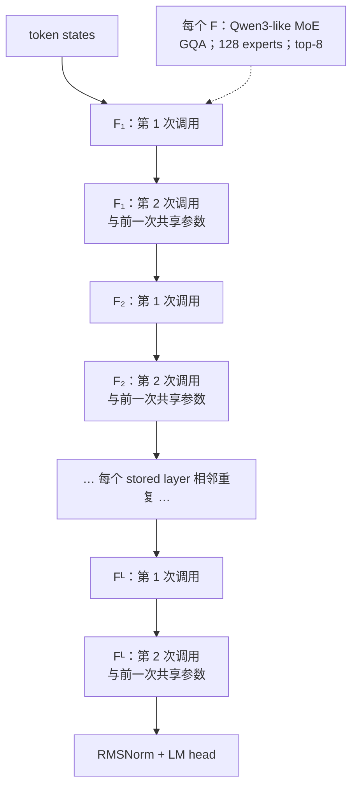

Loopie 的顺序是 `F1,F1,F2,F2,…`，不是 Ouro 的 `F1,F2,…,F1,F2,…`。相邻共享让参数 reuse distance、activation checkpoint 单元和 pipeline stage 边界更规则，但两个非线性函数组合顺序不同，因此它不是 model-loop 的等价重排。

**训练 recipe 示意图（分析者复原）**

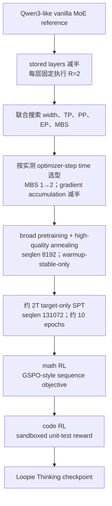

**Loss 怎样计算**

Loopie 的 loss 必须按 pretraining、SPT、RL 三段分别看。前两段共享同一个 masked causal CE 形式（§4.1）：

$$
\mathcal L_{\mathrm{CE}}(\theta;w)
=-\frac{\sum_{i=1}^{B}\sum_{t=1}^{T_i}
w_{it}\log p_\theta(z_{it}\mid z_{i,<t})}
{\sum_{i,t}w_{it}}.
$$

pretraining 对所有非 padding token 取 \(w_{it}=1\)；SPT 只对 target response token 取 1，prompt/context/padding 全部 mask 掉。因此 SPT 不是“PT loss + SFT loss”的混合，而是 target-only CE 在 PT 级别数据量和 batch 上训练。Appendix 的配置表给出

$$
\mathcal L_{\mathrm{PT/SPT}}
=\mathcal L_{\mathrm{CE}}+0.01\,\mathcal L_{\mathrm{MoE\text{-}aux}},
$$

但论文没有展开 \(\mathcal L_{\mathrm{MoE\text{-}aux}}\) 的精确公式，不能仅凭 Qwen/Megatron 惯例认定是哪一种 balance loss。

RL 对每个 prompt \(q\) 采样一组 \(G\) 个回答 \(o_i\)，由答案等价规则或代码单测给 reward \(R_i\)，组内标准化：

$$
\widehat A_i
=\frac{R_i-\operatorname{mean}_jR_j}
{\operatorname{std}_jR_j+\epsilon}.
$$

它使用 length-normalized sequence importance ratio

$$
s_i(\theta)=\exp\!\left[
\frac1{|o_i|}\sum_t
\log\frac{\pi_\theta(o_{i,t}\mid q,o_{i,<t})}
{\pi_{\theta_{\mathrm{old}}}(o_{i,t}\mid q,o_{i,<t})}
\right],
$$

并最大化 GSPO-style clipped objective

$$
J_{\mathrm{RL}}
=\mathbb E\!\left[\frac1G\sum_i
\min\!\left(
s_i\widehat A_i,\,
\operatorname{clip}(s_i,1-\epsilon_{\mathrm{low}},1+\epsilon_{\mathrm{high}})
\widehat A_i
\right)\right],
$$

训练时最小化 \(-J_{\mathrm{RL}}\)，且 \(\epsilon_{\mathrm{high}}>\epsilon_{\mathrm{low}}\)。同一 sequence ratio 作用于回答内全部 token；全对或全错、组内无比较信号的 prompt 被动态过滤。因而最终 Thinking 模型的能力是 target-only CE 与 verifier-reward RL 的共同结果，不能归因于 layer-loop 本身。

- **具体结构：** 20B-A2B 有 27 stored layers，每层相邻执行 2 次；6B-A0.6B 有 18 stored layers，同样 $R=2$；backbone为Qwen3-like MoE。
- **怎样 loop：** execution order是 `F1,F1,F2,F2,...`，而不是 full model的 `F1,F2,...,F1,F2,...`。
- **training recipe：** 从头 pretraining + high-quality annealing；warmup-stable-only，seqlen 8192；之后约 2T target-only SPT、math/code RL。
- **性能含义：** controlled evidence是 800B-token、实测 optimizer-step-time-matched head-to-head和四档 scaling ladder；final Thinking leaderboard不是 architecture ablation。
- **核心 insight：** stored depth减少可降低 checkpointed activation footprint；若因此 microbatch 1→2、gradient accumulation减半，nominal work更多也可能有相似 realized step time。
- **主要边界：** 结论是 hardware/software-specific；论文对 total pretraining tokens还有 3T vs 2.28T 的内部不一致，需要作者/config澄清。

进一步拆开，Loopie 的核心不是“循环层更省 FLOPs”，而是把 architecture 和 Megatron execution plan 一起优化：

- **结构尺度：** 20B-A2B/6B-A0.6B 分别有 27/18 个 stored layers，每层固定执行两次；active parameters 约 2B/0.6B。不同物理层不共享，只有同一物理层的相邻两次调用共享。
- **为什么可能更快：** 论文的 checkpoint policy 下，dominant activation memory更接近随 stored depth 增长。释放的显存让 microbatch 加倍、gradient accumulation 减半，并改善 MoE/parallelism 利用率；这是一条 measured systems path，不是架构恒等式。
- **最干净的 performance 证据：** 20B-A2B 与 Qwen3-like 30B-A3B 在同硬件、同 tokens/update、同 800B-token区间和近似 optimizer-step time下比较，Loopie 约在 600B tokens 后反超；四个 wall-clock-matched scaling rungs 也都领先对应 vanilla。
- **不能混入的证据：** 最终 Thinking 分数同时包含数万亿 token pretraining、约 2T SPT、math RL、code RL 和 decoding protocol，不能当成 layer-loop 单因素消融。
- **数据审计：** v2 对总 pretraining 量存在 `3T + 1.26T`、`570B × 4 = 2.28T` 与约 3.5T 三种口径；在日志/config 未澄清前，应在任何 token-efficiency claim 旁保留这个不确定性。
- **复现重点：** 既要固定 analytical block calls，也要允许双方各自调 TP/PP/EP/MBS；最后同时报告 peak memory、step time、tokens/s、通信占比和 GPU-hours，才能知道收益是否能跨硬件迁移。

### 5.5 LoopUS：低 token budget 改造 pretrained LLM

完整解析：[LoopUS：把标准 pretrained LLM 重组为 latent refinement model](/topics/looped-transformer/loopus/)；论文版本：[arXiv v1](https://arxiv.org/abs/2605.11011v1)。

**模型结构图（分析者复原）**

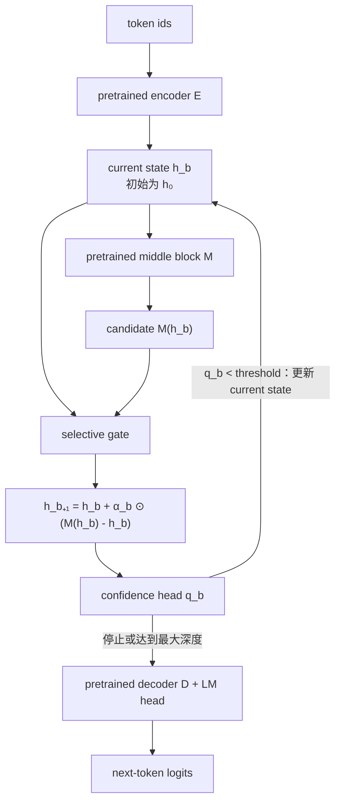

selective gate 在 $M(h_b)$ 已经计算完之后才混合新旧 state，因此它控制的是更新幅度而非当前轮是否执行；真正决定是否省掉后续 loops 的是 confidence head。gate 的 $\alpha_b$ 是 token×channel 级张量，而停止决策在论文主要设置中是 sample/batch 级 proxy。

**训练 recipe 示意图（分析者复原）**

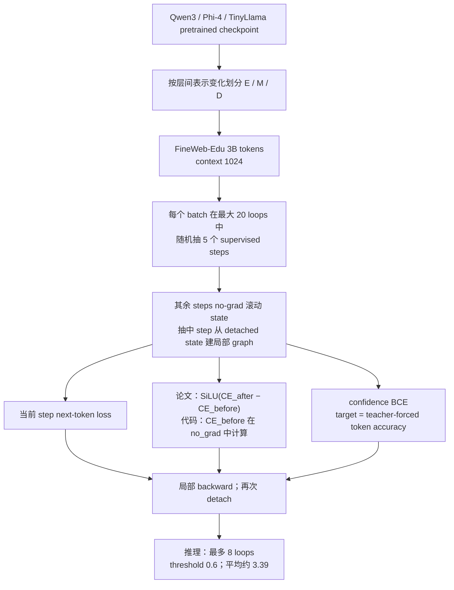

**Loss 怎样计算**

LoopUS 每个 batch 从最多 20 个 loops 中抽 \(K=5\) 个监督步 \(b\in\mathcal S\)。先把 decoder/head 上的平均 next-token CE 记为

$$
E_x(h)=\operatorname{CE}\!\left(\mathcal D(h),x_{2:T}\right),
\qquad
\mathcal L_{\mathrm{LM}}^{(b)}=E_x(h^{(b)}).
$$

它再比较同一次更新前后的 CE，并用 signed SiLU regularizer 鼓励“不变差”。论文 Eq. (12) 写成：

$$
\mathcal L_{\mathrm{mono}}^{(b)}
=\operatorname{SiLU}\!\left(
E_x(h^{(b)})-E_x(h^{(b-1)})
\right).
$$

这项不一定非负：小幅改善时它给有限的负奖励，退步时为正惩罚；所以“monotonicity”是 soft preference，不是逐 token、逐步都单调下降的保证。需要把论文公式和代码行为分开：截至 2026-08-04 的官方 [`training_runtime.py`](https://github.com/Thrillcrazyer/LoopUS/blob/main/training_runtime.py) 在 `torch.no_grad()` 中计算前一步 CE，因此实现中的梯度等价于对 $E_x(h^{(b-1)})$ 使用 `stopgrad`，但这个 stop-gradient 没有写进论文 Eq. (12) 或伪代码。

confidence head 输出 \(q_n^{(b)}=\sigma(\tilde q_n^{(b)})\)。监督 target 不是答案正确与否，而是该 sample 在当前深度的 teacher-forced token argmax accuracy：

$$
q_{\mathrm{target},n}^{(b)}
=\frac{1}{T_{\mathrm{valid},n}}\sum_j
\mathbf 1\!\left[
\arg\max_v\ell_{n,j,v}^{(b)}=x_{n,j+1}
\right],
$$

$$
\mathcal L_{Q,n}^{(b)}
=-q_{\mathrm{target},n}^{(b)}\log q_n^{(b)}
-(1-q_{\mathrm{target},n}^{(b)})\log(1-q_n^{(b)}).
$$

对随机抽中的步求平均，目标可写为

$$
\mathcal L_{\mathrm{LoopUS}}
=\frac1K\sum_{b\in\mathcal S}
\left[
E_x(h^{(b)})
+\mathcal L_{\mathrm{mono}}^{(b)}
+\mathcal L_Q^{(b)}
\right],
$$

论文总式没有为 monotonicity 项单列系数；若把代码里的权重显式记作 \(\beta\)，当前默认值是 \(\beta=1\)。关键是梯度局部化：前一步 CE、confidence 的 argmax target 以及传入当前监督步的旧 state 都 detach；梯度只穿过当前这次 \(M\)、selective gate、decoder/head 和 confidence head，不穿过此前的 1 到 \(b-1\) 条 trajectory。它因此节省 backward graph，但没有完整 20-step BPTT 的长程 credit。

- **具体结构：** 根据层间表示变化把 pretrained backbone分为 encoder $E$、middle reasoning block $M$、decoder $D$。
- **怎样 loop：** $M$ 提出 $\tilde h=M(h)$，selective gate按 token×channel阻尼更新：$h^+=h+\alpha\odot(\tilde h-h)$；confidence head决定是否继续。
- **training recipe：** FineWeb-Edu 3B tokens，seqlen 1024；最多 forward 20 loops，但每 batch随机选 5 个 steps做局部 supervision/backward。
- **性能含义：** 跨 Qwen/Phi 的平均 gain说明 retrofit可行；若只报平均分会隐藏 MMLU/HellaSwag等 retained-capability下降。
- **核心 insight：** random deep supervision省的是 backward graph与activation memory，不省 20 次 middle-block forward，也放弃长 trajectory的端到端 credit assignment。
- **主要边界：** gate先在当前轮计算完 $M$ 后才混合，因此它不省当前轮 FLOPs；confidence target是 token-accuracy proxy，不是 sequence答案正确概率。

LoopUS 的细节价值在于，它把“已有 checkpoint 怎样变成 recurrent model”拆成了结构选择、稳定更新、训练内存和停止策略四个问题：

- **结构选择：** 作者用相邻层 representation change 找出中间相对平缓的区域作为 $M$，首尾保留为 $E/D$。这是经验性的 layer-role hypothesis，不证明任意 pretrained middle block天然是 fixed-point operator。
- **gate 机制：** $M$ 先给出 proposed update $\delta_b=M(h_b)-h_b$；低秩投影产生正值 $\Delta_b$，再由负 channel decay $A$ 得到 $0<\alpha_b=\exp(\Delta_b\odot A)<1$。这保证插值但不保证整个 Jacobian 是 contraction。
- **三类 supervision：** LM loss 让抽中深度可读出；论文中的 monotonicity regularizer 比较相邻 CE，当前代码再用 no-grad 前一步 CE 把它实现成局部退步惩罚；confidence BCE 学习 teacher-forced token accuracy proxy。三者分别对应“能预测”“别变差”“是否可停”。
- **训练成本：** 20 个 middle-block forwards仍全部执行，只有 5 个 steps 保留 backward graph。粗略成本是 $20C_F+5C_B$ 加多个 decoder/head，而不是 full BPTT 的 $20C_F+20C_B$；换来的代价是 step 20 的 loss不能跨 detach训练 step 1。
- **性能边界：** 七项平均分跨多个 backbone 提升约 1.6–2.2 points，但 Qwen3-8B 的 MMLU/HellaSwag 从 72.8/57.2 降到 71.5/56.0，Phi-4-14B HellaSwag 也从 63.1 降到 60.5。
- **实现审计：** 截至 2026-08-04 的官方 main，训练和 threshold inference 都通过共享的 [`ReasoningBlock`](https://github.com/Thrillcrazyer/LoopUS/blob/main/models/modeling_lds.py) 路径，让 confidence head 读取 selective gate 之前的 proposed-update delta；因此当前版本不存在旧实现所担心的 confidence-input train–inference mismatch。复现仍应固定 commit，因为这类代码语义比论文伪代码更具体。

### 5.6 LOTUS：把 gold CoT 并行压入 latent workspace

完整解析：[LOTUS：用并行 gold-CoT supervision 对齐 looped latent states](/topics/looped-transformer/lotus/)；论文版本：[arXiv v2](https://arxiv.org/abs/2606.31779v2)。

**模型结构图（分析者复原）**

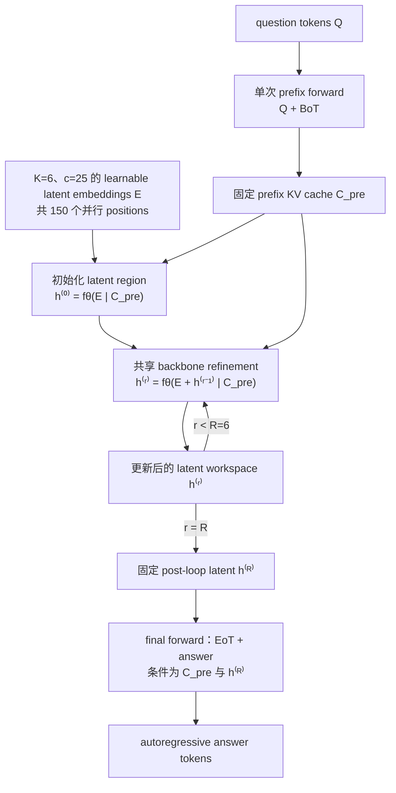

问题 $Q+\mathrm{BoT}$ 只计算一次并形成固定的 $C_{\mathrm{pre}}$，不是每轮把 question 和 latent slots 一起重跑。随后 150 个 latent positions 在每次 backbone pass 内并行更新，和生成 150 个不可见 autoregressive tokens不是同一种成本。按论文 Eq. (2) 与官方实现的记数，先有一次初始化 $h^{(0)}=f_\theta(E\mid C_{\mathrm{pre}})$，再做 $R=6$ 次 refinement；作者在正文和图中把后者称为 “$R$ loops”，因此 literal latent-region backbone calls 是 $R+1=7$。循环阶段不生成答案；答案只在最终 latent workspace 后按普通自回归方式解码。

**实现补充：** 上一段先按论文公式复原。当前官方 [`scripts/lotus.py`](https://github.com/yingfan-bot/lotus/blob/main/scripts/lotus.py) 为了让 loop-region logits 对齐第一个 latent target，把 `loop_start` 设为首个 latent position前一位；因此代码实际把 $\mathrm{BoT}$ 放进 loop region、只缓存 $Q$，与论文把 $[Q,\mathrm{BoT}]$ 都写进 $C_{\mathrm{pre}}$ 略有差异。它不改变 $K/c$ 的含义，但会影响逐 token cache 与精确 forward accounting，复现应固定 commit 并明确采用哪一种语义。

$K$ 和 $c$ 是两个不同的容量轴：$K=6$ 是可并行承载的 reasoning-step block 数，$c=25$ 是每个 step block 的 token 槽位数。训练 trace 先按 reasoning step 切分，每个 step 再独立 tokenize，并 pad/truncate 到 $c$ 个位置；因此有效的每个 $(i,j)$ latent position确实对应一个 gold CoT token，而不是整个 block只对应一个 token。padding 位置不计 loss。

**训练 recipe 示意图（分析者复原）**

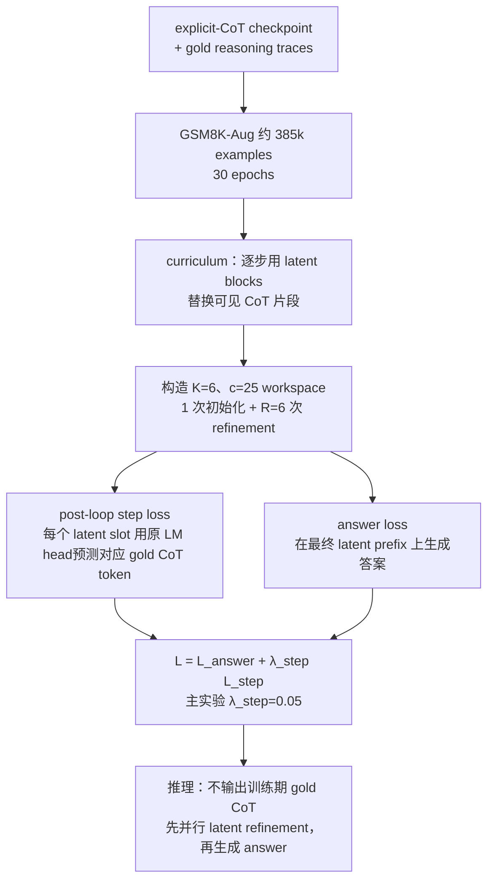

**Loss 怎样计算**

LOTUS 有两个直接监督项。第一项只在第 \(R\) 次 loop 完成后，把每个有效 latent position \(h_{ij}^{(R)}\) 通过原 LM head 对齐到对应 gold CoT token \(T_{ij}\)：

$$
\mathcal L_{\mathrm{step}}
=\frac1N\sum_{i,j}
\operatorname{CE}\!\left(
f_{\mathrm{head}}(h_{ij}^{(R)}),T_{ij}
\right),
$$

其中 $T_{ij}$ 是第 $i$ 个 reasoning step 经 tokenizer 后的第 $j$ 个 gold token，$N$ 是未被 padding mask 掉的有效 latent target 数；超过每步 $c$ 容量的部分按数据构造规则截断。也就是说，每个有效 latent position有一个对应的 gold token label。前 $1,\ldots,R-1$ 轮没有各自的 token label；它们只通过最终 latent states 收到端到端梯度。这一点正是“post-loop supervision”，不同于强迫第 $r$ 轮复现 CoT 的第 $r$ 步。

第二项在 question 和最终 latent prefix 条件下，自回归生成最终答案：

$$
\mathcal L_{\mathrm{ans}}
=-\sum_t\log p_\theta
\!\left(A_t\mid Q,h^{(R)},A_{<t}\right).
$$

总目标是

$$
\mathcal L
=\mathcal L_{\mathrm{ans}}
+\lambda_{\mathrm{step}}\,\mathcal L_{\mathrm{step}}.
$$

主实验使用 \(\lambda_{\mathrm{step}}=0.05\)；论文的 natural-language stress-test recipe 使用 0.033。所以 \(\mathcal L_{\mathrm{step}}\) 解决 latent workspace 缺少局部可读监督的问题，\(\mathcal L_{\mathrm{ans}}\) 保证被压缩的 workspace 对最终回答有用。curriculum 逐步把可见 CoT 换成 latent slots，但不改变这两个 loss 的代数形式。两项都能经最终 workspace 回传到 $h^{(0)}$ 的初始化 forward 与后续 $R=6$ 次共享-backbone refinement；与 LoopUS 不同，论文的方法定义没有在相邻 loops 之间做 stop-gradient。

- **具体结构：** question后的 $\mathrm{BoT}$ 建立固定 prefix cache；随后放入 $K=6$ 个 latent blocks，每个 $c=25$ positions，共 150 个并行 latent positions；最后再接 $\mathrm{EoT}$ 和 answer。
- **怎样 loop：** question+$\mathrm{BoT}$ 只计算一次；先从 learnable $E$ 得到 $h^{(0)}$，再以 $E+h^{(r-1)}$ 为输入做 $R=6$ 次共享-backbone refinement。最终 latent state固定后，才单独 autoregressive生成答案。
- **training recipe：** 从 explicit-CoT checkpoint和 curriculum起步；在最终 loop后让每个有效 latent position经原 LM head预测对应 gold CoT token，并加 answer loss；主实验 $\lambda_{\mathrm{step}}=0.05$。
- **性能含义：** 3B math setup接近 explicit CoT且显著减少 thought latency；优势会随显式 CoT变长而增大。
- **核心 insight：** 给最终并行 workspace直接 step supervision，比 only-answer或把每个 loop强制对齐某一推理步更容易优化。
- **主要边界：** 它没有摆脱显式 reasoning data，而是把训练期 gold traces压缩到 inference latent space；LM-head可读性是被直接监督出来的，不证明 causal faithfulness。

LOTUS 应理解为 reasoning-trace compression，而不是“无监督地涌现出隐藏 CoT”：

- **两个正交轴：** $Kc$ 决定并行 workspace 容量，其中 $K$ 是 reasoning-step blocks、$c$ 是每步 token slots；$R$ 决定同一 workspace被 refinement多少轮。增大前者主要增加 attention sequence length，增大后者主要增加串行 full-forward 次数。按公式/代码 convention，latent region还有一次 $h^{(0)}$ 初始化，所以总调用数是 $R+1$，不能把两条轴都简称“更多 latent tokens”。
- **为什么 post-loop supervision 有效：** only-answer supervision 的 credit assignment太弱；per-iteration supervision又强迫第 $r$ 轮对应某个固定 reasoning step。post-loop objective只要求 6 轮共同形成一个可读 workspace，给内部 trajectory 留出自由度。
- **最关键消融：** only-answer、CODI-style、direct per-iteration、direct post-loop 的 GSM8K 分别为 63.3、64.4、68.2、70.0；train-$R=2$ 只有 14.6，而 train-$R=6$ 达 70.0。
- **性能与成本：** Llama-3.2-3B 上 GSM8K 为 $70.0\pm0.9$，接近 explicit CoT 的 71.5；H100、batch 1 下 thought latency 133.0 ms vs 338.8 ms，总 latency 181.2 ms vs 384.2 ms。该优势会随显式 trace变长而扩大，也会在 workspace不足需要 fallback 时缩小。
- **可解释性边界：** gold-token retrieval top-1/top-5 为 70.9%/85.8%，但 state从训练开始就被 LM head直接监督成可读；这支持 representational alignment，不支持“这些 token就是对 final answer有因果作用的真实思维”。
- **复现重点：** 除 $K,c,R$ 外，还要分别固定“单个 reasoning step 超过 $c$ tokens”的截断规则，以及“trace 超过 $K$ steps”时保留为 visible/autoregressive tail 的规则；再固定 tokenizer、curriculum替换速度及 answer decoding budget，否则 latency与 accuracy都不可比。

### 5.7 LoopRPT：把 reinforcement signal 放到 latent steps

完整解析：[LoopRPT：把 reinforcement signal 放进 latent recurrent steps](/topics/looped-transformer/looprpt/)；论文版本：[arXiv v1](https://arxiv.org/abs/2603.19714v1)。

**模型结构图（分析者复原）**

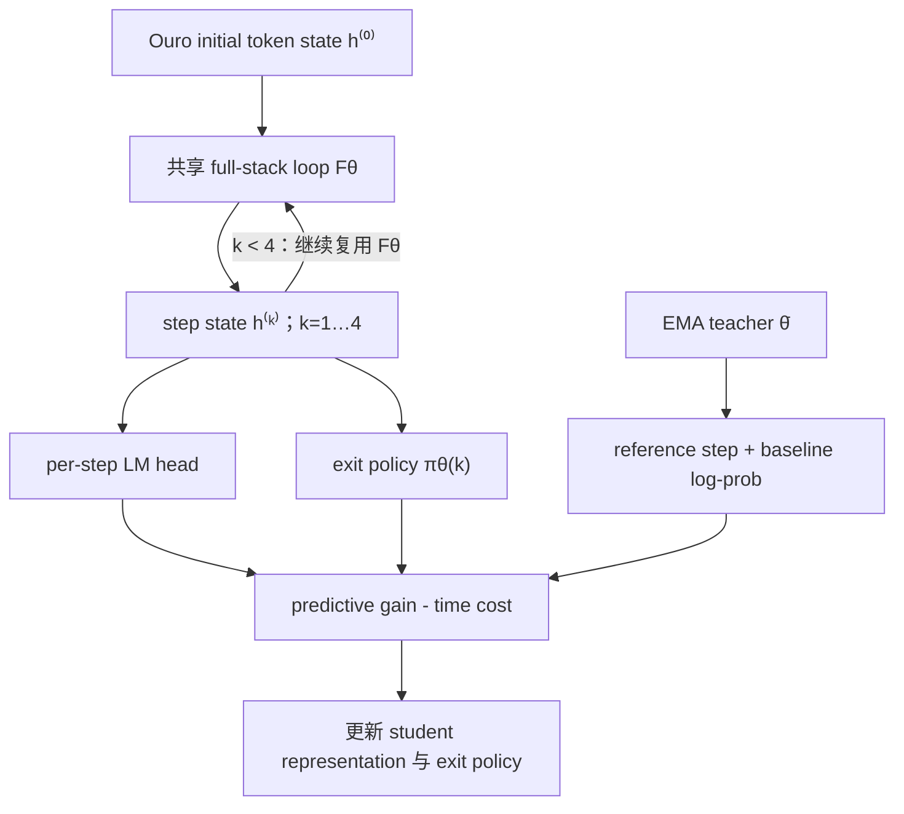

LoopRPT 不改变 Ouro 的 backbone topology；它改变的是 latent trajectory 上的 credit placement。每个 step已有的 LM head与 exit distribution被重新解释为可奖励的 actions和states。

**训练 recipe 示意图（分析者复原）**

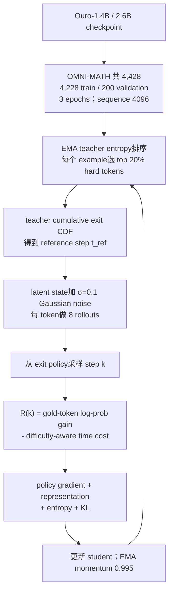

**Loss 怎样计算**

LoopRPT 只在每个 example 中 EMA teacher entropy 最高的 20% token positions 上计算以下 loss。对选中的 gold next token，令 student 第 \(k\) 步 log-prob 为 \(\ell_\theta^{(k)}\)，teacher 在 reference exit step 的 log-prob 为 \(b_{\mathrm{ref}}\)。step reward 是“相对 teacher 的预测增益减计算成本”（§3）：

$$
R(k)
=\ell_\theta^{(k)}-b_{\mathrm{ref}}
-\lambda_t(k-t_{\mathrm{ref}}),
\qquad
\lambda_t=\lambda_{\mathrm{base}}
\left[1+\lambda_{\mathrm{scale}}(1-d_t)\right].
$$

\(d_t\) 是归一化 teacher entropy；容易 token 的 \(d_t\) 小，时间惩罚更大。把 \(R(k)\) 在 \(K\) 个 steps 内标准化成 \(\widehat A(k)\)，representation loss 为

$$
w_k=\pi_\theta(k)\left(1+\operatorname{ReLU}(\widehat A(k))\right),
\qquad
\mathcal L_{\mathrm{rep}}
=-\sum_{k=1}^{K}w_k\,\ell_\theta^{(k)}.
$$

它仍是 gold-token NLL，但高 reward、且 exit policy 本来更可能选择的 steps 得到更大权重，因而直接训练 early latent states 的可预测性。

policy 部分对同一个 token 做 \(G=8\) 次 noisy latent rollout，从各自的 \(\pi_\theta^{(g)}\) 采样 exit step \(t^{(g)}\)，查表得到 \(r^{(g)}=R(t^{(g)})\)，再做组内标准化：

$$
A^{(g)}
=\frac{r^{(g)}-\operatorname{mean}_g r^{(g)}}
{\operatorname{std}_g r^{(g)}+\epsilon},
\qquad
\mathcal L_{\mathrm{PG}}
=-\mathbb E_g\left[
A^{(g)}\log\pi_\theta^{(g)}(t^{(g)})
\right].
$$

此外，student 由 K3 surrogate 约束在 EMA teacher 附近：

$$
\Delta^{(k)}=\ell_{\bar\theta}^{(k)}-\ell_{\theta,g}^{(k)},
\quad
\mathrm{K3}^{(k)}=e^{\Delta^{(k)}}-\Delta^{(k)}-1,
\quad
\mathcal L_{\mathrm{KL}}
=\operatorname{masked\ mean}_{k,t}\mathrm{K3}^{(k)}.
$$

论文给出的总式与系数是

$$
\mathcal L
=\alpha\mathcal L_{\mathrm{PG}}
+\beta\mathcal L_{\mathrm{rep}}
+\gamma\mathcal L_{\mathrm{ent}}
+\delta\mathcal L_{\mathrm{KL}},
\qquad
(\alpha,\beta,\gamma,\delta)=(1,1,0.01,10^{-4}).
$$

这里有一个需要复现者特别注意的论文内部符号问题：正文定义
\(\mathcal L_{\mathrm{ent}}=-\mathbb E[\sum_k\pi(k)\log\pi(k)]=H(\pi)\)，又把 \(+\gamma\mathcal L_{\mathrm{ent}}\) 放进“最小化的 loss”，按字面会降低而不是提高 entropy，与“entropy bonus、防 collapse”的文字相反。论文未给公开代码来消除歧义，因此应核对作者实现究竟是使用 \(-H\)、负系数，还是对该项做梯度上升，不能静默替论文改符号。

- **具体结构：** 不另建 backbone，直接在 Ouro-1.4B/2.6B 的四步 latent trajectory上训练 representation与 exit policy。
- **怎样 loop：** EMA teacher给 reference step；student对每步的 gold-token log-prob gain减去 difficulty-aware时间成本，得到 $R(k)$。
- **training recipe：** 每个 example选20% high-entropy hard tokens；对 latent state加 $\sigma=0.1$ Gaussian noise，每 token做 8 rollouts；policy gradient + representation + entropy + KL。
- **性能含义：** peak accuracy和adaptive accuracy同时提高，说明不是只把 gate提前，而是早期 latent states也变好。
- **核心 insight：** looped model的 credit assignment可以直接落在“多算一步是否值得”上，而不必只奖励最终输出 token。
- **主要边界：** OMNI-MATH 共 4,428 条，其中 4,228 train、200 validation；3 epochs属于小型 math reinforcement continued training。“Reinforcement Pre-Training”是方法名，不应与 foundation pretraining混为一谈。

LoopRPT 的核心贡献可以进一步拆成“选哪里训练、怎样定义动作、怎样平衡质量与时间”三步：

- **hard-token selection：** EMA teacher entropy最高的 20% token进入训练，减少标点和模板 token稀释信号；但 entropy只是 difficulty proxy，可能选中罕见词或噪声，也会漏掉 confidently wrong 的关键 token。
- **reward 语义：** teacher 用累计 exit distribution选 $t_{ref}$，student 的 step-$k$ reward是相对 teacher reference的 gold-token log-prob gain减去时间成本；容易 token的时间惩罚更强，困难 token允许多算。
- **为何需要 noisy rollouts：** 在同一个 latent neighborhood注入 Gaussian noise，产生 8 条可比较 trajectory并从 exit policy采样动作；组内标准化得到 advantage。这优化的是局部 Gaussian-smoothed objective，不等于真实 serving扰动分布。
- **不只是 gate tuning：** representation loss让高 reward step本身更能预测正确 token，policy-gradient让 exit distribution偏向这些 steps，entropy/KL分别防塌缩和限制对 EMA teacher的漂移。
- **性能证据：** Ouro-2.6B hard-token peak/adaptive accuracy 从 34.52/34.35 提到 38.10/37.24，平均 step从 3.51 降到 2.28；GSM8K 从 81.76 提到 85.36。peak与adaptive同时提高，排除了“仅提前退出、质量不变”这一种解释。
- **外推边界：** reward仍以 teacher-forced next-token log-prob为核心，未直接验证完整证明或答案正确；general tasks大多只提升不到 1 point，也没有 production latency与官方 code/model证据。

### 5.8 LoopFormer：同一 checkpoint 支持多个全局 compute budgets

完整解析：[LoopFormer：用 shortcut consistency 训练 elastic-depth trajectories](/topics/looped-transformer/loopformer/)；论文版本：[arXiv v1 / ICLR 2026](https://arxiv.org/abs/2602.11451v1)。

**模型结构图（分析者复原）**

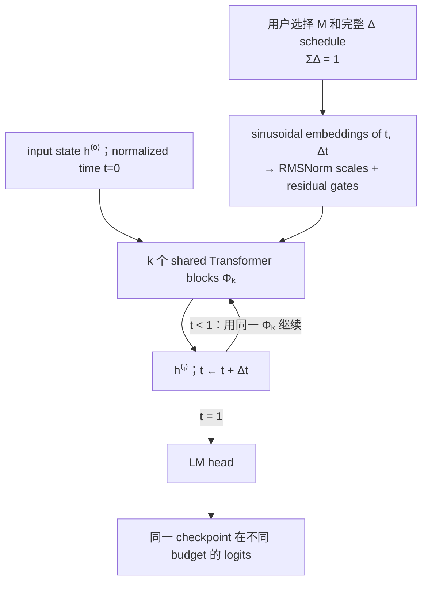

`t` 告诉 shared block 当前在完整 trajectory 的哪个位置，`Δt` 告诉它这一步要跨多远。少步路线不是简单地提前截断长路线，而是使用更大的 step size走到同一个 $t=1$ endpoint。

**训练 recipe 示意图（分析者复原）**

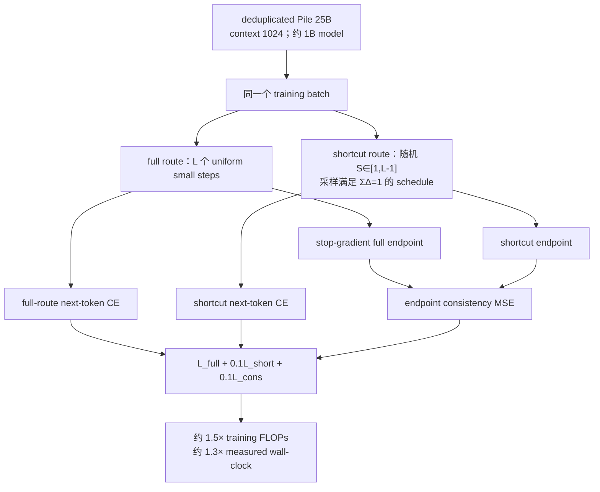

**Loss 怎样计算**

LoopFormer 在同一个 batch 上跑一条最大深度 full route 和一条随机 shortcut route；两条路线使用同一组 target \(Y\)，各自做 next-token CE：

$$
\mathcal L_L
=\operatorname{CE}(\operatorname{LMHead}(h^{(L)}),Y),
\qquad
\mathcal L_S
=\operatorname{CE}(\operatorname{LMHead}(h^{(S)}),Y).
$$

短路线还要匹配 full route 的最终 hidden endpoint：

$$
\mathcal L_{\mathrm{cons}}
=\left\|
\operatorname{stopgrad}(h^{(L)})-h^{(S)}
\right\|_2^2.
$$

这里采用论文 Eq. (7) 和 Algorithm 1 的 formal definition，即 consistency 作用在 hidden endpoint $h$ 上。§3.3 的一处 prose 把目标描述成 logits，与公式和算法不一致；复现时应按 hidden-state MSE 理解，而不要把两种说法静默混合。

总目标固定为

$$
\mathcal L
=\mathcal L_L
+0.1\,\mathcal L_S
+0.1\,\mathcal L_{\mathrm{cons}}.
$$

梯度分工非常清楚：full route 通过 \(\mathcal L_L\) 学标准语言建模；shortcut route 同时通过 \(\mathcal L_S\) 学直接预测、通过 \(\mathcal L_{\mathrm{cons}}\) 模仿 full endpoint。consistency target 上的 stop-gradient 意味着 full route 不会为了迁就 shortcut 而被 MSE 拉动，但它仍从自己的 CE 更新。这里没有 exit gate、policy loss 或 per-token halting loss；训练的是“多个用户指定全局预算都到达可用 endpoint”，不是学习由模型自动决定何时停止。

- **具体结构：** $k$ 个 physical blocks重复最多 $L$ 次；每轮由 normalized time $t$ 和 step size $\Delta t$ 调制 RMSNorm scales与residual gates。
- **怎样 loop：** 不同步数的 trajectory都要从 $t=0$ 走到 $t=1$；少步路线用更大的 $\Delta t$。
- **training recipe：** 每 batch同时跑 full route和随机 shortcut；两条路线都有 CE，short route再匹配 stop-gradient full endpoint。
- **性能含义：** 它优于其他 looped elastic baselines并能随 budget平滑改善，但没有在当前规模超过强 non-looped baseline。
- **核心 insight：** 要让浅/深多个读出点都可用，需要训练 trajectory equivalence，而不只是给 shared block一个 loop-index embedding。
- **主要边界：** 训练额外跑第二条 trajectory；“elastic”是系统预先选 budget，不是模型按样本难度自动选择。

LoopFormer 最适合被看作“多 compute budget 的同模型自蒸馏”，而不是 learned early exit：

- **结构调制：** $t$ 与 $\Delta t$ 经过 sinusoidal embedding和 MLP，调制每个 block的 RMSNorm scale与 residual gate；这让同一参数在早期小步、后期小步和 shortcut大步中承担不同角色。
- **训练信号：** full与shortcut路线都做 CE，短路线另外匹配 stop-gradient full endpoint。stop-gradient很重要：它让 full route充当 batch内 teacher，而不是两条路线互相拉到一个折中但更差的表示。
- **弹性不等于自适应：** inference前由用户或系统选择 $M$ 与完整 $\Delta$ schedule，整个 request/batch按同一预算运行；模型没有学会根据 token或样本难度自动 halt。
- **性能边界：** $(3\otimes8)$ 的 Pile PPL/十项平均为 10.28/44.81，优于 TMLT 的 10.38/44.69，但仍弱于 non-looped 24-layer baseline的 9.49/45.27。
- **训练成本校正：** 同 token训练时，额外 shortcut route给了 LoopFormer更多 FLOPs；FLOP-matched后它只训练 34k vs 50k iterations、少看约 8B tokens，平均分为 44.21，低于 base 45.27。
- **复现重点：** 相同 $M$ 下不同 $\Delta$ schedule仍可带来约 1.4–3 PPL或约 1.3 accuracy points的差异，所以实验记录必须保存完整 schedule，不能只写“用了 8 loops”。

## 6. 跨论文真正值得带走的 Insight

### Insight 1：一个 block 能被重复，不等于它学会了迭代

Huginn从头训练 recurrent core；Ouro在多个 steps上给 loss；LoopUS用 gate和random deep supervision修复 pretrained middle block；LOTUS直接给 latent positions gold-step target；LoopFormer匹配不同 trajectory endpoint。五条路线共同说明：**iterative operator是训练出来的角色，不是 weight tying自动赋予的性质。**

### Insight 2：训练深度分布决定可用的 inference depth区间

固定深度训练通常产生一个窄的 sweet spot。random depth、multi-depth loss、shortcut consistency、monotonic regularization都在扩大可读出区间，但没有一项工作证明 arbitrary-depth extrapolation。最实用的评测不是“最佳 loop分数”，而是完整曲线：

$$
\left\{
\text{quality}(t),
\text{loss}(t),
\operatorname{KL}(p_{t+1}\Vert p_t),
\lVert h^{(t+1)}-h^{(t)}\rVert,
\text{latency}(t)
\right\}_{t=1}^{T_{\max}}.
$$

### Insight 3：fixed point 只是一个可能的视角

LoopUS的damping可减小单步位移，但不保证 contraction；Huginn和Ouro的最佳输出可能出现在有限 step而非收敛点；LOTUS把 $R$ 轮共同看作形成 workspace的过程。不要把所有 looped LLM都强行解释为在求一个 equilibrium。

### Insight 4：KV cache 是 model semantics的一部分

对于 token-wise depth，历史 token在更深 recurrence没有 K/V 时，未来 token能否访问它会改变模型函数。Ouro的 per-loop cache、MoR的selective cache/KV sharing、batched early exit不是纯工程后处理，而是在近似或重定义 causal computation。

### Insight 5：最现实的研究路线可能是 retrofit，而不是重做 trillion-token pretraining

Huginn/Ouro/Loopie证明从头训练可行，但成本高。LoopUS表明 3B tokens可适配多个 pretrained backbone；LOTUS和LoopRPT进一步说明后续 supervision可以直接塑造 latent trajectory。对普通研究预算，更有信息量的实验是：

```text
同一个 fully-open base checkpoint
  ├─ vanilla continued training
  ├─ recurrent retrofit
  ├─ recurrent retrofit + latent supervision
  └─ recurrent retrofit + output-only / latent-step RL
```

### Insight 6：目前最大的证据缺口是 broad post-training 后的能力保持

现有结果大量集中在 math/code/academic benchmarks。真正的通用 LLM结论还需要同一 checkpoint flow中联合评测：base LM、knowledge、instruction following、multi-turn chat、tool use、long context、safety、calibration和serving latency。

## 7. 如果只按一个顺序读

1. **Huginn**：先建立 recurrent core、random depth、truncated BPTT的基本模型。
2. **Ouro**：看 full-stack loop怎样进入 multi-trillion-token staged training，并认真读 depth外推的负面结果。
3. **MoR**：补 token-wise routing、causality和KV cache。
4. **Loopie**：理解 architecture–system co-design与 wall-clock matching。
5. **LoopUS**：进入 pretrained-model retrofit、damping与random deep supervision。
6. **LOTUS**：看显式 CoT监督怎样进入 parallel latent workspace。
7. **LoopRPT**：看 reward怎样进入 latent steps与exit policy。
8. **LoopFormer**：看多 compute budget的trajectory consistency。

## 8. 下一步实验：怎样真正比较这八类路线

### 8.1 最小统一 baseline matrix

选一个 fully-open 1B–3B base model和固定 data order，训练：

| 组别 | 模型 | 目的 |
|---|---|---|
| A | 原始 base checkpoint | 记录未改造能力 |
| B | vanilla continued training | 隔离额外 tokens/optimizer steps |
| C | Huginn-style core loop retrofit | 测 input injection/random depth |
| D | Ouro-style full-stack loop | 比较 loop unit |
| E | LoopUS-style middle loop | 测低成本 retrofit |
| F | E + LOTUS supervision | 测 gold latent-step target |
| G | E/F + LoopRPT | 测 latent-step reinforcement |
| H | 各 loop模型 + LoopFormer conditioning | 测 elastic depth |

### 8.2 四套必须同时报告的成本口径

1. **Parameter-matched**：total/active/non-embedding parameters；
2. **Execution-matched**：block calls、analytical FLOPs、attention FLOPs；
3. **Training-budget-matched**：unique/seen/loss tokens、optimizer steps、GPU-hours、energy；
4. **Realized-system-matched**：peak memory、tokens/s、step time、TTFT、inter-token latency、continuous-batching throughput。

### 8.3 三个最高信息量问题

1. **收益来自哪里？** recurrent architecture、额外 data、更多 executed depth、latent supervision还是更好的硬件利用率？
2. **什么时候该停？** 能否用 calibrated exit在几乎不降质量时减少真实 wall-clock，而不是只减少理论平均 loops？
3. **post-training 后还剩什么？** SFT/DPO/RLVR会扩大 depth-scaling能力、保持它，还是让模型重新依赖最终一步或显式 CoT？

## 9. 最终判断

按“通用 LLM成熟度”排序，当前最重要的是：

- **规模与 checkpoint：** Ouro、Loopie、Huginn；
- **动态计算与 cache：** MoR、Ouro；
- **低成本 pretrained-model改造：** LoopUS；
- **latent reasoning supervision：** LOTUS、LoopRPT；
- **多预算稳健性：** LoopFormer；

如果目标是现在就做一个可信研究项目，最佳起点不是再证明一次“共享 block能做迭代”，而是：**在同一个 fully-open base model上做 vanilla continued training vs recurrent retrofit，随后给两者走完全相同的 SFT/DPO/RLVR flow，并同时报告 capability retention、完整 performance–depth curve、KV/cache语义和真实 wall-clock。**
