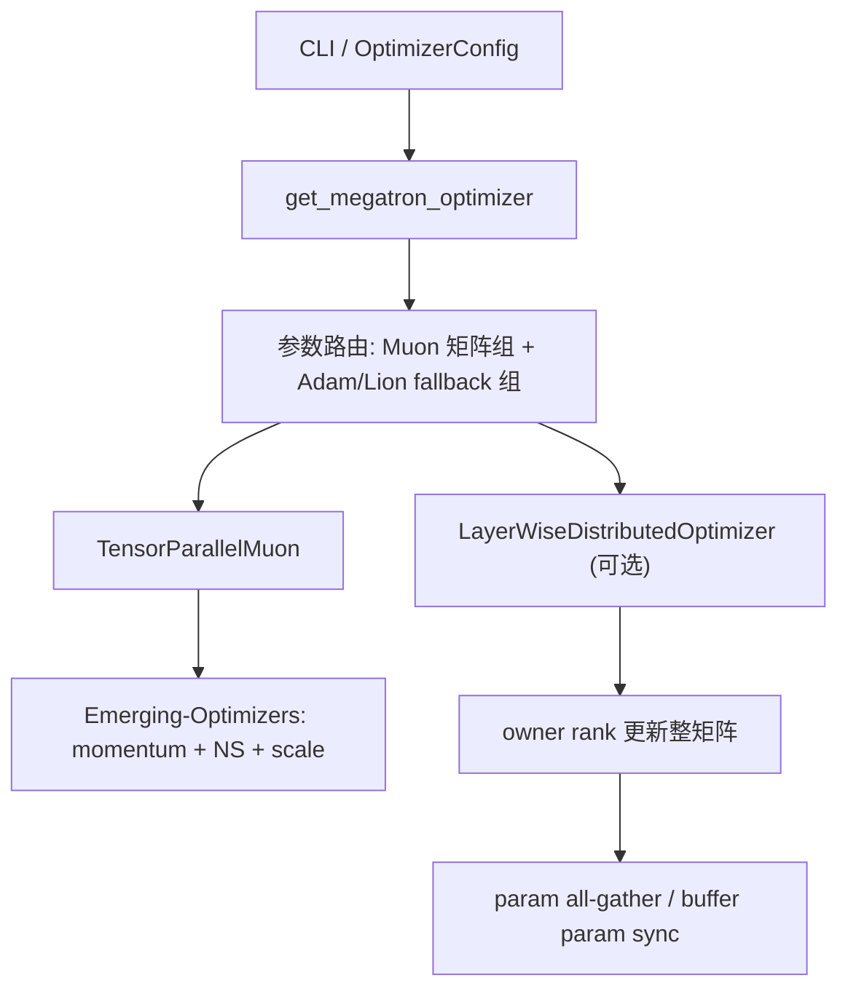

> 层次：深度学习工程
> 信息截点：2026-07-06
> 分析对象：本仓库 submodule `Megatron-LM`，commit `0823c731ed7d793aef047b6a64f2dbbf32bf6e2c`。
> 上游核心依赖：`NVIDIA-NeMo/Emerging-Optimizers`，Megatron-LM 在 `pyproject.toml` 中 pin 到 `v0.2.0`，对应本文核对的 commit `1effa026ff096b7fa1063ca2fba19d98be6e6cdf`。

## 一句话定位

Megatron-LM 的 Muon 支持不是把普通 AdamW/ZeRO 代码改一个 optimizer 名字，而是把 Muon 拆成两层：`Emerging-Optimizers` 提供 momentum、Newton-Schulz 和 scaling 的核心更新；Megatron-LM 提供参数路由、Tensor Parallel QKV split、DP/EP/PP process group 集成、LayerWise 分布式参数布局、参数同步和 checkpoint 适配。

## 先看哪些文件

| 主题 | 关键代码 | 先读什么 |
|---|---|---|
| CLI 参数 | [arguments.py](https://github.com/NVIDIA/Megatron-LM/blob/0823c731ed7d793aef047b6a64f2dbbf32bf6e2c/megatron/training/arguments.py#L2358) | `--optimizer muon`、Muon 超参、`--use-distributed-optimizer` 如何切到 layer-wise |
| OptimizerConfig | [optimizer_config.py](https://github.com/NVIDIA/Megatron-LM/blob/0823c731ed7d793aef047b6a64f2dbbf32bf6e2c/megatron/core/optimizer/optimizer_config.py#L260) | Muon 的 config 字段和默认值 |
| Muon 注册与 TP 包装 | [emerging_optimizers.py](https://github.com/NVIDIA/Megatron-LM/blob/0823c731ed7d793aef047b6a64f2dbbf32bf6e2c/megatron/core/optimizer/emerging_optimizers.py#L160) | `TensorParallelMuon`、QKV split、TP mode、scale |
| Optimizer 构造入口 | [optimizer/\_\_init\_\_.py](https://github.com/NVIDIA/Megatron-LM/blob/0823c731ed7d793aef047b6a64f2dbbf32bf6e2c/megatron/core/optimizer/__init__.py#L725) | 参数分组、fallback Adam、LayerWise 包装 |
| LayerWise 分布式优化器 | [layer_wise_optimizer.py](https://github.com/NVIDIA/Megatron-LM/blob/0823c731ed7d793aef047b6a64f2dbbf32bf6e2c/megatron/core/optimizer/layer_wise_optimizer.py#L89) | 整矩阵归属、owner rank step、参数 all-gather |
| DDP buffer 布局 | [param_layout.py](https://github.com/NVIDIA/Megatron-LM/blob/0823c731ed7d793aef047b6a64f2dbbf32bf6e2c/megatron/core/optimizer/param_layout.py#L45)、[param_and_grad_buffer.py](https://github.com/NVIDIA/Megatron-LM/blob/0823c731ed7d793aef047b6a64f2dbbf32bf6e2c/megatron/core/distributed/param_and_grad_buffer.py#L835) | 为什么要把 Muon 参数放进单独 buffer |
| DDP 包装时机 | [training.py](https://github.com/NVIDIA/Megatron-LM/blob/0823c731ed7d793aef047b6a64f2dbbf32bf6e2c/megatron/training/training.py#L1566) | DDP 前预计算 `full_param_layout` |
| 兼容 shim | [muon.py](https://github.com/NVIDIA/Megatron-LM/blob/0823c731ed7d793aef047b6a64f2dbbf32bf6e2c/megatron/core/optimizer/muon.py#L3) | 老入口已迁移到 emerging optimizer 路径 |
| 功能测试样例 | [model_config.yaml](https://github.com/NVIDIA/Megatron-LM/blob/0823c731ed7d793aef047b6a64f2dbbf32bf6e2c/tests/functional_tests/test_cases/moe/gpt3_moe_mcore_te_ep8_resume_torch_dist_dist_muon/model_config.yaml#L62) | MoE + Muon + distributed optimizer 的测试配置 |

外部依赖的核心代码不在 submodule 里，但 Megatron-LM 明确 pin 了它：[pyproject.toml](https://github.com/NVIDIA/Megatron-LM/blob/0823c731ed7d793aef047b6a64f2dbbf32bf6e2c/pyproject.toml#L232)。对应源码可看：

- [`OrthogonalizedOptimizer.step`](https://github.com/NVIDIA-NeMo/Emerging-Optimizers/blob/v0.2.0/emerging_optimizers/orthogonalized_optimizers/orthogonalized_optimizer.py#L155-L203)
- [`Muon`](https://github.com/NVIDIA-NeMo/Emerging-Optimizers/blob/v0.2.0/emerging_optimizers/orthogonalized_optimizers/muon.py#L36-L162)
- [`newton_schulz` / `newton_schulz_tp`](https://github.com/NVIDIA-NeMo/Emerging-Optimizers/blob/v0.2.0/emerging_optimizers/orthogonalized_optimizers/muon_utils.py#L114-L272)

## 总体结构

Megatron-LM 这一版的 Muon 路径可以分成四段：



其中最重要的工程判断是：Muon 的 Newton-Schulz 要看到一个有语义的二维矩阵。标准 ZeRO-1 可以把 optimizer state 按字节或连续 buffer 切开，但 Muon 不能随便把一个矩阵切成局部 shard 后分别正交化。Megatron 的 LayerWise 路径因此选择“整参数归属”：某个 DP 或 expert-DP rank 拥有某些完整矩阵，只有 owner rank 对这些完整矩阵做 Muon step，之后把更新后的参数同步给同组其他 rank。

## 入口流程

### 1. 参数解析阶段

Muon 相关命令行参数在 [arguments.py](https://github.com/NVIDIA/Megatron-LM/blob/0823c731ed7d793aef047b6a64f2dbbf32bf6e2c/megatron/training/arguments.py#L2358)：

- `--muon-momentum`
- `--muon-no-split-qkv`
- `--muon-nesterov`
- `--muon-scale-mode`
- `--muon-fp32-matmul-prec`
- `--muon-coefficient-type`
- `--muon-num-ns-steps`
- `--muon-tp-mode`
- `--muon-extra-scale-factor`
- `--muon-scalar-optimizer`

`--optimizer` 的 choices 包含 `muon`、`dist_muon` 和 `adaptive_muon`，见 [arguments.py](https://github.com/NVIDIA/Megatron-LM/blob/0823c731ed7d793aef047b6a64f2dbbf32bf6e2c/megatron/training/arguments.py#L2617)。`dist_muon` 已经被标成 deprecated：解析阶段会把它改写成 `optimizer='muon'`，并打开 `use_layer_wise_distributed_optimizer`，见 [arguments.py](https://github.com/NVIDIA/Megatron-LM/blob/0823c731ed7d793aef047b6a64f2dbbf32bf6e2c/megatron/training/arguments.py#L1530)。

更关键的是：如果用户传了 `--optimizer muon --use-distributed-optimizer`，解析阶段会把普通 distributed optimizer 开关关掉，把 `use_layer_wise_distributed_optimizer` 打开，见 [arguments.py](https://github.com/NVIDIA/Megatron-LM/blob/0823c731ed7d793aef047b6a64f2dbbf32bf6e2c/megatron/training/arguments.py#L1541)。这说明 Megatron 不让 Muon 走普通 DistOpt 路径，而是专门走 LayerWise 路径。

### 2. Config 字段

Muon 的 config 字段在 [optimizer_config.py](https://github.com/NVIDIA/Megatron-LM/blob/0823c731ed7d793aef047b6a64f2dbbf32bf6e2c/megatron/core/optimizer/optimizer_config.py#L260)。这里有几个值得注意的默认值：

- `muon_momentum = 0.95`，但 argparse 默认是 `0.9`，实际使用时以参数解析写入的 config 为准。
- `muon_split_qkv = True`。
- `muon_nesterov = False`。
- `muon_scale_mode = "spectral"`。
- `muon_fp32_matmul_prec = "medium"`。
- `muon_coefficient_type = "quintic"`。
- `muon_num_ns_steps = 5`。
- `muon_tp_mode = "blockwise"`。
- `muon_scalar_optimizer = "adam"`。

`muon_extra_scale_factor` 默认是 `1.0`。Moonlight/Kimi 风格常见的 `0.2` 需要显式传，例如功能测试配置里用了 `--muon-extra-scale-factor: 0.2` 和 `--muon-scale-mode: spectral`，见 [model_config.yaml](https://github.com/NVIDIA/Megatron-LM/blob/0823c731ed7d793aef047b6a64f2dbbf32bf6e2c/tests/functional_tests/test_cases/moe/gpt3_moe_mcore_te_ep8_resume_torch_dist_dist_muon/model_config.yaml#L62)。

## 核心更新步骤

Megatron-LM 本身不重新实现普通单机 Muon step，而是依赖 `emerging_optimizers`。上游 `OrthogonalizedOptimizer.step` 的更新顺序是：

1. lazy init `momentum_buffer`，见 [`orthogonalized_optimizer.py`](https://github.com/NVIDIA-NeMo/Emerging-Optimizers/blob/v0.2.0/emerging_optimizers/orthogonalized_optimizers/orthogonalized_optimizer.py#L126-L146)；
2. 对参数或梯度施加 weight decay，见 [`orthogonalized_optimizer.py`](https://github.com/NVIDIA-NeMo/Emerging-Optimizers/blob/v0.2.0/emerging_optimizers/orthogonalized_optimizers/orthogonalized_optimizer.py#L178-L183)；
3. `momentum_buffer.lerp_(grad, 1 - momentum)`；
4. 如果启用 Nesterov，用 `grad.lerp(momentum_buffer, momentum)` 作为正交化输入，否则用 momentum buffer；
5. 在指定 `fp32_matmul_precision` 上执行 `orthogonalize`；
6. `p.add_(orth_grad, alpha=-lr)`。

上游 `Muon` 的 `scaled_orthogonalize_fn` 会调用 `newton_schulz`，再乘上 `get_muon_scale_factor` 和 `extra_scale_factor`，见 [`muon.py`](https://github.com/NVIDIA-NeMo/Emerging-Optimizers/blob/v0.2.0/emerging_optimizers/orthogonalized_optimizers/muon.py#L107-L119)。

因此抽象更新式是：

$$
M_t=\beta M_{t-1}+(1-\beta)G_t
$$

若不开 Nesterov，则进入 NS 的是 $M_t$；若开 Nesterov，则进入 NS 的是 $G_t$ 与 $M_t$ 的 Nesterov 组合。之后：

$$
O_t=\operatorname{NS}(M_t),\qquad
W_{t+1}=(1-\eta\lambda)W_t-\eta\,s(A,B)\,O_t
$$

这里的 $s(A,B)$ 对应 `muon_scale_mode` 和 `muon_extra_scale_factor`。上游 `get_muon_scale_factor` 支持三种模式，见 [`muon.py`](https://github.com/NVIDIA-NeMo/Emerging-Optimizers/blob/v0.2.0/emerging_optimizers/orthogonalized_optimizers/muon.py#L136-L162)：

| mode | 代码尺度 | 直觉 |
|---|---:|---|
| `shape_scaling` | $\sqrt{\max(1,A/B)}$ | Keller 早期 shape scaling |
| `spectral` | $\sqrt{\max(A,B)}$ | 大规模配方常用；再配 `extra_scale_factor=0.2` 接近 AdamW RMS |
| `unit_rms_norm` | $\sqrt{A/B}$ | 更接近 unit RMS/muP 相关讨论 |

## Newton-Schulz 细节

`newton_schulz` 的实现要点在上游 [`muon_utils.py`](https://github.com/NVIDIA-NeMo/Emerging-Optimizers/blob/v0.2.0/emerging_optimizers/orthogonalized_optimizers/muon_utils.py#L114-L207)：

- 输入必须至少二维且 dtype 为 `float32`；
- 如果 `transpose is None`，会在行数大于列数时转置，让白化发生在较小维度；
- 先用 Frobenius/p=2 normalize 保证谱范数不超过 1；
- coefficient 支持 `simple`、`quintic`、`polar_express`、`aol`、`custom`；
- `quintic` 默认系数来自 Muon/modded-nanogpt 系列调参；
- `torch.get_float32_matmul_precision() == "medium"` 时显式把 `X` 转成 bf16，用 BF16 I/O kernel 做 NS，再转回 fp32；
- 每一步核心是

$$
A=XX^\top,\quad
B=bA+cA^2,\quad
X=aX+BX
$$

对应 [`newton_schulz_step`](https://github.com/NVIDIA-NeMo/Emerging-Optimizers/blob/v0.2.0/emerging_optimizers/orthogonalized_optimizers/muon_utils.py#L275-L302)。

这个实现的注释也提醒：调系数 NS 不一定收敛到精确 $UV^\top$，更像 $US'V^\top$，其中 $S'$ 在 1 附近有噪声。这不是 bug，而是 Muon 工程配方的一部分。

## Megatron 的 TensorParallelMuon

Megatron-LM 在 [emerging_optimizers.py](https://github.com/NVIDIA/Megatron-LM/blob/0823c731ed7d793aef047b6a64f2dbbf32bf6e2c/megatron/core/optimizer/emerging_optimizers.py#L160) 定义 `TensorParallelMuon`，继承上游 `OrthogonalizedOptimizer`，但把 `scaled_orthogonalize_fn` 换成支持 TP 的版本。

关键逻辑在 [emerging_optimizers.py](https://github.com/NVIDIA/Megatron-LM/blob/0823c731ed7d793aef047b6a64f2dbbf32bf6e2c/megatron/core/optimizer/emerging_optimizers.py#L185)：

1. 先根据当前 local grad shape 计算 `size = [grad.size(-2), grad.size(-1)]`；
2. 如果知道 `partition_dim`，把对应维度乘以 TP group size，用 global shape 做 scale；
3. 调 `newton_schulz_tp`；
4. 乘 `get_muon_scale_factor(global_shape, mode=scale_mode)` 和 `extra_scale_factor`。

这里的 global shape 很重要。Muon 的 update RMS 与矩阵形状有关；如果用 TP shard 的 local shape 做 scale，不同 TP size 会改变训练动力学。

### TP mode

`muon_tp_mode` 有三种：

| mode | 代码行为 | 语义 |
|---|---|---|
| `blockwise` | 在 [orthogonalize](https://github.com/NVIDIA/Megatron-LM/blob/0823c731ed7d793aef047b6a64f2dbbf32bf6e2c/megatron/core/optimizer/emerging_optimizers.py#L254) 中令 `partition_dim=None`，最终对 local shard 做普通 `newton_schulz` | 最便宜，但通常不等价于完整矩阵 Muon |
| `duplicated` | 上游 [`newton_schulz_tp`](https://github.com/NVIDIA-NeMo/Emerging-Optimizers/blob/v0.2.0/emerging_optimizers/orthogonalized_optimizers/muon_utils.py#L254-L260) all-gather 出 global tensor，每个 TP rank 都算完整 NS，再切回本 rank shard | 数学语义接近完整矩阵，计算/显存重复 |
| `distributed` | 上游 [`newton_schulz_tp`](https://github.com/NVIDIA-NeMo/Emerging-Optimizers/blob/v0.2.0/emerging_optimizers/orthogonalized_optimizers/muon_utils.py#L261-L268) 在 sharded tensor 上做 NS，每步对 Gram 矩阵 all-reduce | 避免 full all-gather，但要求 shard 维度与 NS 白化维度匹配 |

测试中明确区分了这些模式：[test_emerging_optimizers.py](https://github.com/NVIDIA/Megatron-LM/blob/0823c731ed7d793aef047b6a64f2dbbf32bf6e2c/tests/unit_tests/test_emerging_optimizers.py#L478) 检查 `duplicated` 和 `distributed` 路径；[test_emerging_optimizers.py](https://github.com/NVIDIA/Megatron-LM/blob/0823c731ed7d793aef047b6a64f2dbbf32bf6e2c/tests/unit_tests/test_emerging_optimizers.py#L499) 标注 `blockwise` 会产生不同结果。

### `distributed` TP mode 的直觉

这里的关键不是“每个 TP rank 对自己的 local shard 独立做一次完整 Muon”，而是“把完整矩阵的 Newton-Schulz 迭代拆成每个 rank 算局部贡献，再在 Gram 矩阵上 all-reduce”。

设 NS 当前处理的矩阵是 `X`，shape 为 `[m, n]`，并且实现选择让 `m` 是要白化/正交化的较小维度。每一步 NS 会先算：

```text
A = X @ X.T
B = b * A + c * A @ A
X = a * X + B @ X
```

这里的 `A` 就是 Gram 矩阵：它记录的是 `X` 的行与行之间的内积，shape 是 `[m, m]`。直观地说，Gram 矩阵回答的是“这些行方向之间有多相关”，NS 再用它把这些方向推向正交。

如果 `X` 在 TP 上按列切分为 `[X0 | X1 | ...]`，每个 rank 只持有 `Xi: [m, n_i]`，那么：

```text
X @ X.T = sum_i (Xi @ Xi.T)
```

所以每个 rank 可以先算自己的局部 Gram `Xi @ Xi.T`，再对 Gram 做一次 TP all-reduce 求和。all-reduce 后所有 rank 都拿到同一个全局 `A`，再用同一个 `B` 更新自己的 local shard `Xi`。这就是“在 sharded tensor 上做 NS”：不 all-gather 完整 `X`，但 Gram 是完整矩阵语义的 Gram。

这也解释了“shard 维度与 NS 白化维度匹配”的意思：经过必要的转置后，每个 rank 应该持有完整的白化维度 `m`，只在求和维度 `n` 上分片。上游 `newton_schulz_tp` 在 `partition_dim == 0` 时传 `transpose=True`，在 `partition_dim == 1` 时传 `transpose=False`，见 [`muon_utils.py`](https://github.com/NVIDIA-NeMo/Emerging-Optimizers/blob/v0.2.0/emerging_optimizers/orthogonalized_optimizers/muon_utils.py#L261-L268)。这样原始矩阵如果是 row-sharded，会先转置成 column-sharded 的 NS 视角；如果本来就是 column-sharded，则直接做。

实际判断时可以记住一个简单标准：distributed TP mode 想要的是“每个 rank 都有完整的短边，只切长边”。例如 MLP 的 `W_up [4h, h]` 若按 dim0 切，转置后 local 视角是 `[h, 4h/tp]`，Gram 是 `[h, h]`；`W_down [h, 4h]` 若按 dim1 切，local 视角也是 `[h, 4h/tp]`，Gram 仍是 `[h, h]`。这类情况通信的是小 Gram，语义也接近完整矩阵 Muon。反过来，如果切错方向，可能会让 Gram 变成 `[4h, 4h]`，既贵又更容易偏离想要的白化语义。

### QKV split

Megatron 会在构造 optimizer 前扫描参数名。如果参数名包含 `linear_qkv.weight` 且 shape 与 QKV split 兼容，就打上 `param.is_qkv=True` 和 `param.qkv_split_shapes`，见 [optimizer/\_\_init\_\_.py](https://github.com/NVIDIA/Megatron-LM/blob/0823c731ed7d793aef047b6a64f2dbbf32bf6e2c/megatron/core/optimizer/__init__.py#L777)。

QKV split shape 的计算在 [emerging_optimizers.py](https://github.com/NVIDIA/Megatron-LM/blob/0823c731ed7d793aef047b6a64f2dbbf32bf6e2c/megatron/core/optimizer/emerging_optimizers.py#L133)。普通 GQA 下 split 是：

```text
Q: num_attention_heads / num_query_groups * kv_channels
K: kv_channels
V: kv_channels
```

如果 `attention_output_gate` 开启，还会出现第四块 gate。`TensorParallelMuon.orthogonalize` 会把 fused QKV grad reshape 成 `(num_query_groups, qkv_split_dim, -1)`，按 Q/K/V 分别做正交化，再 cat 回原形状，见 [emerging_optimizers.py](https://github.com/NVIDIA/Megatron-LM/blob/0823c731ed7d793aef047b6a64f2dbbf32bf6e2c/megatron/core/optimizer/emerging_optimizers.py#L258)。

为什么要这么做：fused QKV 是 kernel/layout 优化，不是数学上同一个线性算子。把 Q、K、V 拼成一个大矩阵整体做 polar 会混合三者奇异方向。

## 参数路由

默认路由来自 [emerging_optimizers.py](https://github.com/NVIDIA/Megatron-LM/blob/0823c731ed7d793aef047b6a64f2dbbf32bf6e2c/megatron/core/optimizer/emerging_optimizers.py#L81) 和 [emerging_optimizers.py](https://github.com/NVIDIA/Megatron-LM/blob/0823c731ed7d793aef047b6a64f2dbbf32bf6e2c/megatron/core/optimizer/emerging_optimizers.py#L128)：

```python
def _is_nonlinear_or_embedding(param):
    return getattr(param, 'is_embedding_or_output_parameter', False) or len(param.shape) != 2
```

注册 `muon` 时，匹配这个 predicate 的参数会被 override 到 Adam，见 [emerging_optimizers.py](https://github.com/NVIDIA/Megatron-LM/blob/0823c731ed7d793aef047b6a64f2dbbf32bf6e2c/megatron/core/optimizer/emerging_optimizers.py#L427)。也就是说：

- embedding/output head：Adam；
- bias、norm、所有非 2D 参数：Adam；
- 其他 2D 参数：默认 Muon。

`get_megatron_optimizer` 进入 emerging optimizer 路径后，会把这些 overrides 合并进参数组，见 [optimizer/\_\_init\_\_.py](https://github.com/NVIDIA/Megatron-LM/blob/0823c731ed7d793aef047b6a64f2dbbf32bf6e2c/megatron/core/optimizer/__init__.py#L800)。真正遍历模型参数并生成 param groups 的地方是 [optimizer/\_\_init\_\_.py](https://github.com/NVIDIA/Megatron-LM/blob/0823c731ed7d793aef047b6a64f2dbbf32bf6e2c/megatron/core/optimizer/__init__.py#L300)。

### Router/gate 的注意点

这套默认规则非常简洁，但也可能过宽。MoE router 的 gate weight 在 [router.py](https://github.com/NVIDIA/Megatron-LM/blob/0823c731ed7d793aef047b6a64f2dbbf32bf6e2c/megatron/core/transformer/moe/router.py#L58) 中是二维参数：

```python
torch.empty((num_moe_experts, hidden_size), dtype=torch.float32)
```

它没有在默认规则里按名字排除。因此，如果不额外配置，某些 MoE router weight 可能会因为 `dim == 2` 进入 Muon。之前我们从算法语义上建议 router/gate 优先用 AdamW，是因为 router 更像 token-to-expert classifier，对 top-k 边界、load balance loss、capacity 和 token drop 很敏感。这和当前 Megatron 默认路由并不完全一致。

如果你的训练配方明确要求 router/gate 用 AdamW，需要用 `ParamWithNamePredicate` / `ParamKey` 加自定义 override，或者在建模代码里给 router 参数打一个专门属性。`ParamKey` 支持 name、attr、predicate 和带 name 的 predicate，见 [optimizer_config.py](https://github.com/NVIDIA/Megatron-LM/blob/0823c731ed7d793aef047b6a64f2dbbf32bf6e2c/megatron/core/optimizer/optimizer_config.py#L64)。这是一个值得在生产 recipe 中显式检查的点。

另一个类似点是 SwiGLU/GLU 的 `linear_fc1`。MLP 在 gated linear unit 下会把隐藏宽度翻倍，见 [mlp.py](https://github.com/NVIDIA/Megatron-LM/blob/0823c731ed7d793aef047b6a64f2dbbf32bf6e2c/megatron/core/transformer/mlp.py#L198)。当前 Muon 代码只特别处理 QKV split，没有看到 gate/up split 的同级逻辑。如果你希望 gate/up 语义上分别正交化，需要另外扩展类似 QKV 的 split。

## LayerWise 分布式 Muon

### 为什么不是普通 ZeRO-1

普通 ZeRO-1 的直觉是：每个 DP rank 保存一段 optimizer state shard，然后更新自己的 shard。对 AdamW 这类逐元素 optimizer 来说，这很自然；对 Muon 不自然，因为 NS 要处理完整二维矩阵的奇异方向。

Megatron-LM 的 LayerWise 方案写在 [layer_wise_optimizer.py](https://github.com/NVIDIA/Megatron-LM/blob/0823c731ed7d793aef047b6a64f2dbbf32bf6e2c/megatron/core/optimizer/layer_wise_optimizer.py#L89)。文件注释给出的模型是：

1. 权重按 layer/参数列表分配到 DP ranks；
2. Megatron DDP 负责 grad all-reduce；
3. optimizer 只更新本 rank 拥有的参数；
4. grad norm 和 zero count 做全局规约；
5. optimizer step 后 all-gather 更新后的参数。

这意味着 DP 维度上不是“同一个矩阵的不同 shard 各自做 NS”，而是“一个完整矩阵归某个 owner rank，owner rank 独自做 NS”。这天然避免了每个 DP rank 独立算 NS 后把不同数值版本拼起来的问题。

### 参数布局新路径

新路径通过 `use_layer_wise_param_layout=True` 开启，默认开启。DDP 包装前，`wrap_model_chunks_with_ddp` 会做三件事：

1. 如果 `use_layer_wise_distributed_optimizer and use_layer_wise_param_layout`，把 `ddp_config.use_distributed_optimizer=True`；
2. 调 `tag_params_for_buffer_routing(model_chunks)`，给 Muon-managed 参数打 `is_managed_by_layer_wise_optimizer`；
3. 调 `LayerWiseDistributedOptimizer.compute_full_param_layout` 计算 shard-aligned layout。

入口见 [training.py](https://github.com/NVIDIA/Megatron-LM/blob/0823c731ed7d793aef047b6a64f2dbbf32bf6e2c/megatron/training/training.py#L1622)。layout 之后传给 DDP，见 [training.py](https://github.com/NVIDIA/Megatron-LM/blob/0823c731ed7d793aef047b6a64f2dbbf32bf6e2c/megatron/training/training.py#L1668)。

`tag_params_for_buffer_routing` 的规则在 [layer_wise_optimizer.py](https://github.com/NVIDIA/Megatron-LM/blob/0823c731ed7d793aef047b6a64f2dbbf32bf6e2c/megatron/core/optimizer/layer_wise_optimizer.py#L73)：二维、非 embedding/output 的参数被视作 LayerWise 管理参数。DDP buffer grouping 会把这个 flag 放入 `BufferKey`，见 [param_and_grad_buffer.py](https://github.com/NVIDIA/Megatron-LM/blob/0823c731ed7d793aef047b6a64f2dbbf32bf6e2c/megatron/core/distributed/param_and_grad_buffer.py#L871)。`BufferKey` 本身定义在 [param_layout.py](https://github.com/NVIDIA/Megatron-LM/blob/0823c731ed7d793aef047b6a64f2dbbf32bf6e2c/megatron/core/optimizer/param_layout.py#L45)，它把 buffer 按四个维度拆开：

- param dtype；
- grad dtype；
- 是否 expert parallel；
- 是否 layer-wise optimizer 管理。

为什么要把 `is_managed_by_layer_wise_optimizer` 放进 buffer key：Muon-managed 参数需要 shard-aligned layout，保证每个完整参数落在一个 shard 内；非 Muon 参数可以继续走 DistributedOptimizer 的 byte-level sharding。两类参数混在同一 buffer 里，既会破坏 Muon 的整矩阵 owner 语义，也会让同步路径互相踩踏。

`LayerWiseDistributedOptimizer.compute_full_param_layout` 会按 `BufferKey` 分组，对 Muon buffer 使用自己的 `_compute_per_buffer_param_layout`，对非 Muon buffer 复用 `DistributedOptimizer._compute_per_buffer_param_layout`，见 [layer_wise_optimizer.py](https://github.com/NVIDIA/Megatron-LM/blob/0823c731ed7d793aef047b6a64f2dbbf32bf6e2c/megatron/core/optimizer/layer_wise_optimizer.py#L294)。

### Shard-aligned layout

Muon layout 的核心在 [layer_wise_optimizer.py](https://github.com/NVIDIA/Megatron-LM/blob/0823c731ed7d793aef047b6a64f2dbbf32bf6e2c/megatron/core/optimizer/layer_wise_optimizer.py#L117)。它的目标不是把每个 tensor 按字节平均切开，而是：

- 每个参数完整放进某个 shard；
- bucket 内每个 shard padding 到同样大小；
- 参数起点 64 元素对齐；
- 尽量用 greedy LPT bin-packing 平衡每个 shard 的参数总量；
- bucket 仍保持与反向传播顺序兼容，方便 overlap grad reduce。

关键断言在 [layer_wise_optimizer.py](https://github.com/NVIDIA/Megatron-LM/blob/0823c731ed7d793aef047b6a64f2dbbf32bf6e2c/megatron/core/optimizer/layer_wise_optimizer.py#L491)：如果某个参数跨 shard boundary，就直接报错。这个断言正是 Muon 分布式正确性的底线。

### Optimizer 构造

`get_megatron_optimizer` 在 [optimizer/\_\_init\_\_.py](https://github.com/NVIDIA/Megatron-LM/blob/0823c731ed7d793aef047b6a64f2dbbf32bf6e2c/megatron/core/optimizer/__init__.py#L1025) 判断非 Adam/SGD 时进入 `_get_megatron_emerging_optimizer`。

`_get_megatron_emerging_optimizer` 做几件事：

1. 处理 `dist_` legacy 名字，见 [optimizer/\_\_init\_\_.py](https://github.com/NVIDIA/Megatron-LM/blob/0823c731ed7d793aef047b6a64f2dbbf32bf6e2c/megatron/core/optimizer/__init__.py#L744)；
2. 检查 `emerging-optimizers >= 0.2`，见 [optimizer/\_\_init\_\_.py](https://github.com/NVIDIA/Megatron-LM/blob/0823c731ed7d793aef047b6a64f2dbbf32bf6e2c/megatron/core/optimizer/__init__.py#L756)；
3. 禁止 fp16 emerging optimizer，见 [optimizer/\_\_init\_\_.py](https://github.com/NVIDIA/Megatron-LM/blob/0823c731ed7d793aef047b6a64f2dbbf32bf6e2c/megatron/core/optimizer/__init__.py#L769)；
4. 给 expert 参数和 QKV 参数打属性，见 [optimizer/\_\_init\_\_.py](https://github.com/NVIDIA/Megatron-LM/blob/0823c731ed7d793aef047b6a64f2dbbf32bf6e2c/megatron/core/optimizer/__init__.py#L777)；
5. 加默认 route override：非 2D 和 embedding/output 到 Adam；
6. 用 `_get_param_groups` 分组；
7. emerging optimizer 组构造 `TensorParallelMuon`；
8. fallback Adam/Lion 组走标准 Megatron optimizer 构造；
9. 如果 `use_layer_wise`，把 base optimizers 包进 `LayerWiseDistributedOptimizer`。

最后一步在 [optimizer/\_\_init\_\_.py](https://github.com/NVIDIA/Megatron-LM/blob/0823c731ed7d793aef047b6a64f2dbbf32bf6e2c/megatron/core/optimizer/__init__.py#L952)。如果同时有 LayerWise Muon 和独立 DistOpt fallback，就返回一个 `ChainedOptimizer`，让训练循环看起来仍然只有一个 optimizer。

### Owner rank 更新和参数同步

`LayerWiseDistributedOptimizer.__init__` 会先根据 layout 调 `shard_params`，把每个 base optimizer 的 param group 缩到本 rank 拥有的完整参数，见 [layer_wise_optimizer.py](https://github.com/NVIDIA/Megatron-LM/blob/0823c731ed7d793aef047b6a64f2dbbf32bf6e2c/megatron/core/optimizer/layer_wise_optimizer.py#L433)。如果有 `full_param_layout`，会走 `_shard_params_from_layout`，见 [layer_wise_optimizer.py](https://github.com/NVIDIA/Megatron-LM/blob/0823c731ed7d793aef047b6a64f2dbbf32bf6e2c/megatron/core/optimizer/layer_wise_optimizer.py#L464)。

更新完成后，`step_with_ready_grads` 会同步参数，见 [layer_wise_optimizer.py](https://github.com/NVIDIA/Megatron-LM/blob/0823c731ed7d793aef047b6a64f2dbbf32bf6e2c/megatron/core/optimizer/layer_wise_optimizer.py#L777)：

- 如果有新 layout，即 `use_buffer_param_sync=True`，调用 `start_param_sync_for_bucket_group_subset`，只同步 LayerWise 管理的 bucket groups；
- 如果没有 layout，走 legacy `allgather_params`，把每个 rank 拥有的参数 flatten、all_gather、unflatten 后 copy 回模型参数。

legacy `allgather_params` 在 [layer_wise_optimizer.py](https://github.com/NVIDIA/Megatron-LM/blob/0823c731ed7d793aef047b6a64f2dbbf32bf6e2c/megatron/core/optimizer/layer_wise_optimizer.py#L631)。新 buffer sync 路径在 [layer_wise_optimizer.py](https://github.com/NVIDIA/Megatron-LM/blob/0823c731ed7d793aef047b6a64f2dbbf32bf6e2c/megatron/core/optimizer/layer_wise_optimizer.py#L758)。

DDP 的 `start_param_sync` 也被扩展过：当 `ddp_config.use_distributed_optimizer=False` 但 `overlap_param_gather=True` 时，legacy LayerWise 可以用 variable-size all-gather 路径，见 [param_and_grad_buffer.py](https://github.com/NVIDIA/Megatron-LM/blob/0823c731ed7d793aef047b6a64f2dbbf32bf6e2c/megatron/core/distributed/param_and_grad_buffer.py#L349)。新 layout 路径则复用标准 distributed optimizer 的 buffer all-gather。

非 Muon 的 DistOpt sibling 也会只同步自己管理的 bucket groups，避免和 LayerWise 双重同步，见 [distrib_optimizer.py](https://github.com/NVIDIA/Megatron-LM/blob/0823c731ed7d793aef047b6a64f2dbbf32bf6e2c/megatron/core/optimizer/distrib_optimizer.py#L3040)。

### Legacy path

如果传 `--no-use-layer-wise-param-layout`，就关闭新 layout。参数说明写得很清楚：会回到 legacy ping-pong path，所有参数包括非 Muon 参数都住在单个 LayerWise buffer 中，用 `allgather_params()` 同步，见 [arguments.py](https://github.com/NVIDIA/Megatron-LM/blob/0823c731ed7d793aef047b6a64f2dbbf32bf6e2c/megatron/training/arguments.py#L2839)。

这里的“新 layout”和“旧 layout”不是指 Transformer 参数本身的新旧排列，而是 LayerWise Muon 与 DDP/DistOpt buffer 的集成方式：

- 新 layout：DDP 包装前预计算 `FullParamLayout`。DDP buffer 按 `BufferKey` 拆开，Muon-managed 二维矩阵进入 shard-aligned buffer，保证每个完整参数落在某个 DP/expert-DP shard 内；非 Muon 参数进入单独 buffer，继续使用 `DistributedOptimizer` 的 byte-level sharding。LayerWise optimizer 更新完 owner rank 上的整矩阵后，通过标准 DDP/DistOpt buffer all-gather 同步自己管理的 bucket groups。
- 旧 layout，也就是 legacy ping-pong path：不使用预计算的 `FullParamLayout`，DDP 也不把 Muon 与非 Muon 参数拆成可由 DistOpt 分别管理的 buffer。LayerWise optimizer 自己给参数分 owner rank，更新后把本 rank 拥有的参数 flatten，通过 `allgather_params()` 做 variable-size all-gather，再 unflatten/copy 回各 rank 的模型参数。

因此，旧路径仍然保持“owner rank 对完整参数做 Muon”的数学底线，但系统实现更像手写的参数 ping-pong；新路径则把这种 owner 语义写进 DDP buffer layout，让 Muon 和普通 DistOpt fallback 可以在同一个训练流程里分工同步。两者的通信顺序和 bf16 reduction ordering 不同，所以即使训练语义接近，也不能要求 loss 曲线 bitwise 完全一致。

功能测试里的 MoE dist_muon 配置仍显式传了这个开关，见 [model_config.yaml](https://github.com/NVIDIA/Megatron-LM/blob/0823c731ed7d793aef047b6a64f2dbbf32bf6e2c/tests/functional_tests/test_cases/moe/gpt3_moe_mcore_te_ep8_resume_torch_dist_dist_muon/model_config.yaml#L68)。这说明新 layout 虽然是默认方向，但测试/兼容性仍保留旧路径。文档和实验记录里必须注明自己跑的是哪一条路径，因为两者的 bf16 reduction ordering 可能不同，loss 曲线不保证 bitwise 对齐。

## PP、EP、TP、DP 放在一起看

### PP

Pipeline parallel 对 Muon 的影响相对简单：每个 pipeline stage 只持有自己的 model chunk，optimizer 也只构造该 stage 的参数。LayerWise layout 是 per chunk 计算并传给 DDP 的，见 [training.py](https://github.com/NVIDIA/Megatron-LM/blob/0823c731ed7d793aef047b6a64f2dbbf32bf6e2c/megatron/training/training.py#L1650)。

### EP 和 expert-DP

MoE expert 参数通过 `is_expert_parallel = not getattr(param, 'allreduce', True)` 分到 expert buffer，见 [param_and_grad_buffer.py](https://github.com/NVIDIA/Megatron-LM/blob/0823c731ed7d793aef047b6a64f2dbbf32bf6e2c/megatron/core/distributed/param_and_grad_buffer.py#L870)。LayerWise layout 对 expert buffer 使用 `expert_data_parallel_world_size`，见 [layer_wise_optimizer.py](https://github.com/NVIDIA/Megatron-LM/blob/0823c731ed7d793aef047b6a64f2dbbf32bf6e2c/megatron/core/optimizer/layer_wise_optimizer.py#L325)。

`_get_megatron_emerging_optimizer` 还会给名字包含 `experts` 且不包含 `shared` 的参数打 `param.expert_tp=True`，见 [optimizer/\_\_init\_\_.py](https://github.com/NVIDIA/Megatron-LM/blob/0823c731ed7d793aef047b6a64f2dbbf32bf6e2c/megatron/core/optimizer/__init__.py#L783)。`TensorParallelMuon.orthogonalize` 根据这个属性选择 `pg_collection.expt_tp` 或普通 `pg_collection.tp`，见 [emerging_optimizers.py](https://github.com/NVIDIA/Megatron-LM/blob/0823c731ed7d793aef047b6a64f2dbbf32bf6e2c/megatron/core/optimizer/emerging_optimizers.py#L245)。

所以 EP 场景下有两层 group：

- expert-DP group：用于 owner rank 分配和参数同步；
- expert-TP group：用于 expert 矩阵的 TP-aware Newton-Schulz。

### DP / ZeRO-1

Megatron 的 layer-wise Muon 可以看作 Muon 特化的 ZeRO-1：optimizer state 不在每个 DP rank 上完整复制，而是每个完整参数由某个 DP rank 拥有。和普通 ZeRO-1 不同的是，它不把一个 Muon 矩阵内部切开做局部 step。

这种设计牺牲了一些完美均匀切分和 byte-level 灵活性，换来 Muon 的矩阵语义正确性。

## Checkpoint 和状态

`LayerWiseDistributedOptimizer` 对 sharded state dict 做了特殊处理，见 [layer_wise_optimizer.py](https://github.com/NVIDIA/Megatron-LM/blob/0823c731ed7d793aef047b6a64f2dbbf32bf6e2c/megatron/core/optimizer/layer_wise_optimizer.py#L805)：

- 单 optimizer 和 chained optimizer 的 state dict 结构不完全一致，需要包装；
- 空 group 会被包装成 `LocalNonpersistentObject`；
- `replica_id` 被归一到 DP replica 0，避免固定 DP 用法下重复保存；
- param group metadata 通过 `all_gather_object` 从非空 rank 补齐。

checkpoint metadata 也知道 layer-wise optimizer 的存在：[checkpointing.py](https://github.com/NVIDIA/Megatron-LM/blob/0823c731ed7d793aef047b6a64f2dbbf32bf6e2c/megatron/training/checkpointing.py#L449) 把 `use_layer_wise_distributed_optimizer` 视为 distributed optimizer sharding 相关状态，即使 parser 已经把 `use_distributed_optimizer` 关掉。

原因很现实：LayerWise 路径虽然不是普通 DistributedOptimizer，但它仍然有分布式 optimizer state 和分片保存/恢复问题。

## 为什么这样实现

### 保住 Muon 的矩阵语义

Muon 的核心对象是二维更新矩阵的 polar-like direction。局部 shard 的 polar 一般不等于完整矩阵 polar 的 shard。LayerWise 让一个完整参数落到一个 owner rank 上，避免了对切碎矩阵做错误的局部正交化。

### 不让非 Muon 参数拖累 Muon 布局

embedding、bias、norm 等参数不需要 Muon 的整矩阵布局。新 `BufferKey` 把 LayerWise 参数和非 LayerWise 参数分开，让非 Muon 参数继续使用成熟的 DistOpt byte-level sharding。

### 复用 Megatron 的 DDP buffer/overlap 机制

新 layout 路径不是自己再写一套通信系统，而是把 layout 传给 DDP，让 param sync 走现有 bucket infrastructure。这样可以复用 overlap param gather、FP8 post-all-gather 处理、bucket 顺序等已有机制。

### 把 TP 作为独立问题处理

DP 上整参数 owner 解决的是 optimizer state/参数同步问题。TP 上单个矩阵本身可能被模型并行切开，因此 `TensorParallelMuon` 另设 `blockwise`、`duplicated`、`distributed` 三种模式，把“数学等价”和“系统开销”的选择交给用户。

### 保持混合优化器

Muon 不适合所有参数。Megatron 通过 param override 把非 2D/embedding/output 参数送到 Adam 或 Lion，再通过 `ChainedOptimizer` 统一暴露给训练循环。这比强行让 Muon 接受所有参数更稳。

## 还有没有更好的实现方式

### 1. 更精细的参数路由

当前默认路由主要看 `dim == 2` 和 embedding/output 属性。生产配方更应该按模块语义路由：

- attention Q/K/V/O：Muon；
- MLP up/down：Muon；
- SwiGLU gate/up：最好可选拆分后分别 Muon；
- MoE expert up/gate/down：Muon；
- MoE router/gate classifier：建议 AdamW，除非单独验证；
- shared expert gate、attention output gate 等小型 gating 参数：建议单独审查；
- embedding/lm_head/norm/bias：AdamW 或 scalar optimizer。

Megatron 目前已经处理 QKV split，但 router 和 GLU gate/up 还值得在 recipe 层或代码层显式处理。

### 2. 默认走新 layout，逐步淘汰 legacy

legacy ping-pong path 简单、兼容旧测试，但有几个问题：

- variable-size all-gather 路径更特殊；
- 非 Muon 参数也可能被塞进 LayerWise buffer；
- padding、同步和 checkpoint 逻辑更难推理；
- 与新 layout 的 bf16 reduction ordering 不保证 bitwise 对齐。

长期看，默认的 `full_param_layout` + LayerWise/DistOpt buffer split 更清晰。等测试覆盖足够后，legacy path 可以收缩成兼容选项。

### 3. TP 上优先评估 `distributed`

`duplicated` 语义直观，但每个 TP rank 都 all-gather full tensor 并重复 NS。`distributed` 用 Gram all-reduce 支持 sharded NS，理论上更省显存和重复计算。问题是它对 shard 维度有要求；如果 sharded 维度不合适，会沿长维做 NS，浪费计算。实际大模型中应按层类型记录：

- parameter global shape；
- local shard shape；
- `partition_dim`；
- `muon_tp_mode`；
- NS 时间和通信时间。

### 4. 对大量同形状 expert 做 batched NS

MoE 有大量 expert 矩阵。LayerWise owner 设计能保证每个 expert 矩阵完整，但逐个矩阵启动 NS kernel 可能浪费 launch 和小 GEMM 效率。更好的实现可以把同形状、同 dtype、同 TP mode 的 expert weights 批处理，做 batched Newton-Schulz 或 fused scheduling。

### 5. 处理非 Muon expert-parallel fallback

在新 layout + separate DistOpt fallback 路径里，代码目前对非 emerging expert-parallel param groups 有断言限制，见 [optimizer/\_\_init\_\_.py](https://github.com/NVIDIA/Megatron-LM/blob/0823c731ed7d793aef047b6a64f2dbbf32bf6e2c/megatron/core/optimizer/__init__.py#L900)。这意味着某些 MoE 配方如果把 expert 内的非矩阵参数送到 Adam，可能需要回 legacy path 或补齐 expert-DP DistOpt wiring。

更完整的实现应该支持：

- dense non-Muon fallback：普通 DP/CP DistOpt；
- expert non-Muon fallback：expert-DP DistOpt；
- LayerWise Muon：dense DP 和 expert-DP owner layout。

### 6. 可复现性和 bitwise 策略

DP 维度上，LayerWise owner 设计已经比“每个 DP rank 各算完整 NS 后取 shard”更稳，因为每个参数只由一个 owner 产生更新。TP 维度上，如果用 `duplicated`，每个 TP rank 会独立算 full NS 再取自己的 chunk；如果追求严格 bitwise 的完整参数一致性，可以考虑单 TP owner 算完后 scatter，但这会牺牲 TP 并行性。

多数训练只需要数值等价和统计稳定；如果目标是 bitwise reproducibility，需要额外固定：

- NCCL collective 算法；
- matmul precision；
- TF32/BF16 路径；
- stochastic rounding；
- kernel autotune；
- 参数同步顺序。

### 7. 暴露更多 NS kernel 选择

上游普通 `Muon` 已有 `use_syrk` 相关逻辑，见 [`muon.py`](https://github.com/NVIDIA-NeMo/Emerging-Optimizers/blob/v0.2.0/emerging_optimizers/orthogonalized_optimizers/muon.py#L93-L106)。Megatron 的 `TensorParallelMuon` 目前主要通过 `newton_schulz_tp` 走通用路径，没有把所有 kernel 变体都作为 CLI 配置暴露。未来可以把 Gram/TSYRK/专用 Triton kernel 作为可选 backend，但需要先验证数值稳定性、TP 模式兼容性和 checkpoint 复现。

## 推荐阅读顺序

1. 先读上游 [`OrthogonalizedOptimizer.step`](https://github.com/NVIDIA-NeMo/Emerging-Optimizers/blob/v0.2.0/emerging_optimizers/orthogonalized_optimizers/orthogonalized_optimizer.py#L155-L203)，把单参数 Muon 更新顺序记住。
2. 再读上游 [`newton_schulz`](https://github.com/NVIDIA-NeMo/Emerging-Optimizers/blob/v0.2.0/emerging_optimizers/orthogonalized_optimizers/muon_utils.py#L114-L207)，理解 dtype、transpose、normalize、coefficient、迭代式。
3. 回到 Megatron 的 [TensorParallelMuon](https://github.com/NVIDIA/Megatron-LM/blob/0823c731ed7d793aef047b6a64f2dbbf32bf6e2c/megatron/core/optimizer/emerging_optimizers.py#L160)，看它如何把 TP group、QKV split 和 global shape scale 接进去。
4. 读 [get_megatron_optimizer](https://github.com/NVIDIA/Megatron-LM/blob/0823c731ed7d793aef047b6a64f2dbbf32bf6e2c/megatron/core/optimizer/__init__.py#L975) 和 [_get_megatron_emerging_optimizer](https://github.com/NVIDIA/Megatron-LM/blob/0823c731ed7d793aef047b6a64f2dbbf32bf6e2c/megatron/core/optimizer/__init__.py#L725)，理解参数组如何分到 Muon 与 Adam。
5. 读 [wrap_model_chunks_with_ddp](https://github.com/NVIDIA/Megatron-LM/blob/0823c731ed7d793aef047b6a64f2dbbf32bf6e2c/megatron/training/training.py#L1566)，看 layout 是在 DDP 前计算的。
6. 读 [LayerWiseDistributedOptimizer](https://github.com/NVIDIA/Megatron-LM/blob/0823c731ed7d793aef047b6a64f2dbbf32bf6e2c/megatron/core/optimizer/layer_wise_optimizer.py#L89)，特别是 layout、shard_params、step_with_ready_grads。
7. 最后看测试：[test_emerging_optimizers.py](https://github.com/NVIDIA/Megatron-LM/blob/0823c731ed7d793aef047b6a64f2dbbf32bf6e2c/tests/unit_tests/test_emerging_optimizers.py#L146) 和 [test_layer_wise_optimizer.py](https://github.com/NVIDIA/Megatron-LM/blob/0823c731ed7d793aef047b6a64f2dbbf32bf6e2c/tests/unit_tests/test_layer_wise_optimizer.py#L80)，确认哪些路径被覆盖。

## 自测问题

1. 为什么普通 ZeRO-1 的 byte-level shard 不适合直接套在 Muon 矩阵上？
2. `blockwise`、`duplicated`、`distributed` 三种 TP mode 的数学语义和系统成本分别是什么？
3. 为什么 fused QKV 要 split 后正交化？
4. 新 `full_param_layout` 路径和 legacy `allgather_params` 路径有什么差别？
5. Megatron 默认 Muon 参数路由会不会把 MoE router weight 放进 Muon？如果你的配方不希望这样，应该在哪一层改？
6. LayerWise owner rank 方案如何避免 DP ranks 独立 NS 造成的 update 拼接不一致？

## 和 Muon 的关系

这套实现展示了 Muon 大规模落地的关键：算法不是孤立的 `optimizer.step()`，而是参数语义、矩阵形状、TP/DP/EP group、buffer layout、checkpoint 和数值 kernel 共同定义出来的训练系统。读懂 Megatron-LM 这条路径后，再看 Moonlight、Kimi 或其他 MoE 训练 recipe，会更容易判断一个实现是在做完整矩阵 Muon、局部 shard 近似，还是某种 owner-based/communication-saving 折中。
