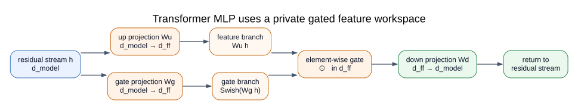

<!-- layout: title -->

# Muon：从优化几何到工业化，再到模型设计

一次 optimizer 如何穿过数学、稳定性、Megatron 与模型结构

<!-- notes:
正文按约 50 分钟设计，预留约 10 分钟讨论。

开场不先问 polar 或 Newton–Schulz。先建立共同问题：当 architecture、data 与算力大致确定后，optimizer 仍会改变有限预算内能够训练到什么模型，以及这条训练路径能否稳定、便宜地在集群上执行。
-->

---

<!-- layout: statement -->

## 为什么还要研究 optimizer？因为有限预算下，可表达不等于可训练

同一个 architecture 与 dataset，optimizer 会同时改变：

- 达到目标 loss 所需的 tokens 与 FLOPs；
- 哪些 feature directions 在有限 step 内被充分学习；
- weight、activation 与 attention logit 是否稳定；
- optimizer state、通信与 step critical path。

Muon 的价值不只在一组结果，而在于它把这些原本分散的问题连成了同一条工程链。

<!-- notes:
不要把“更好的 optimizer”定义成最终 loss 更低。对于大模型，更完整的问题是 time-to-loss、稳定性、内存、world-size invariance 和调参成本。
-->

---

## 这次分享沿五个问题前进

1. **数学前置**：gradient 如何在不同 geometry 下变成 update？
2. **前导思想**：为什么从逐元素统计走向 matrix-aware optimizer？
3. **演化路线**：2024–2026 每个 Muon 变体究竟修复了什么瓶颈？
4. **分布式实现**：为什么 Megatron 必须特殊布局；当前实现还缺什么？
5. **未来展望**：模型需要怎样的 spectrum、矩形层与 initialization？

<!-- notes:
这不是论文清单。后一个问题由前一个问题自然产生：矩阵 geometry 导致 shape scaling；shape 与语义又导致分布式约束；MuonR 最后把优化问题提前到了模型设计与初始化。
-->

---

<!-- layout: statement -->

## 第一部分｜“沿负梯度最快”偷偷假设了一个 norm

局部线性近似只告诉我们 loss 对 update 的响应：

$$
\mathcal L(W+\Delta)\approx \mathcal L(W)+\langle G,\Delta\rangle.
$$

真正决定“一步怎么走”的是允许的 update 集合：

$$
\Delta^*=\arg\min_{\|\Delta\|\le \eta}\langle G,\Delta\rangle.
$$

换一个 norm，最速下降方向就会改变。

> 来源：[Old Optimizer, New Norm](https://arxiv.org/abs/2409.20325)，§2

<!-- notes:
gradient 是 cotangent / sensitivity；update 是 parameter-space displacement。二者之间仍缺一项 geometry。

这里仅讨论当前点的一阶局部问题，不能直接推出完整深度网络训练轨迹的全局最优性。
-->

---

## 一个 $2\times2$ 例子已经能看见两种 optimizer geometry

设

$$
G=\begin{bmatrix}9&0\\0&1\end{bmatrix}.
$$

Frobenius budget 给出：

$$
\Delta_F=-\eta\frac{G}{\|G\|_F},
$$

仍保留约 $9:1$ 的两个方向幅度；spectral budget 给出：

$$
\Delta_2=-\eta I,
$$

两个 singular directions 都用满允许的 operator-norm 幅度。

<!-- notes:
这是全场的最小检查锚点。两个 budget 的单位球不同，所以不要直接比较两者的元素范数后宣称谁“更大”或“更正确”。
-->

---

<!-- layout: figure -->

## SVD 把矩阵 action 拆成输入方向、增益与输出方向


$$
M=U\Sigma V^\top,
\qquad
\operatorname{msign}(M)=UV^\top.
$$

Muon 保留当前 momentum 的左右 singular directions，并重写 update 的非零 singular values；它不是在 orthogonalize weight。

<!-- notes:
对 rank-deficient 矩阵，补空间方向不能由输入唯一决定。对矩形矩阵，结果是 partial isometry / semi-orthogonal，而不是两侧都等于单位阵。
-->

---

## spectral norm 的对偶问题直接给出 polar direction

若 $G=U\Sigma V^\top$，则 spectral norm 与 nuclear norm 对偶：

$$
\langle G,\Delta\rangle
\ge -\|G\|_*\,\|\Delta\|_2.
$$

在 $\|\Delta\|_2\le1$ 下，

$$
\Delta^*=-UV^\top
$$

取到下界。Muon 可以理解为：对 Linear 层选择与 operator norm 相联系的 steepest-descent map。

> 来源：[Scalable Optimization in the Modular Norm](https://arxiv.org/abs/2405.14813)；[Modular Duality in Deep Learning](https://arxiv.org/abs/2410.21265)

<!-- notes:
实际 Muon 对 momentum surrogate 而不是瞬时 gradient 做近似 polar，并叠加 Nesterov、finite-step NS、scale、decay 与 stochastic dynamics。

这不是 Hessian Newton step，也不是“谱范数约束一定优于 Adam”的定理。
-->

---

<!-- layout: figure -->

## Newton–Schulz 用 GEMM 近似 $UV^\top$，无需显式 SVD


先缩放 $X_0=M/(\|M\|_F+\varepsilon)$，再做少量 quintic iteration：

$$
X_{k+1}=aX_k+bX_kX_k^\top X_k+c(X_kX_k^\top)^2X_k.
$$

在 singular-value 坐标中，它退化为标量多项式 $x\mapsto ax+bx^3+cx^5$。

> 来源：[Muon 原始设计说明](https://kellerjordan.github.io/posts/muon/)；[msign 的 Newton–Schulz 迭代](https://spaces.ac.cn/archives/10922)

<!-- notes:
常见原始配置使用 5 steps 与系数 (3.4445, -4.7750, 2.0315)。重点不是背系数，而是认识到 coefficient、steps、normalization、transpose 方向、dtype 与乘法顺序共同定义具体 approximation。

更小的 polar error 不自动等于更好的 loss-vs-time。
-->

---

## 非方阵让原始 polar update 的元素 RMS 天然依赖 shape

对满秩 $m\times n$ polar factor $O$：

$$
\|O\|_F^2=\min(m,n),
$$

所以

$$
\operatorname{RMS}(O)
=\frac{\sqrt{\min(m,n)}}{\sqrt{mn}}
=\frac1{\sqrt{\max(m,n)}}.
$$

同一个 learning rate 落在不同 shape 上，不会得到同样大小的逐元素 update。

<!-- notes:
这页是数学部分通往 scalable recipe 的桥。方向被规范化以后，还必须回答每层究竟走多远。
-->

---

<!-- layout: comparison -->

## 第二部分｜AdamW、Shampoo 与 Muon 选择了不同的优化单位

|  | AdamW | Shampoo | Muon |
|---|---|---|---|
| 核心对象 | scalar coordinates | row / column covariance | semantic matrix |
| 主要变换 | element-wise second moment | two-sided inverse-root preconditioning | momentum 的 polar-like transform |
| 典型持久 state | 两组逐元素 moments | 左右 Kronecker factors | 一组 momentum |
| 分片难点 | state 可按 byte 切分 | factors 与 tensor axes 绑定 | full-matrix transform 非线性 |

矩阵结构并不是 Muon 突然发明的；Muon 的不同在于用较低 state 把 operator geometry 推到 update 中心。

> 来源：[Shampoo](https://arxiv.org/abs/1802.09568)；[Muon](https://kellerjordan.github.io/posts/muon/)

<!-- notes:
不要讲成线性进化史：Shampoo、modular norm 与 Muon 是相互交叉的思想线。比较重点是 transformed object、state 和 failure mode。
-->

---

## modular norm 把 layer function 变成 optimizer 的设计输入

一个 Linear 层不是孤立的 $mn$ 个数字，而是一个 operator：

$$
x\mapsto Wx.
$$

设计顺序可以反过来：

$$
\text{layer function}
\rightarrow
\text{允许的 feature disturbance}
\rightarrow
\text{parameter norm}
\rightarrow
\text{dual update map}.
$$

这解释了为什么 Linear、Embedding、Normalization 与 bias 不必共享同一种 optimizer geometry。

> 来源：[Scalable Optimization in the Modular Norm](https://arxiv.org/abs/2405.14813)；[Deriving Muon](https://jeremybernste.in/writing/deriving-muon)

<!-- notes:
主讲只保留这一层直觉。完整 modular duality、layer composition norm 与大宽度 scaling 放在课后阅读。
-->

---

<!-- layout: figure -->

## Muon 把 matrix-aware geometry 压成一条低状态 update pipeline


$$
M_t=\mu M_{t-1}+G_t,
\qquad
O_t\approx\operatorname{msign}(M_t),
\qquad
W_{t+1}=(1-\eta\lambda)W_t-\eta s(m,n)O_t.
$$

<!-- notes:
实际 recipe 可能使用 Nesterov combination。图中的顺序不能随意交换：对 micro-batch gradient 各自做 NS 再相加，不等于对最终 accumulated gradient 做一次 NS；fused QKV 先拆还是后拆也会改变 optimizer。
-->

---

## Newton–Schulz 只是一段 kernel；算法合同还包括四件事

- **Parameter routing**：hidden Linear weights 与 embedding、head、norm、bias 分组；
- **Semantic matrix boundary**：fused QKV、SwiGLU 与 experts 怎样拆成逻辑矩阵；
- **Scale 与 decay**：global shape、Update RMS matching、decoupled weight decay；
- **Distributed semantics**：physical shard 不能偷偷重定义 polar 的对象。

因此，“代码里调用了 NS”远不足以证明运行的是同一个 Muon。

<!-- notes:
两条高频纠错一起完成：Muon 不 orthogonalize weight；Muon 也通常不替代所有 AdamW parameter groups。

生产代码应断言每个 trainable parameter 恰好进入一个 optimizer group。
-->

---

<!-- layout: figure -->

## 第三部分｜Muon 的演化是一连串瓶颈被依次暴露


主线不是版本号，而是：

$$
\text{direction}
\rightarrow \text{scale}
\rightarrow \text{stability}
\rightarrow \text{distributed semantics}
\rightarrow \text{architecture questions}.
$$

<!-- notes:
时间线只放主节点；其他变体按改变的层次归类。Modular norm 早于正式 Muon blog，不要讲成发布后的理论附会。
-->

---

## Moonlight 发现：方向统一以后，不同 shape 仍然走得不一样远

Scalable Muon 增加了四个关键合同：

1. decoupled weight decay；
2. shape-dependent scale，抵消 $1/\sqrt{\max(m,n)}$；
3. 将 Muon Update RMS 匹配到 AdamW 经验范围；
4. 明确混合 optimizer 的 parameter routing。

常见 recipe 取约 $0.2\sqrt{\max(m,n)}$，使理想 polar update 的元素 RMS 接近 0.2。

> 来源：[Muon is Scalable for LLM Training](https://arxiv.org/html/2502.16982v1)，§2.2

<!-- notes:
0.2 是作者实验选择与 AdamW update RMS matching 常数，不是 polar theorem 推出的普遍最优值。

参数如何 reshape、QKV 是否拆分、scale 使用 local 还是 global shape，都会改变实际 update。
-->

---

<!-- layout: figure -->

## weight decay 修复的是长训练中的 drift，不只是早期 loss


作者在 800M、100B-token 设置中观察到：vanilla Muon 早期下降更快，但带 weight decay 的 Muon 在 over-train 区间取得更低 validation loss。

> 来源：[Muon is Scalable for LLM Training](https://arxiv.org/html/2502.16982v1#S2.F2)，Figure 2；作者实验

<!-- notes:
曲线支持 weight decay 是 scalable recipe 的重要组成，但不能单独证明 weight/output RMS growth 是全部因果机制。
-->

---

<!-- layout: figure -->

## Moonlight 报告 compute efficiency 提升，但结论范围必须跟着曲线走


作者在其 compute-optimal dense Llama-family 设置中报告：Muon 匹配 AdamW performance 约需 **52% training FLOPs**。

这不是任意模型、数据、schedule、batch size 与实现上都成立的“通用 2×”。

> 来源：[Muon is Scalable for LLM Training](https://arxiv.org/html/2502.16982v1#S3.F3)，Figure 3；[Practical Efficiency of Muon](https://arxiv.org/abs/2505.02222)

<!-- notes:
明确说“作者报告”。FLOPs、wall-clock 和 time-to-loss 是不同结论；这张图主要回答 compute efficiency，不回答 Megatron 上的 realized overhead。
-->

---

<!-- layout: figure -->

## MuonClip 把 attention instability 变成 optimizer 外环反馈


若 head $h$ 的最大正 logit 为 $S_{\max}^h$：

$$
\gamma_h=\min\left(1,\frac{\tau}{S_{\max}^h}\right),
\qquad
W_q^h,W_k^h\leftarrow\sqrt{\gamma_h}\,(W_q^h,W_k^h).
$$

它不裁当前 score，也不是 gradient clipping；修正作用于下一 step。

> 来源：[Kimi K2 Technical Report](https://arxiv.org/html/2507.20534v2)，§2.1

<!-- notes:
MuonClip 是 scalable Muon recipe 加 QK-Clip，不只是 QK-Clip。K2 的 threshold 100 与两侧对称缩放是该训练配方，不应抽象为唯一标准。

MLA 的 shared rotary key 不能机械套用普通 per-head K scaling。
-->

---

<!-- layout: comparison -->

## K2 Figure 2 展示 failure pattern 与稳定 run，不是同配置 A/B

| vanilla Muon：9B active / 53B total | Kimi K2 + MuonClip：32B active / 1.04T total |
|---|---|
|  |  |

模型规模、总 steps 与 y-axis 都不同；两图不能读成 clip-off / clip-on 的严格对照。

> 来源：[Kimi K2](https://arxiv.org/html/2507.20534v2#S2.F2)，Figure 2；作者生产训练观察

<!-- notes:
可以口头补充作者的小模型 ablation 报告 validation loss 近似重合，但这只支持该设置未测到明显质量损害。不能把 K2 的最终能力或 zero loss spike 因果归给单一组件。
-->

---

## 2025–2026 的分支修改了 Muon pipeline 的不同位置

| 改变的层次 | 代表工作 | 核心问题 |
|---|---|---|
| polar / msign kernel | Polar Express、Gram NS、Turbo-Muon | 怎样更快得到同一或近似方向？ |
| update statistics | AdaMuon、NorMuon、Muon²、Newton-Muon | magnitude、second moment、curvature 放在哪里？ |
| parameter constraint | Muown、Pion、MuonR | weight spectrum 是否也应受约束？ |
| distributed semantics | Dion、Canzona、DMuon | 谁对哪个完整矩阵做一次 update？ |
| higher-order object | Tensorion | matrix geometry 能否推广到 tensor？ |

这些工作不能排成单一冠军榜；它们改变的对象、state 与 baseline 不同。

<!-- notes:
主讲不逐篇报数字。Polar Express / Gram NS 可不改变 optimizer state；Muon² full 会重新引入较重 second-moment state；Dion 可能改变 update 表示；DMuon 主要重排执行位置。
-->

---

<!-- layout: figure -->

## MuonR 固定 $\Sigma$、旋转 $U,V$，把训练问题提前到了初始化


$$
W'=LWR,
\qquad L^\top L=I,
\qquad R^\top R=I,
$$

所以 $\sigma_i(W')=\sigma_i(W)$。代价是：初始化时就必须决定每个矩阵的完整 singular-value distribution。

> 来源：[流形上的最速下降：6. Muon + 双旋转](https://spaces.ac.cn/archives/11777)

<!-- notes:
截止 2026-07-20，MuonR 是博客提出的推导与早期研究设想，不是已有大规模训练验证的成熟 recipe。

可补充“中途切换”想法：先用普通 Muon，谱范数/F 范数异常增长后切换 MuonR 维稳；切换仍需对齐 update norm。

这页只交代历史与机制。它引出的 architecture / initialization 问题将在第五部分展开。
-->

---

<!-- layout: figure -->

## 第四部分｜physical shard 不能偷偷重定义 logical matrix


一般而言：

$$
\operatorname{msign}
\begin{pmatrix}M_0\\M_1\end{pmatrix}
\neq
\begin{pmatrix}
\operatorname{msign}(M_0)\\
\operatorname{msign}(M_1)
\end{pmatrix}.
$$

差异来自被变换对象不同，不是浮点误差。

<!-- notes:
用最小数值例子口头检查：M=[[2,0],[1,1]] 的 full polar 约为 [[0.9487,-0.3162],[0.3162,0.9487]]；逐行归一化后拼接是 [[1,0],[0.7071,0.7071]]。

Muon 可以分布式计算；要求是某处获得完整矩阵，或通过 global Gram 等数学等价信息完成同一 transform。
-->

---

## DP、TP、EP 切开的不是同一个对象

| 并行维度 | 物理上切开的对象 | Muon 必须回答的问题 |
|---|---|---|
| DP / ZeRO | optimizer state 与 grad/param buffer | 哪个 rank 拥有一次完整 parameter update？ |
| TP | Linear operator 的输入或输出轴 | local polar 是否只是 blockwise approximation？ |
| EP | experts 与 expert 内部 matrices | 哪个 expert-TP/DP group 定义 global matrix？ |
| PP | 当前 stage 的层集合 | checkpoint 与 owner metadata 怎样跟随 stage？ |

先写清 `semantic/global shape`，再谈 `physical/local shard shape`。

<!-- notes:
LayerWise owner 在 DP 维度拥有的是完整 TP-local parameter，不会自动恢复 TP 之前的全局矩阵。DP ownership 与 TP matrix semantics 是两个正交问题。
-->

---

<!-- layout: figure -->

## Megatron 先解决 DP ownership，再单独选择 TP semantics


- 每个 DP owner 保存一个完整 **TP-local parameter** 的 FP32 master 与 momentum；
- global matrix 是否被完整 orthogonalize，仍由 `muon_tp_mode` 决定；
- PP 与 EP 再限定参数集合和 process group。

> 固定代码版本：Megatron-LM `0823c731ed7d…`，信息截点 2026-07-20

<!-- notes:
不要说 owner 拥有“全局 TP 之前的完整权重”。图中横向是 TP partition，纵向是 DP replicas；每个 TP column 内圈出的 owner 只解决 state ownership。
-->

---

<!-- layout: figure -->

## 预计算 layout 让 reduce-scatter 把完整 TP-local gradient 交给 owner


```text
backward
  → DP reduce-scatter
  → owner: FP32 momentum + TP-aware NS + update
  → Muon / Adam parameter buffers separately all-gather
  → next forward
```

> 代码：[layout precompute](https://github.com/NVIDIA/Megatron-LM/blob/0823c731ed7d793aef047b6a64f2dbbf32bf6e2c/megatron/training/training.py#L1580-L1640)；[LayerWise optimizer](https://github.com/NVIDIA/Megatron-LM/blob/0823c731ed7d793aef047b6a64f2dbbf32bf6e2c/megatron/core/optimizer/layer_wise_optimizer.py)

<!-- notes:
二维非 embedding/output 参数先被标为 LayerWise-managed；layout 保证完整 TP-local tensor 不跨 DP shard boundary。Muon buffer 使用 whole-tensor ownership，Adam buffer 继续 byte-level DistOpt sharding。

最终结构可理解为 ChainedOptimizer[LayerWiseDistributedOptimizer[Muon], DistributedOptimizer[Adam]]。
-->

---

<!-- layout: comparison -->

## Megatron 的三种 TP mode 是三种不同的 optimizer 取舍

| mode | NS 看见的对象 | TP 额外通信 | 语义与代价 |
|---|---|---:|---|
| `blockwise` | local $M_r$ | 无 | **默认**；便宜，但结果依赖 partition |
| `duplicated` | all-gather 后的 $M$ | 每矩阵一次 AG | full semantics；每个 rank 重复 NS |
| `distributed` | local $X_r$ + global Gram | normalization + 每轮 Gram AR | 保留全局耦合；collective 进入每轮 iteration |

若 $X=[X_0|\cdots|X_{T-1}]$，distributed mode 使用：

$$
XX^\top=\sum_rX_rX_r^\top.
$$

> 代码：[默认配置](https://github.com/NVIDIA/Megatron-LM/blob/0823c731ed7d793aef047b6a64f2dbbf32bf6e2c/megatron/core/optimizer/optimizer_config.py#L282)；[TP path](https://github.com/NVIDIA/Megatron-LM/blob/0823c731ed7d793aef047b6a64f2dbbf32bf6e2c/megatron/core/optimizer/emerging_optimizers.py#L188-L290)

<!-- notes:
blockwise 不是实现 bug，而是性能优先的显式 approximation；但它必须成为实验配方的一部分，不能隐藏在 infra 默认值里。

改变 TP size 会同时改变 local singular geometry 和 local-shape scale。duplicated/distributed 只需在数值容差内匹配 reference，不要求 BF16 bitwise 一致。
-->

---

## 当前实现的第一类缺口：parameter semantics 仍靠 heuristic

- 默认路由近似为“二维且不是 embedding/output $\Rightarrow$ Muon”；router、gate 等角色可能被误纳入；
- fused QKV 依赖参数名识别语义 block；
- `duplicated/distributed` 缺少 `partition_dim` 时会静默退化为 local path；
- `--muon-scalar-optimizer lion` 尚未接入实际 fallback，生产路径仍硬编码 Adam。

代码能跑，不代表参数被按预期的数学对象优化。

> 代码：[parameter routing](https://github.com/NVIDIA/Megatron-LM/blob/0823c731ed7d793aef047b6a64f2dbbf32bf6e2c/megatron/core/optimizer/layer_wise_optimizer.py#L37-L72)；[partition metadata](https://github.com/NVIDIA/Megatron-LM/blob/0823c731ed7d793aef047b6a64f2dbbf32bf6e2c/megatron/core/optimizer/emerging_optimizers.py#L245-L290)

<!-- notes:
这些是固定 commit 的代码审计结论。未来版本可能修复，因此页面必须保留 commit 与 cutoff。
-->

---

## 当前实现的第二类缺口：layout 平衡了 bytes，没有平衡 NS critical path

owner assignment 使用 `numel` 做 LPT bin packing，但 Direct NS 主项更接近：

$$
C_{\mathrm{NS}}=\Theta(kq^2p),
\qquad q=\min(m,n),\quad p=\max(m,n).
$$

- 相同 numel、不同 aspect ratio 的矩阵，NS 成本可能差很多；
- whole-tensor layout 引入 padding 与额外 all-gather bytes；
- 最大单矩阵仍是不可分割 critical path；
- 固定版本不支持 FSDP、多 distributed-optimizer instances 与 optimizer-step overlap；部分 expert fallback 尚未接线。

<!-- notes:
4096×4096 与 1024×16384 都约 16M elements，但按 q²p 主项前者约为后者 4×。这只是解释排序指标失配，不是精确 wall-clock 预测。

legacy torch checkpoint 的 hybrid path 还有静态可疑点；没有运行复现前只放 notes，不在页面上定级为已验证 bug。
-->

---

## 正确性测试应证明 world-size invariance，而不只是“weight 变了”

至少需要四类 reference：

1. `duplicated/distributed` 重建 update，匹配单卡 full-matrix reference；
2. 明确验证 `blockwise` 与 full reference **different by design**；
3. 多 step 对照 momentum、decay、gradient clipping、QKV split 与空 owner；
4. TP×DP×EP 组合、checkpoint reshard 与不同 matrix aspect ratios。

当前部分 TP tests 名为 `same_result` / `different_result`，实际只断言参数发生了更新。

> 代码：[现有 TP tests](https://github.com/NVIDIA/Megatron-LM/blob/0823c731ed7d793aef047b6a64f2dbbf32bf6e2c/tests/unit_tests/test_emerging_optimizers.py#L459-L540)

<!-- notes:
数学语义测试与性能测试必须分开。throughput 无法替代 correctness；反过来，reference error 很小也不说明 realized overhead 可接受。
-->

---

<!-- layout: figure -->

## DMuon 让每个完整矩阵只在 authoritative owner 上执行一次 NS


1. backward gradient average-reduce 到 owner；
2. owner 保存 parameter / momentum state 并运行 Muon；
3. 更新后的 packed parameter 异步 publication；
4. 下一次 layer 消费前才等待 materialization。

DMuon 改的是 ownership、layout、通信时机与 overlap，目标不是发明新的 update direction。

> 来源：[DMuon](https://arxiv.org/abs/2606.27153)，§3–4

<!-- notes:
关键问题从“所有 rank 怎样做同一个 NS”变成“谁在何时对哪一个矩阵只做一次 NS”。大矩阵形成 owner critical path，小 expert matrices 则需要 batching。
-->

---

<!-- layout: figure -->

## Gram-space NS 把多轮工作留在短边方阵里


当 $X_k\in\mathbb R^{m\times n}$ 且 $m\le n$：

$$
G_k=X_kX_k^\top,\qquad
P_k=aI+bG_k+cG_k^2,\qquad
X_{k+1}=P_kX_k.
$$

Direct NS 的宽矩阵主项约为 $O(qm^2n)$；Gram reformulation 约为 $O(m^2n+qm^3)$。

<!-- notes:
exact arithmetic 下可得到与相同 polynomial Direct NS 等价的 recurrence；低精度乘法次序改变后只要求 tolerance 与训练行为一致。

m>n 时使用右 Gram XᵀX，始终把 cubic term 放在短维。
-->

---

<!-- layout: comparison -->

## DMuon 的大幅加速是相对 naive distributed Muon 的 workload-specific 结果

| Optimizer compute | End-to-end throughput |
|---|---|
|  |  |

作者在四个 workload 上报告：optimizer step **6.85–163×**、end-to-end **1.48–3.01×**；Figure 8 展示 Wall-OSS 在 1–256 张 A800 上的 scaling。

> 来源：[DMuon](https://arxiv.org/html/2606.27153v1#S5.F8)，Figure 8 / Table 1；作者报告

<!-- notes:
baseline 是论文定义的 vanilla gather-then-compute Muon，不是 AdamW。near-Adam overhead 不是跨硬件、shape、并行模式的常数。
-->

---

<!-- layout: comparison -->

## Megatron 与 DMuon 追求同一语义，但系统调度的成熟度不同

| 轴 | Megatron 固定版本 | DMuon 论文方案 |
|---|---|---|
| DP state | whole TP-local parameter owner | authoritative owner + packed layout |
| TP semantics | blockwise / duplicated / distributed | nested ownership 与 full-matrix reconstruction |
| NS backend | Direct NS；distributed mode 每轮 global Gram | Gram-space + symmetric kernels |
| overlap | 复用 DDP / DistOpt buffer path | fine-grained routing 与 async publication |
| 主要未解问题 | semantic metadata、coverage、tests | 最大 owner critical path、load balance、integration cost |

真正的验收标准是：**同一 global matrix 的 update、可控误差、world-size invariance 与 time-to-loss 同时成立。**

<!-- notes:
DMuon 不是“下一代 Muon 算法”；更准确的定位是 mathematically equivalent reformulation 加系统 runtime 优化。Megatron 的 blockwise mode 则明确改变算法语义。
-->

---

<!-- layout: statement -->

## 第五部分｜Muon 的下一步，也许不是另一个 optimizer

Muon 已经迫使我们把矩阵视为完整对象；MuonR 又进一步问：

> 如果 optimizer 不再自由修改 weight spectrum，模型设计是否必须先回答“每个矩阵应该长什么样”？

这把研究视角从 update 推向三者的共同设计：

$$
\text{optimizer}
\longleftrightarrow
\text{parameterization / initialization}
\longleftrightarrow
\text{architecture}.
$$

<!-- notes:
这一部分是研究议程，不是成熟结论。明确区分 source-reported observation、可检查推导和开放问题。
-->

---

<!-- layout: figure -->

## “模型需要什么 spectrum”必须先说清是哪一层 spectrum


$$
\operatorname{spec}(W)
\neq
\operatorname{spec}(J_{\text{block}})
\neq
\operatorname{spec}(J_{\text{network}}).
$$

weight spectrum 直接描述参数；信号传播、gradient stability 与 trainability 往往更接近后两者。

> 来源：[Resurrecting the Sigmoid through Dynamical Isometry](https://arxiv.org/abs/1711.04735)；[A Spectral Condition for Feature Learning](https://arxiv.org/abs/2310.17813)

<!-- notes:
RMSNorm、activation/gating、residual path 与相邻矩阵缩放对 function 有共同影响。单个 W 的谱不是功能的完整不变量。
-->

---

<!-- layout: figure -->

## Muon 权重的谱更平，是观察；“越平越好”仍是开放问题


Moonlight 作者观察到多数 weight groups 的 singular-value entropy 高于 AdamW；这说明 optimizer 与最终 weight geometry **empirically associated**，但没有证明高 entropy 导致更高效率。

苏剑林在一个自由度模型中得到参考位置：

$$
H^*\approx \log n-(1-\gamma)\approx\log n-0.4228,
$$

它是启发性分析框架，不是 universal optimum。

> 来源：[Muon is Scalable](https://arxiv.org/html/2502.16982v1#S3.SS4)，Figure 4；[矩阵参数的奇异值熵越高越好吗？](https://spaces.ac.cn/archives/11767)

<!-- notes:
未来实验不应只问 entropy。至少同时控制或记录 overall scale、condition number、effective rank、tail shape 与 outliers，并按 Q/K/V/O、MLP up/gate/down、router 等角色分组。
-->

---

<!-- layout: figure -->

## MLP 的升维—非线性—降维，是每层私有的 feature workspace



简单 MLP：

$$
h\mapsto W_{\rm down}\,\phi(W_{\rm up}h).
$$

SwiGLU：两个升维分支产生 feature 与 gate，逐元素选择后再回到 residual stream。

没有非线性时 $W_{\rm down}W_{\rm up}$ 可以合并；正是 activation / gating 让扩展空间成为 token-dependent computation。

> 来源：[Attention Is All You Need](https://arxiv.org/abs/1706.03762)；[GLU Variants Improve Transformer](https://arxiv.org/abs/2002.05202)

<!-- notes:
residual stream 是各层共享的通信空间；d_ff 是当前 block 临时使用的工作宽度。扩展提供更多 feature slots，gating 决定每个 token 使用哪些 slots。
-->

---

## 不是“模型不能只用方阵”，而是矩形 shape 表达了功能取舍

若 $W_{\rm up}\in\mathbb R^{d_{ff}\times d}$ 且 $d_{ff}>d$，可追求近似等距嵌入：

$$
W_{\rm up}^\top W_{\rm up}\approx cI_d.
$$

若 $W_{\rm down}\in\mathbb R^{d\times d_{ff}}$，可追求 row geometry：

$$
W_{\rm down}W_{\rm down}^\top\approx c'I_d.
$$

全方阵网络当然可以构造，但要用深度、MoE、structured transform 或其他机制重新购买 feature capacity 与 compute efficiency。

<!-- notes:
“矩形矩阵是残缺方阵”是错误直觉。semi-orthogonality 的哪一侧成立取决于 shape；这也正是 Muon scale 和 TP partition 必须保留 global shape semantics 的原因。
-->

---

<!-- layout: comparison -->

## 更好的初始化目标，可能是整个 block 的 Jacobian，而非逐个 weight variance

| 思路 | 主要控制对象 |
|---|---|
| Xavier / He | activation 与 gradient 的平均方差 |
| orthogonal initialization | 单个 $W$ 的 singular values |
| dynamical isometry | network / block Jacobian spectrum |
| μP / spectral scaling | width 变化下 weight 与 update 的尺度 |
| MuonR 式 parameterization | 预设 $\Sigma$，优化 singular vectors |

对简单 MLP：

$$
J_{\rm MLP}=W_{\rm down}D_\phi W_{\rm up}.
$$

分别把两个 $W$ 初始化得“很好”，并不保证整个 $J_{\rm MLP}$ 的谱好。

<!-- notes:
SwiGLU 的 Jacobian还包含两个分支的 product rule；Transformer 还需一起考虑 RMSNorm、residual scaling、attention branch 和 depth。

orthogonal initialization 的理论收益通常有架构与假设范围；不要宣传为 Transformer 通用答案。
-->

---

## 一个可证伪的研究计划：同时控制初始谱与训练中的谱自由度

**初始化 sweep**

- flat / semi-orthogonal；random-matrix bulk；power-law / Zipf；low-rank + outliers；
- 匹配 Frobenius norm、spectral norm、parameter RMS 与 compute。

**optimizer intervention**

- AdamW；Muon；MuonR；soft spectral regularization；分别更新 $U,V$ 与 $\Sigma$。

**同时观测**

- weight spectra、activation covariance、block Jacobian、effective rank；
- MaxLogit、gradient/update RMS、time-to-loss、world-size invariance。

<!-- notes:
关键是 intervention：仅比较 AdamW 与 Muon 的最终谱仍是相关性。矩阵角色和训练阶段应作为实验变量，而不是把所有层 macro-average 后寻找一个数字。
-->

---

<!-- layout: statement -->

## Muon 最重要的遗产，可能不是一个更快的 optimizer

1. **数学上**：gradient 到 update 之间必须选择 geometry；
2. **工业上**：scale、stability、semantic matrix 与 distributed runtime 共同定义 optimizer；
3. **未来上**：当 optimizer 尊重矩阵，architecture 与 initialization 也需要回答矩阵应具有怎样的结构。

> 模型的基本对象不只是一堆 scalar parameters，而是具有几何结构、功能角色与分布式语义的矩阵。

<!-- notes:
回扣开场：研究 optimizer 不是为多一个 class name，而是重新分配有限训练预算、稳定性余量和系统成本。

讨论题可以留给现场：如果只允许选择一个可观测量来指导下一代初始化，应该是 weight entropy、block Jacobian condition number，还是 feature covariance？
-->

---

## Appendix A｜如何阅读这套 slides 中的证据

| 页面措辞 | 含义 |
|---|---|
| **公式 / 本文推导** | 可从已写假设直接检查 |
| **代码行为** | 固定 commit 下的静态或运行检查 |
| **作者报告** | 论文或技术报告在其 workload 上给出的结果 |
| **跨论文比较** | baseline、预算与实现可能不同，不形成直接排名 |
| **早期构想 / 仍待验证** | blog、v1 preprint 或尚无大规模独立复现 |

信息截点：**2026-07-20**。Megatron 分析固定于 `0823c731ed7d793aef047b6a64f2dbbf32bf6e2c`。

<!-- notes:
Appendix 不必在正文逐页讲。把它留作 handout，帮助听众区分“推导成立”和“训练结论已证实”。
-->

---

## Appendix B｜苏剑林博客：最短主线先回答四个问题

1. **它改变了什么？**
   [Muon优化器赏析：从向量到矩阵的本质跨越](https://spaces.ac.cn/archives/10592)
2. **它怎样只用 GEMM 计算？**
   [Newton–Schulz（上）](https://spaces.ac.cn/archives/10922) · [（下）](https://spaces.ac.cn/archives/10996)
3. **它怎样变成 scalable recipe？**
   [Muon续集](https://spaces.ac.cn/archives/10739) · [Muon优化器指南](https://spaces.ac.cn/archives/11416)
4. **它怎样处理大规模 instability？**
   [QK-Clip](https://spaces.ac.cn/archives/11126) · [为什么 Adam 的 Update RMS 是 0.2？](https://spaces.ac.cn/archives/11267)

最短阅读目标：能区分 **矩阵语义、数值近似、scaling recipe、稳定性控制**。

---

## Appendix C｜Muon 直接演化链：2024–2025

**起点与 scale**

- 2024-12：[Muon优化器赏析](https://spaces.ac.cn/archives/10592)
- 2025-02：[Muon续集](https://spaces.ac.cn/archives/10739)
- 2025-03：[高阶MuP：谱条件缩放](https://spaces.ac.cn/archives/10795)

**msign / matrix function**

- 2025-05/06：[Newton–Schulz（上）](https://spaces.ac.cn/archives/10922) · [（下）](https://spaces.ac.cn/archives/10996)
- 2025-06：[mclip（上）](https://spaces.ac.cn/archives/11006) · [msign 的导数](https://spaces.ac.cn/archives/11025) · [mclip（下）](https://spaces.ac.cn/archives/11059)

**stability 与 manifold**

- 2025-07：[QK-Clip](https://spaces.ac.cn/archives/11126)
- 2025-08：[Muon + 正交](https://spaces.ac.cn/archives/11215) · [Muon + Stiefel](https://spaces.ac.cn/archives/11221) · [Muon + 谱球面](https://spaces.ac.cn/archives/11241)
- 2025-09：[重新思考学习率与 Batch Size（三）：Muon](https://spaces.ac.cn/archives/11285)
- 2025-11：[对偶梯度下降](https://spaces.ac.cn/archives/11388) · [Muon优化器指南](https://spaces.ac.cn/archives/11416)

---

## Appendix D｜Muon 直接演化链：2026

**scale 与流式 numerical backend**

- [为什么我们偏爱各向同性？](https://spaces.ac.cn/archives/11549)
- [MuP之上：2. 线性层与最速下降](https://spaces.ac.cn/archives/11605)
- 流式幂迭代：[1](https://spaces.ac.cn/archives/11654) · [2](https://spaces.ac.cn/archives/11673) · [3](https://spaces.ac.cn/archives/11697) · [4](https://spaces.ac.cn/archives/11710) · [5](https://spaces.ac.cn/archives/11719)

**控制 weight 与 spectrum**

- [MuP之上：4. 坚守参数的稳定性](https://spaces.ac.cn/archives/11729)
- [如何更科学地估计矩阵的谱范数？](https://spaces.ac.cn/archives/11736)
- [矩阵参数的奇异值熵越高越好吗？](https://spaces.ac.cn/archives/11767)
- [官方版 Muon 为什么多一个 `max(1,·)`？](https://spaces.ac.cn/archives/11772)
- [Muon + 双旋转](https://spaces.ac.cn/archives/11777)
- [矩阵函数近似中的暴力美学](https://spaces.ac.cn/archives/11787)

> 上述后半部分以推导、分析与新提案为主，不等同于大规模训练共识。

---

## Appendix E｜Adam、learning rate 与训练稳定性路线

**Adam 与 adaptive update**

- [从 Hessian 近似看自适应学习率优化器](https://spaces.ac.cn/archives/10588)
- [为什么 Adam 的 Update RMS 是 0.2？](https://spaces.ac.cn/archives/11267)
- AdamW Weight RMS：[上](https://spaces.ac.cn/archives/11307) · [下](https://spaces.ac.cn/archives/11404)
- [Adam 的最优超参数是 $\beta_1=\beta_2$？](https://spaces.ac.cn/archives/11593)

**LR、batch size、decay 与 clipping**

- [Batch Size 增大时，学习率如何变化？](https://spaces.ac.cn/archives/10542)
- [Adam 的 epsilon 如何影响 LR Scaling Law？](https://spaces.ac.cn/archives/10563)
- [为什么 gradient clipping 默认模长是 1？](https://spaces.ac.cn/archives/10657)
- [重新思考学习率与 Batch Size（一）](https://spaces.ac.cn/archives/11260)
- [滑动平均视角下的 weight decay 和 learning rate](https://spaces.ac.cn/archives/11459)

---

## Appendix F｜MuP、谱范数与 initialization 路线

- [初探MuP：超参数的跨模型尺度迁移规律](https://spaces.ac.cn/archives/10770)
- [MuP之上：1. 好模型的三个特征](https://spaces.ac.cn/archives/11340)
- [高阶MuP：谱条件缩放](https://spaces.ac.cn/archives/10795)
- [MuP之上：2. 线性层与最速下降](https://spaces.ac.cn/archives/11605)
- [MuP之上：3. 特殊情况特殊处理](https://spaces.ac.cn/archives/11647)
- [随机矩阵的谱范数快速估计](https://spaces.ac.cn/archives/11335)
- [从谱范数梯度到新式 weight decay](https://spaces.ac.cn/archives/10648)
- [SVD 的导数](https://spaces.ac.cn/archives/10878)
- [为什么我们偏爱各向同性？](https://spaces.ac.cn/archives/11549)

扩展入口：[Muon 标签归档](https://spaces.ac.cn/content.html?tag=muon) · [优化器标签归档](https://spaces.ac.cn/tag/%E4%BC%98%E5%8C%96%E5%99%A8/) · [全站归档](https://spaces.ac.cn/content.html)

<!-- notes:
Scientific Spaces 的标签并不完全一致，Muon 标签页也曾存在缓存滞后。这里交叉使用分类、标签与年月归档，检索截点为 2026-07-20；仍可能漏掉标题与标签都未指向 optimizer、但思想相邻的文章。
-->

---

## Appendix G｜Megatron 代码走读从这五个入口开始

- [`optimizer_config.py`](https://github.com/NVIDIA/Megatron-LM/blob/0823c731ed7d793aef047b6a64f2dbbf32bf6e2c/megatron/core/optimizer/optimizer_config.py#L250-L335)：Muon flags 与默认 TP mode；
- [`emerging_optimizers.py`](https://github.com/NVIDIA/Megatron-LM/blob/0823c731ed7d793aef047b6a64f2dbbf32bf6e2c/megatron/core/optimizer/emerging_optimizers.py)：parameter routing、QKV split、TP-aware NS；
- [`layer_wise_optimizer.py`](https://github.com/NVIDIA/Megatron-LM/blob/0823c731ed7d793aef047b6a64f2dbbf32bf6e2c/megatron/core/optimizer/layer_wise_optimizer.py)：whole-tensor layout、owner state、parameter sync；
- [`param_and_grad_buffer.py`](https://github.com/NVIDIA/Megatron-LM/blob/0823c731ed7d793aef047b6a64f2dbbf32bf6e2c/megatron/core/distributed/param_and_grad_buffer.py)：reduce-scatter / all-gather 如何落到 buffers；
- [`test_emerging_optimizers.py`](https://github.com/NVIDIA/Megatron-LM/blob/0823c731ed7d793aef047b6a64f2dbbf32bf6e2c/tests/unit_tests/test_emerging_optimizers.py)：当前 tests 真正断言了什么。

建议按一条 invariant 贯穿代码：

> 同一个 semantic matrix 在不同 TP/DP layout 下，重建后的 update 是否匹配 reference？
