<!-- layout: title -->

# Muon：从优化几何到工业化，再到模型设计

一次优化器（optimizer）如何穿过数学、稳定性、Megatron 与模型结构

<!-- notes:
正文按约 50 分钟设计，预留约 10 分钟讨论。

开场不先问 polar 或 Newton–Schulz。先建立共同问题：当 architecture、data 与算力大致确定后，optimizer 仍会改变有限预算内能够训练到什么模型，以及这条训练路径能否稳定、便宜地在集群上执行。
-->

---

<!-- layout: statement -->

## 为什么还要研究优化器？因为“模型能表达”不等于“有限预算内能训练出来”

同一个模型结构（architecture）和训练数据集（dataset），优化器会同时改变：

- 达到目标损失（loss）所需的训练数据量与计算量；
- 哪些特征方向（feature directions）能在有限更新步内被充分学习；
- 参数、激活值与注意力分数是否稳定；
- 优化器状态、通信量与每步最慢的关键路径。

Muon 的价值不只在一组结果，而在于它把这些原本分散的问题连成了同一条工程链。

<!-- notes:
不要把“更好的 optimizer”定义成最终 loss 更低。对于大模型，更完整的问题是 time-to-loss、稳定性、内存、world-size invariance 和调参成本。
-->

---

## 这次分享沿五个问题前进

1. **数学前置**：梯度如何在不同几何约束下变成参数更新？
2. **前导思想**：为什么从逐元素统计走向“把矩阵作为整体”的优化器？
3. **演化路线**：2024–2026 每个 Muon 变体究竟修复了什么瓶颈？
4. **分布式实现**：为什么 Megatron 必须特殊布局；当前实现还缺什么？
5. **未来展望**：模型需要怎样的权重谱、Jacobian 与初始化？

<!-- notes:
这不是论文清单。后一个问题由前一个问题自然产生：矩阵 geometry 导致 shape scaling；shape 与语义又导致分布式约束；MuonR 最后把优化问题提前到了模型设计与初始化。

建议节奏：开场 3 分钟；数学前置 12 分钟；前导思想 5 分钟；演化路线 10 分钟；分布式实现 15 分钟；未来与总结 5 分钟。总计约 50 分钟，留 10 分钟讨论。
-->

---

<!-- layout: statement -->

## 第一部分｜“沿负梯度最快”之前，必须先说“一步最多能走多远”

梯度只描述局部敏感度；最快下降方向还取决于我们怎样度量一次参数变化。

> 同一个梯度，换一种范数约束，最速下降更新就会改变。

<!-- notes:
这一页只提出问题，不提前使用尚未定义的符号。后面先给符号表，再写局部线性问题。
-->

---

## 本节符号：先固定对象、形状与运算

| 符号 | 含义 |
|---|---|
| $W\in\mathbb R^{m\times n}$ | 线性层权重；$n$ 是输入维度，$m$ 是输出维度 |
| $\mathcal L(W)\in\mathbb R$ | 当前训练目标的标量损失（loss） |
| $G=\nabla_W\mathcal L(W)\in\mathbb R^{m\times n}$ | 损失对 $W$ 的梯度，与 $W$ 同形状 |
| $\Delta W\in\mathbb R^{m\times n}$ | 准备施加到 $W$ 上的一次参数变化 |
| $\eta>0$ | 本地问题允许的步长预算；进入训练配方后对应学习率（learning rate）尺度 |

这里 $\mathbb R$ 表示实数集，$A^\top$ 表示 $A$ 的转置。对任意两个同形状矩阵 $A,B$，Frobenius（弗罗贝尼乌斯）内积定义为

$$
\langle A,B\rangle_F=\operatorname{tr}(A^\top B)=\sum_{i,j}A_{ij}B_{ij}.
$$

其中 $\operatorname{tr}$ 表示方阵对角线元素之和。

<!-- notes:
后文始终用 \mathcal L 表示 loss，避免与 MuonR 中的左旋转矩阵 L 混淆。
-->

---

## 局部线性近似只给出“响应”；范数才给出“允许集合”

在当前 $W$ 附近，

$$
\mathcal L(W+\Delta W)
\approx
\mathcal L(W)+\langle G,\Delta W\rangle_F.
$$

因此一步最速下降的局部问题是

$$
\Delta W^*
\in\arg\min_{\|\Delta W\|\le \eta}
\langle G,\Delta W\rangle_F.
$$

其中 $\arg\min$ 表示“使目标函数取得最小值的解的集合”；写 $\Delta W^*\in\arg\min$ 是因为最优解不一定唯一。

左边的内积衡量一阶 loss 变化；约束中的范数决定什么叫“同样大的一步”。

> 来源：[Old Optimizer, New Norm](https://arxiv.org/abs/2409.20325)，§2

<!-- notes:
这里仅讨论当前点的一阶局部问题，不能直接推出完整深度网络训练轨迹的全局最优性。
-->

---

<!-- layout: figure -->

## SVD 把矩阵拆成输入方向、方向增益与输出方向

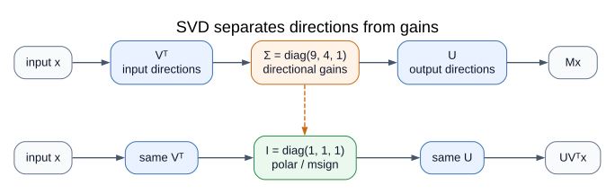

对 $M\in\mathbb R^{m\times n}$，紧致奇异值分解（singular value decomposition, SVD）写成

$$
M=U_r\Sigma_r V_r^\top,
\qquad
\Sigma_r=\operatorname{diag}(\sigma_1,\ldots,\sigma_r),
\quad r=\operatorname{rank}(M).
$$

$r=\operatorname{rank}(M)$ 是矩阵的秩，即非零奇异值的个数。$U_r^\top U_r=V_r^\top V_r=I_r$，其中 $I_r$ 是 $r\times r$ 单位阵。$V_r$ 给出输入方向，$\sigma_i>0$ 是各方向的放大倍数，$U_r$ 给出输出方向。本文所说的**奇异值谱**，就是按大小排列的 $\{\sigma_i\}$ 及其分布。

$\operatorname{diag}(\sigma_1,\ldots,\sigma_r)$ 表示只在对角线上放置这些数的对角矩阵。

<!-- notes:
这里的“谱”针对一般矩形矩阵时指 singular-value spectrum，不是 eigenvalue spectrum。
-->

---

## 极分解（polar decomposition）保留方向，把每个非零方向的增益改成 1

右极分解（right polar decomposition）为

$$
M=QH,
\qquad
Q=U_rV_r^\top,
\qquad
H=(M^\top M)^{1/2}=V_r\Sigma_r V_r^\top.
$$

- $H$ 是半正定矩阵，保存原来的奇异值大小；$(M^\top M)^{1/2}$ 表示 $M^\top M$ 的半正定矩阵平方根；
- $Q=U_rV_r^\top$ 是规范选取（canonical）的 polar factor；Muon 文献也常记作 $\operatorname{msign}(M)$；
- 对矩形或秩亏矩阵，$Q$ 是部分等距映射（partial isometry），并非一个两侧都满足 $Q^\top Q=QQ^\top=I$ 的方阵。

更精确地，$Q^\top Q=V_rV_r^\top$、$QQ^\top=U_rU_r^\top$：满列秩高矩阵只有前者为 $I$；满行秩宽矩阵只有后者为 $I$；秩亏时两侧都是投影。

Muon 变换的是动量矩阵的方向增益，不是在每一步把**权重（weight）本身**正交化。

---

## 三种矩阵范数回答三种不同的“有多大”

设 $A$ 的非零奇异值为 $\sigma_1,\ldots,\sigma_r$：

| 范数 | 定义 | 直觉 |
|---|---|---|
| Frobenius（弗罗贝尼乌斯）范数 | $\|A\|_F=\sqrt{\sum_{i,j}A_{ij}^2}=\sqrt{\sum_i\sigma_i^2}$ | 把全部元素当成一个长向量 |
| 谱范数（spectral/operator norm） | $\|A\|_2=\sigma_{\max}(A)=\max_{\|x\|_2=1}\|Ax\|_2$ | 对单位输入，最多能把输出放大多少 |
| 核范数（nuclear norm） | $\|A\|_*=\sum_i\sigma_i$ | 所有方向增益之和；是谱范数的对偶范数 |

“谱预算”在本文中专指 $\|\Delta W\|_2\le\eta$，即限制线性层对任意单位输入造成的最大变化。

---

## 为什么谱范数约束下会出现单位阵？看一个 $2\times2$ 例子

设 $G=\operatorname{diag}(9,1)$。若用 Frobenius 范数约束，

$$
\Delta W_F^*=-\eta\frac{G}{\|G\|_F}
=-\frac{\eta}{\sqrt{82}}\operatorname{diag}(9,1),
$$

一阶变化为 $\langle G,\Delta W_F^*\rangle_F=-\eta\sqrt{82}$；两个方向的更新幅度之比是 $9:1$，占用的平方长度之比则是 $81:1$。若用谱范数约束，

$$
\|\Delta W\|_2\le\eta
\quad\Longrightarrow\quad
\Delta W_2^*=-\eta I_2.
$$

$I_2$ 是 $2\times2$ 单位阵。对角矩阵的谱范数是 $\max(|\Delta_{11}|,|\Delta_{22}|)$；所以两个方向都可同时取到 $-\eta$，并得到一阶变化 $-10\eta$。单位阵来自这个满秩、奇异向量恰好是坐标轴的例子；若 $G=\operatorname{diag}(9,0)$，规范 polar update 是 $-\eta\operatorname{diag}(1,0)$。

<!-- notes:
Frobenius 约束下的一阶最小值是 -eta sqrt(82)；谱范数约束下是 -10 eta。两个可行集不同，不能据此直接宣称其中一个训练上必然更优。秩亏时，梯度支撑空间之外的最优解可能不唯一。
-->

---

## 谱范数的对偶问题：逐步推出规范 polar 更新

令 $G=U_r\Sigma_r V_r^\top$ 是紧致 SVD，并定义 $Z=U_r^\top\Delta W V_r$。则

$$
\begin{aligned}
\langle G,\Delta W\rangle_F
&=\operatorname{tr}(V_r\Sigma_r U_r^\top\Delta W) \\
&=\operatorname{tr}(\Sigma_r Z)
=\sum_{i=1}^r\sigma_i Z_{ii}.
\end{aligned}
$$

因为 $|Z_{ii}|\le\|Z\|_2\le\|\Delta W\|_2\le\eta$，所以

$$
\langle G,\Delta W\rangle_F
\ge-\eta\sum_i\sigma_i
=-\eta\|G\|_*.
$$

又因为 $\|U_rV_r^\top\|_2=1$，取规范解 $\Delta W_{\mathrm{can}}^*=-\eta U_rV_r^\top$ 是可行的；此时 $Z=-\eta I_r$，下界恰好取等号。因此

$$
\boxed{\Delta W_{\mathrm{can}}^*=-\eta\,\operatorname{msign}(G)}.
$$

> 来源：[Scalable Optimization in the Modular Norm](https://arxiv.org/abs/2405.14813)；[Modular Duality in Deep Learning](https://arxiv.org/abs/2410.21265)

<!-- notes:
若 G 满秩，该约束下解唯一；若秩亏，梯度支撑空间之外可能还有其他最优解，Muon 选取补空间为 0 的规范解。实际 Muon 对 momentum surrogate 而不是瞬时 gradient 做近似 polar，并叠加 Nesterov、有限步 NS、scale、decay 与随机训练动力学。这不是 Hessian Newton step，也不是“谱范数约束一定优于 Adam”的全局定理。
-->

---

<!-- layout: figure -->

## Newton–Schulz 迭代只用矩阵乘法快速压平奇异值

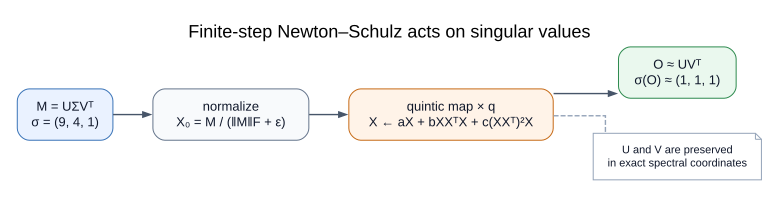

Newton–Schulz（NS）是一类矩阵迭代。对待变换矩阵 $M$，先缩放 $X_0=M/(\|M\|_F+\varepsilon)$，再做少量五次多项式迭代：

$$
X_{k+1}=aX_k+bX_kX_k^\top X_k+c(X_kX_k^\top)^2X_k.
$$

$\varepsilon>0$ 是避免除零的微小稳定常数；$a,b,c$ 是多项式系数，$k$ 是当前迭代编号，$K$ 是总迭代步数。若 $\sigma_i$ 是 $M$ 的奇异值，则 $X_0$ 的奇异值为 $\tilde\sigma_i=\sigma_i/(\|M\|_F+\varepsilon)$。在奇异向量坐标中，对应的带符号增益独立经过 $f(x)=ax+bx^3+cx^5$。精确算术下

$$
X_K=U_r\operatorname{diag}\!\left(f^{\circ K}(\tilde\sigma_i)\right)V_r^\top,
$$

其中 $f^{\circ K}$ 表示把 $f$ 连续复合 $K$ 次，对应奇异值取该结果的绝对值。于是奇异向量至多发生符号翻转，非零奇异值被显著压平，零奇异值仍为零。实现只需要 GEMM（general matrix multiplication，通用矩阵乘法），无需显式计算 SVD。

> 来源：[Muon 原始设计说明](https://kellerjordan.github.io/posts/muon/)；[msign 的 Newton–Schulz 迭代](https://spaces.ac.cn/archives/10922)

<!-- notes:
常见原始配置使用 5 步与系数 (3.4445, -4.7750, 2.0315)。它追求有限步内“足够平”，不是让所有值精确等于 1。系数、步数、初始归一化、是否先转置、数值精度与乘法顺序共同定义具体近似。

图中从 (9,4,1) 得到 (0.689,1.095,0.719) 的数值忽略 epsilon，并按精确算术直接迭代 5 次；它是可核查例子，不代表所有输入的误差范围。

更小的 polar 误差不自动等于更好的单位时间 loss。
-->

---

## 非方阵使 polar 更新的逐元素均方根（RMS）依赖矩阵形状

RMS（root mean square，均方根）定义为所有元素平方均值的平方根。对满秩 $m\times n$ polar factor $O$：

$$
\|O\|_F^2=\min(m,n),
$$

所以

$$
\operatorname{RMS}(O)
=\frac{\sqrt{\min(m,n)}}{\sqrt{mn}}
=\frac1{\sqrt{\max(m,n)}}.
$$

同一个 learning rate（学习率）落在不同形状的矩阵上，不会得到相同大小的逐元素更新。

<!-- notes:
这是 exact polar 的几何基准。若实际秩为 r，则 RMS 为 sqrt(r/(mn))；有限步 tuned NS 的奇异值不精确等于 1，实测 RMS 也不必严格等于满秩公式。
-->

---

<!-- layout: comparison -->

## 第二部分｜AdamW、Shampoo 与 Muon 把不同对象当成“一个整体”

对 $W\in\mathbb R^{m\times n}$，只计算主要优化器状态，不含 FP32（32 位浮点）主权重与框架缓冲区：

| 方法 | 怎样看待 $W$ | 主要变换 | 典型持久状态量 |
|---|---|---|---:|
| AdamW | 每个 $W_{ij}$ 独立 | 用逐元素一阶、二阶矩缩放梯度 | $m_t,v_t$，约 $2mn$ 个数 |
| Shampoo | 行、列方向各有相关性 | 用 $GG^\top$ 与 $G^\top G$ 的逆根做双侧预条件 | 约 $m^2+n^2$ 个数 |
| Muon | 一个有输入轴和输出轴的完整矩阵 | 对一份矩阵动量做近似 polar 变换 | $M_t$，约 $mn$ 个数 |

这里说 Muon“状态较少”，是相对 AdamW 的两份逐元素矩估计（moments）和 Shampoo 的二次方矩阵因子而言；它不是零状态优化器。

> 来源：[Shampoo](https://arxiv.org/abs/1802.09568)；[Muon](https://kellerjordan.github.io/posts/muon/)

<!-- notes:
不要讲成线性进化史：Shampoo、modular norm 与 Muon 是相互交叉的思想线。状态量还受 dtype、master weight 和框架实现影响，因此表中只比较主要算法状态。
-->

---

## 模块范数（modular norm）：先限制层的输出变化，再推导参数更新

一个线性层（Linear layer）不是孤立的 $mn$ 个数字，而是映射

$$
x\mapsto Wx.
$$

若输入满足 $\|x\|_2\le1$，一次权重变化对输出造成的最大扰动是

$$
\max_{\|x\|_2\le1}\|\Delta W x\|_2
=\|\Delta W\|_2.
$$

因此设计顺序可以写成：

$$
\text{限制单位输入的最大输出变化}
\rightarrow
\|\Delta W\|_2\le\eta
\rightarrow
\Delta W_{\mathrm{can}}^*=-\eta\,\operatorname{msign}(G).
$$

这就是上一部分的谱范数约束在“层功能”上的含义，也解释了为什么线性层（Linear）、嵌入层（Embedding）、归一化层（Normalization）与偏置（bias）不必共享同一种更新规则。

> 来源：[Scalable Optimization in the Modular Norm](https://arxiv.org/abs/2405.14813)；[Deriving Muon](https://jeremybernste.in/writing/deriving-muon)

<!-- notes:
这里的“特征扰动”只指 $\Delta W$ 对特征向量造成的输出变化；最后一箭头表示由范数约束解出更新矩阵，并不是另一个独立算法。
-->

---

<!-- layout: figure -->

## Muon 把完整矩阵变换压成一条单动量更新流程

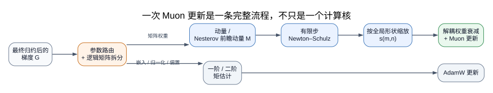

$$
M_t=\mu M_{t-1}+G_t,
\qquad
O_t\approx\operatorname{msign}(M_t),
\qquad
W_{t+1}=(1-\eta\lambda)W_t-\eta s(m,n)O_t.
$$

- $\mu$：动量系数；$\lambda$：权重衰减（weight decay）系数；
- $t$：训练步编号；$G_t$：最终累积并归约后的梯度；$M_t$：矩阵动量；
- $s(m,n)$：按矩阵全局形状决定的幅度因子；
- “把矩阵作为整体”是指 $O_t$ 由 $M_t$ 的全局奇异向量共同决定，而不是逐元素独立生成。

> 来源：[Muon 原始设计说明](https://kellerjordan.github.io/posts/muon/)；[Muon is Scalable](https://arxiv.org/html/2502.16982v1)，§2

<!-- notes:
实际训练配方可能使用 Nesterov 形式。图中的顺序不能随意交换：对每个 micro-batch gradient 各自做 NS 再相加，不等于对最终累积梯度做一次 NS；fused QKV 先拆还是后拆也会改变更新。
-->

---

## 一次 Muon 更新还必须固定四类实现选择

- **参数路由**：哪些隐藏层线性权重用 Muon，哪些 embedding、输出 head、norm、bias 继续用 AdamW；
- **逻辑矩阵边界**：融合 QKV、SwiGLU 的 gate/up/down 与专家（experts）怎样拆成具有实际功能的矩阵；
- **更新幅度与衰减**：使用全局形状还是局部形状，怎样匹配更新 RMS，怎样做解耦 weight decay；
- **分布式语义**：物理分片不能在没有声明的情况下重定义 polar 的对象。

因此，“代码里调用了 NS”远不足以证明运行的是同一个 Muon。

<!-- notes:
两条高频纠错一起完成：Muon 不 orthogonalize weight；Muon 也通常不替代所有 AdamW parameter groups。

生产代码应断言每个可训练参数恰好进入一个 optimizer group。
-->

---

<!-- layout: figure -->

## 第三部分｜Muon 的演化是一连串瓶颈被依次暴露

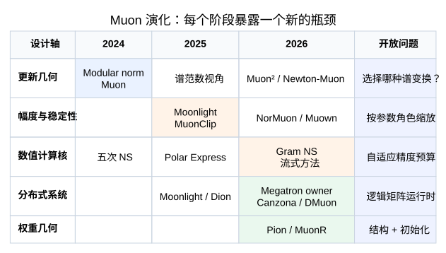

主线不是版本号，而是五个依次暴露的问题：

$$
\text{更新映射的谱几何}
\rightarrow \text{逐矩阵更新幅度}
\rightarrow \text{训练稳定性}
\rightarrow \text{分布式语义}
\rightarrow \text{模型结构问题}.
$$

“谱几何”回答梯度或动量经过什么映射得到 $O_t$，例如 $O_t=\operatorname{msign}(M_t)$；“逐矩阵更新幅度”才是随后乘上的 $s(m,n)$ 与学习率。它与下一页 $m\times n$ 的矩阵形状不是同一概念。

<!-- notes:
时间线只放主节点；其他变体按改变的层次归类。Modular norm 早于正式 Muon blog，不要讲成发布后的理论附会。
-->

---

## Moonlight 的形状缩放（shape scale）来自一个可检查的 RMS 匹配

对满秩 $m\times n$ polar factor $O=U_rV_r^\top$，令 $r=\min(m,n)$：

$$
\|O\|_F^2=r,
\qquad
\operatorname{RMS}(O)=\sqrt{\frac{r}{mn}}
=\frac1{\sqrt{\max(m,n)}}.
$$

若希望缩放后更新 $sO$ 的逐元素 RMS 等于目标常数 $c$，则

$$
\operatorname{RMS}(sO)=\frac{s}{\sqrt{\max(m,n)}}=c
\quad\Longrightarrow\quad
\boxed{s(m,n)=c\sqrt{\max(m,n)}}.
$$

Moonlight 取 $c=0.2$，来自作者观察到 AdamW 的实际 Update RMS 常在 $0.2$–$0.4$，并用实验选择下界附近的匹配值；**0.2 不是 polar 理论推出的普适最优常数**。

> 来源：[Muon is Scalable for LLM Training](https://arxiv.org/html/2502.16982v1)，§2.2

<!-- notes:
参数如何 reshape、QKV 是否拆分、scale 使用 local 还是 global shape，都会改变实际 update。

该解析式假设 ideal full-rank polar。秩亏时 \|O\|_F^2 等于实际秩；有限步 tuned NS 的奇异值也不精确为 1，因此 shape scale 只提供基准，实测 Update RMS 不保证恰好为 0.2。
-->

---

<!-- layout: figure -->

## 权重衰减（weight decay）子步保证径向收缩；完整 Muon 更新的长期收益主要来自实验

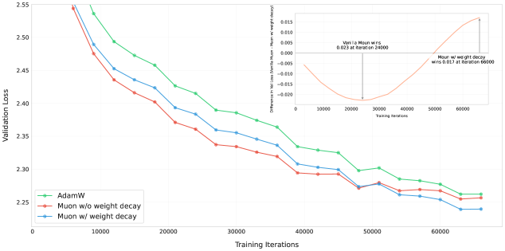

解耦权重衰减写成

$$
W_{t+1}=(1-\eta_t\lambda)W_t-\eta_t s_tO_t.
$$

这里 $\eta_t$ 是第 $t$ 步学习率，$\lambda$ 是衰减系数，$s_tO_t$ 是该步的 Muon 更新矩阵。

若暂时没有优化器更新项，$0<\eta_t\lambda<1$ 时有 $\|W_{t+1}\|_F=(1-\eta_t\lambda)\|W_t\|_F$，这是确定的径向收缩；但加入 $O_t$ 后，交叉项可能使权重范数上升，因此不存在“每步范数必降”的一般保证。

作者在 800M、100B token 设置中报告：原始 Muon 早期下降更快，但带 weight decay 的 Muon 在过度训练区间取得更低验证损失（validation loss），并缓解部分权重 RMS 增长；层输出 RMS 还依赖 RMSNorm 缩放参数 $\gamma$ 等非 Muon 参数组的衰减。现有曲线不能证明其中任一条是唯一因果机制。

> 来源：[Decoupled Weight Decay Regularization](https://openreview.net/forum?id=Bkg6RiCqY7)；[Muon is Scalable for LLM Training](https://arxiv.org/html/2502.16982v1#S2.F2)，Figure 2；作者实验

<!-- notes:
解耦 weight decay 的径向收缩有直接公式支持；“它因此让 Muon 在长训练中更优”则是 Moonlight 特定 workload 上的经验结论，曲线不能单独证明 weight/output RMS growth 是全部因果机制。
-->

---

<!-- layout: figure -->

## Moonlight 的“52% 浮点运算量（FLOPs）”是尺度律拟合结果

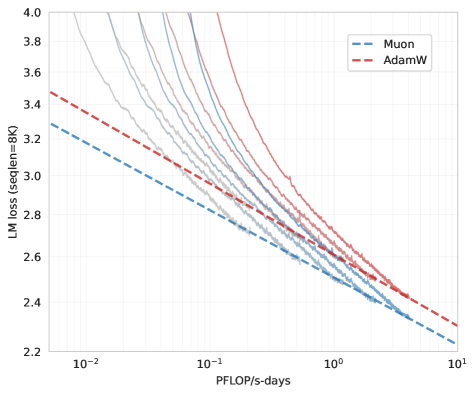

作者在 399M–1.5B 参数的稠密 Llama 系列、8K 上下文长度、计算最优 token 配比并调优 AdamW 基线的设置中报告：Muon 达到同等拟合 loss 约需 AdamW 的 **52% 训练浮点运算量（training FLOPs）**。

它回答的是该设置下的计算效率（compute efficiency），不等于实际耗时（wall-clock），也不是任意模型、数据、学习率计划、批大小（batch size）与实现上都成立的“通用 2×”。

> 来源：[Muon is Scalable for LLM Training](https://arxiv.org/html/2502.16982v1#S3.F3)，Figure 3；作者拟合结果

<!-- notes:
明确说“作者报告”。FLOPs、wall-clock 和 time-to-loss 是不同结论；这张图主要回答 compute efficiency，不回答 Megatron 上的 realized overhead。
-->

---

<!-- layout: figure -->

## MuonClip 用当前前向计算（forward）的信号修正下一步 Q/K 权重

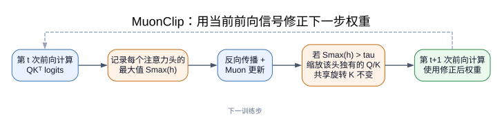

$Q$ 是查询（query），$K$ 是键（key）；attention logit 是 softmax 归一化之前的 $QK^\top$ 分数。若第 $h$ 个注意力头（attention head）的最大 logit 为 $S_{\max}^h$：

$$
\gamma_h=
\begin{cases}
\tau/S_{\max}^h,&S_{\max}^h>\tau,\\
1,&S_{\max}^h\le\tau,
\end{cases}
\qquad
W_q^h\leftarrow\gamma_h^\alpha W_q^h,
\quad
W_k^h\leftarrow\gamma_h^{1-\alpha}W_k^h.
$$

$\tau$ 是目标阈值，$\alpha\in[0,1]$ 决定 Q 与 K 各承担多少缩放；K2 通常取 $\alpha=0.5$。$S_{\max}^h$ 是带符号的最大值（signed maximum），不是绝对值最大值。它不裁剪当前分数，也不是梯度裁剪（gradient clipping）；修正作用于下一训练步。

> 来源：[Kimi K2 Technical Report](https://arxiv.org/html/2507.20534v2)，§2.1

<!-- notes:
MuonClip 是 scalable Muon recipe 加 QK-Clip，不只是 QK-Clip。K2 的 threshold 100 与两侧对称缩放是该训练配方，不应抽象为唯一标准。
-->

---

## K2 的 MLA（多头潜变量注意力）不能照搬普通逐头裁剪

K2 使用 MLA（Multi-head Latent Attention，多头潜变量注意力）。论文指出：MLA 推理时不会完整物化每个注意力头的 key matrix，因此常见的 QK-Norm（对 Q/K 激活做归一化）不能直接用于这条推理路径；QK-Clip 改为在训练的优化器更新后缩放投影权重。

对异常注意力头 $h$，K2 只改动该头独有的分量：

$$
W_{qc}^h,W_{kc}^h
\leftarrow \sqrt{\gamma_h}\,(W_{qc}^h,W_{kc}^h),
\qquad
W_{qr}^h\leftarrow\gamma_h W_{qr}^h,
$$

而跨注意力头共享的旋转位置编码 key 分量保持不变：

$$
W_{kr}^{\mathrm{shared}}\leftarrow W_{kr}^{\mathrm{shared}}.
$$

下标 $qc/kc$ 表示该头独有的内容分量，$qr$ 表示该头独有的旋转 query，$kr$ 表示跨头共享的旋转 key。

原因不是符号技巧：如果按一个异常头的系数缩放共享 $W_{kr}$，其他头的 attention score 也会被同时改变。

> 来源：[Kimi K2 Technical Report](https://arxiv.org/html/2507.20534v2)，§2.1 / Algorithm 1

<!-- notes:
QK-Norm 作用于 forward 中的 Q/K activations；QK-Clip 作用于 optimizer step 后的部分权重，两者作用位置不同。
-->

---

<!-- layout: comparison -->

## K2 Figure 2 是失败案例与生产训练轨迹，不是“开/关裁剪”的严格 A/B

| 原始 Muon：9B 激活参数 / 53B 总参数 | Kimi K2 + MuonClip：32.6B 激活参数 / 1.04T 总参数 |
|---|---|
| 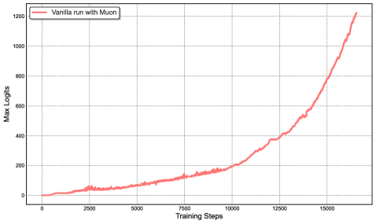 | 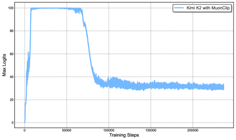 |

模型规模、总训练步数与纵轴范围都不同；两图不能读成关闭/开启 clipping 的严格对照。

> 来源：[Kimi K2](https://arxiv.org/html/2507.20534v2#S2.F2)，Figure 2；作者生产训练观察

<!-- notes:
可以口头补充作者的小模型 ablation 报告 validation loss 近似重合，但这只支持该设置未测到明显质量损害。不能把 K2 的最终能力或 zero loss spike 因果归给单一组件。
-->

---

## 2025–2026 的分支修改了 Muon 处理链的不同位置

| 改变的层次 | 代表工作 | 核心问题 |
|---|---|---|
| polar / msign 计算核 | Polar Express、Gram NS、Turbo-Muon | 怎样更快计算同一或近似的 polar/msign 变换？ |
| 更新统计量 | AdaMuon、NorMuon、Muon²、Newton-Muon | 幅度、二阶矩与曲率放在哪里？ |
| 参数约束 | Muown、Pion、MuonR | 权重奇异值谱是否也应受约束？ |
| 分布式语义 | Dion、Canzona、DMuon | 谁对哪个完整矩阵做一次 update？ |
| 更高阶对象 | Tensorion | 矩阵几何能否推广到张量（tensor）？ |

这些工作不能排成单一冠军榜；它们改变的对象、状态与基线不同。

<!-- notes:
主讲不逐篇报数字。Polar Express / Gram NS 可不改变 optimizer state；Muon² full 会重新引入较重 second-moment state；Dion 可能改变 update 表示；DMuon 主要重排执行位置。
-->

---

<!-- layout: figure -->

## MuonR 把训练限制在等谱流形；初始化因此承诺完整奇异值谱

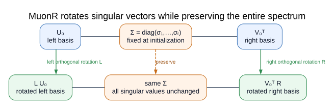

$$
W'=LWR,
\qquad L^\top L=I,
\qquad R^\top R=I,
$$

其中 $L\in\mathbb R^{m\times m}$、$R\in\mathbb R^{n\times n}$ 分别是左、右正交旋转矩阵，$I$ 是相应维度的单位阵。所以 $\sigma_i(W')=\sigma_i(W)$。因为训练过程不能改变 $\{\sigma_i(W)\}$，初始化不再只是起点，而是对整个训练期权重奇异值谱的硬约束。

> 证据状态（截止 2026-07-20）：等谱结论可由上式直接验证；训练收益是作者博客提出的研究设想，尚无公开的大规模训练验证。

> 来源：[流形上的最速下降：6. Muon + 双旋转](https://spaces.ac.cn/archives/11777)

<!-- notes:
截止 2026-07-20，MuonR 是博客提出的推导与早期研究设想，不是已有大规模训练验证的成熟 recipe。

可补充“中途切换”想法：先用普通 Muon，谱范数/F 范数异常增长后切换 MuonR 维稳；切换仍需对齐 update norm。

这页只交代历史与机制。它引出的 architecture / initialization 问题将在第五部分展开。
-->

---

<!-- layout: figure -->

## 第四部分｜物理分片不能偷偷重定义“哪一个矩阵”

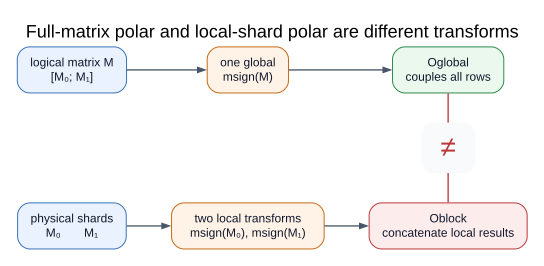

若完整逻辑矩阵 $M$ 沿行切成 $M_0,M_1$，一般而言：

$$
\operatorname{msign}
\begin{pmatrix}M_0\\M_1\end{pmatrix}
\neq
\begin{pmatrix}
\operatorname{msign}(M_0)\\
\operatorname{msign}(M_1)
\end{pmatrix}.
$$

上式左边对完整逻辑矩阵做一次 polar；右边对两个物理分片分别做 polar。差异来自被变换对象不同，不是浮点误差。

<!-- notes:
用最小数值例子口头检查：M=[[2,0],[1,1]] 的 full polar 约为 [[0.9487,-0.3162],[0.3162,0.9487]]；逐行归一化后拼接是 [[1,0],[0.7071,0.7071]]。

Muon 可以分布式计算；要求是某处获得完整矩阵，或通过 global Gram 等数学等价信息完成同一 transform。
-->

---

## DP、TP、EP、PP 切开的不是同一个对象

| 并行维度 | 物理上切开的对象 | Muon 必须回答的问题 |
|---|---|---|
| 数据并行（DP）/ ZeRO | 优化器状态与梯度/参数缓冲区 | 哪个进程拥有一次完整参数更新？ |
| 张量并行（TP） | 线性算子的输入轴或输出轴 | 对本地分片做 polar 是否只是分块近似？ |
| 专家并行（EP） | 专家及其内部矩阵 | 哪个 expert-TP/DP 通信组定义完整矩阵？ |
| 流水并行（PP） | 当前流水阶段的层集合 | 检查点与 owner metadata 怎样跟随阶段？ |

DP、TP、EP、PP 分别是数据、张量、专家与流水并行。先写清逻辑矩阵的全局形状，再谈进程本地看到的分片形状。

<!-- notes:
LayerWise owner 在 DP 维度拥有的是完整 TP-local parameter，不会自动恢复 TP 之前的全局矩阵。DP ownership 与 TP matrix semantics 是两个正交问题。
-->

---

<!-- layout: figure -->

## Megatron 先在 DP 维度选择状态拥有者（owner），再处理 TP 语义

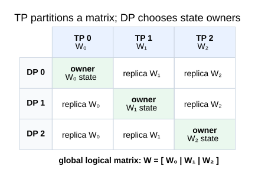

- owner 是该状态的唯一权威进程；每个 owner 保存一个完整 **TP 本地参数**的 FP32 主副本与动量；
- TP 之前的全局矩阵是否被完整变换，仍由 `muon_tp_mode` 决定；
- PP 与 EP 再限定参数集合和通信组。

> 固定代码版本：Megatron-LM `0823c731ed7d…`，信息截点 2026-07-20

<!-- notes:
不要说 owner 拥有“全局 TP 之前的完整权重”。图中横向是 TP partition，纵向是 DP replicas。对 `duplicated/distributed`，同一个 global parameter 的 TP shards 必须在同一 DP row 中选择 owner，使它们处于同一个 TP process group 并保持 collective call order；对角 owner 图会误导甚至导致 collective 对不上。
-->

---

<!-- layout: figure -->

## 预计算布局让“归约并分片”把完整 TP 本地梯度交给 owner

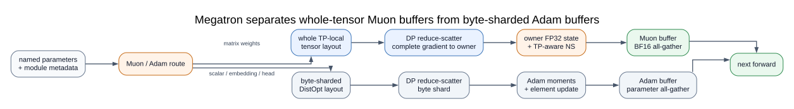

reduce-scatter（归约并分片）先合并各 DP 副本的梯度，再让目标 owner 留下其完整 TP 本地梯度；更新后，all-gather（全收集）把工作精度参数同步回各副本。

```text
反向传播
  → DP reduce-scatter
  → owner：FP32 动量 + 感知 TP 的 NS + 参数更新
  → Muon / Adam 参数缓冲区分别 all-gather
  → 下一次前向计算
```

> 代码：[layout precompute](https://github.com/NVIDIA/Megatron-LM/blob/0823c731ed7d793aef047b6a64f2dbbf32bf6e2c/megatron/training/training.py#L1580-L1640)；[LayerWise optimizer](https://github.com/NVIDIA/Megatron-LM/blob/0823c731ed7d793aef047b6a64f2dbbf32bf6e2c/megatron/core/optimizer/layer_wise_optimizer.py)

<!-- notes:
二维非 embedding/output 参数先被标为 LayerWise-managed；layout 保证完整 TP-local tensor 不跨 DP shard boundary。Muon buffer 使用 whole-tensor ownership，Adam buffer 继续 byte-level DistOpt sharding。

最终结构可理解为 ChainedOptimizer[LayerWiseDistributedOptimizer[Muon], DistributedOptimizer[Adam]]。
-->

---

<!-- layout: comparison -->

## Megatron 的三种 TP 模式对应三种不同的语义—通信取舍

| 模式 | NS 看见的对象 | TP 额外通信 | 语义与代价 |
|---|---|---:|---|
| `blockwise`（分块） | 本地分片 $M_r$ | 无 | **默认**；便宜，但结果依赖 TP 切分方式 |
| `duplicated`（复制计算） | all-gather 后的完整 $M$ | 每个正交化逻辑块一次 all-gather | 保留完整矩阵语义；每个 TP 进程重复执行 NS |
| `distributed`（分布式迭代） | 本地 $X_r$ 与全局 Gram（格拉姆）矩阵 | 归一化通信 + 每轮 Gram all-reduce（全归约） | 保留全局耦合；通信进入每轮迭代 |

若这里展示的是按列切分，$X=[X_0|\cdots|X_{T-1}]$，其中 $T$ 是 TP 进程数，`distributed` 模式使用：

$$
XX^\top=\sum_rX_rX_r^\top.
$$

> 代码：[默认配置](https://github.com/NVIDIA/Megatron-LM/blob/0823c731ed7d793aef047b6a64f2dbbf32bf6e2c/megatron/core/optimizer/optimizer_config.py#L282)；[TP path](https://github.com/NVIDIA/Megatron-LM/blob/0823c731ed7d793aef047b6a64f2dbbf32bf6e2c/megatron/core/optimizer/emerging_optimizers.py#L188-L290)

<!-- notes:
blockwise 不是实现 bug，而是性能优先的显式 approximation；但它必须成为实验配方的一部分，不能隐藏在 infra 默认值里。

row partition 时先转置，使用右 Gram 的对应恒等式。改变 TP size 会同时改变 local singular geometry 和 local-shape scale。duplicated/distributed 只需在数值容差内匹配 reference，不要求 BF16 bitwise 一致。
-->

---

## 当前实现的第一类缺口：参数语义仍靠启发式规则

- 默认路由近似为“二维且不是 embedding/output $\Rightarrow$ Muon”；router、gate 等功能角色可能被误纳入；
- 融合 QKV 依赖参数名识别语义块；
- `duplicated/distributed` 缺少 `partition_dim` 时会静默退化为本地路径；
- 完整矩阵 TP 模式还隐含要求各 TP 进程对同一全局参数选择相同 DP-owner 编号，并保持语义拆分与 collective 调用顺序；固定版本没有显式的跨 TP 断言；
- `--muon-scalar-optimizer lion` 尚未接入实际后备路径，生产路径仍硬编码 Adam。

代码能跑，不代表参数被按预期的数学对象优化。

> 代码：[parameter routing](https://github.com/NVIDIA/Megatron-LM/blob/0823c731ed7d793aef047b6a64f2dbbf32bf6e2c/megatron/core/optimizer/layer_wise_optimizer.py#L37-L72)；[partition metadata](https://github.com/NVIDIA/Megatron-LM/blob/0823c731ed7d793aef047b6a64f2dbbf32bf6e2c/megatron/core/optimizer/emerging_optimizers.py#L245-L290)

<!-- notes:
这些是固定 commit 的代码审计结论。未来版本可能修复，因此页面必须保留 commit 与 cutoff。

其他集成边界：该固定版本的 LayerWise path 不支持 FSDP、多 distributed-optimizer instances 与 optimizer-step overlap；部分 expert fallback 尚未接线。现有 TP tests 也缺少与单卡 full-matrix reference 的数值对照。
-->

---

## Direct NS 的成本由短边平方决定，不由元素数单独决定

令 $X\in\mathbb R^{r\times s}$ 且 $r=\min(m,n)\le s=\max(m,n)$。Direct NS 的一次五次多项式迭代可拆成：

$$
\underbrace{A=XX^\top}_{\approx 2r^2s}
\quad\rightarrow\quad
\underbrace{A^2}_{\approx 2r^3}
\quad\rightarrow\quad
\underbrace{X\leftarrow(a_kI+b_kA+c_kA^2)X}_{\approx 2r^2s}.
$$

$a_k,b_k,c_k$ 是第 $k$ 轮多项式系数；它们可以逐轮变化，但不改变这里的矩阵乘法形状与 FLOPs 计数。

因此 $K$ 轮 Direct NS 的主要 GEMM 计算量约为

$$
F_{\mathrm{Direct}}
\approx K(4r^2s+2r^3)
=\Theta(Kr^2s),
$$

其中最后一个 $\Theta$ 利用了 $r\le s$，但方阵时 $2r^3$ 不能在数值估算中忽略。4096×4096 与 1024×16384 都约有 1678 万个元素；代入完整主项，单轮约为 412.3 与 70.9 GFLOPs（十亿次浮点运算），相差约 **5.82×**。

> 本文推导；与 Megatron 固定版本的 Direct NS 乘法顺序对齐

<!-- notes:
这里只统计 GEMM 并按一次 FMA=2 FLOPs；归一化和 elementwise combine 是低阶项。kernel 常数、dtype 与矩阵乘利用率仍会影响实测时间。
-->

---

## NS 关键路径（critical path）是最慢 owner 的累计工作

对于 Megatron 当前顺序执行的 owner 路径，设 owner $d$ 被分配到的矩阵集合为 $\mathcal A_d$，矩阵 $j$ 的实测 NS 时间为 $t_j$。owner-side 完工时间（makespan）更接近

$$
T_{\mathrm{owner}}
\approx\max_d\sum_{j\in\mathcal A_d}t_j
\ge\max_jt_j.
$$

- $\max_jt_j$ 是“矩阵不能再跨 DP owner 拆分”造成的不可约下界；
- 实际优化器关键路径还包括最慢 owner 的累计工作，以及不能被隐藏的 TP collective、reduce-scatter 和参数发布依赖；
- Megatron 固定版本用 `numel=mn` 做最长处理时间优先（Longest Processing Time first, LPT）装箱，平衡的是存储/字节代理量，不直接最小化上式。

因此相同字节数、不同长宽比（aspect ratio）的矩阵，可能让 owner 布局看起来均匀，实际 NS 完工时间却明显失衡。

> 代码审计：Megatron-LM `0823c731ed7d…`；对照：[DMuon](https://arxiv.org/html/2606.27153v1)，§3.4

<!-- notes:
DMuon 在其调度与 overlap 生效后观察到残余 overhead 由最大 owner-side matrix NS 主导；这是论文 workload 上的结果，不是 critical path 的通用定义。
-->

---

<!-- layout: figure -->

## DMuon 让每个完整矩阵只在唯一权威 owner 上执行一次 NS

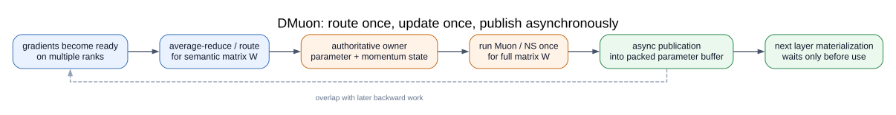

1. 反向传播梯度平均归约到 owner；
2. owner 保存参数与动量状态并运行 Muon；
3. 更新后的打包参数异步发布；
4. 下一次层计算使用前，才等待参数就绪。

图展示无 TP 时的简化流程。存在 TP 时，先确定 DP owner 槽位；该槽位的 TP 通信组保存权威分片，再选一个 TP owner 聚合完整梯度、执行一次 NS，并把更新分片发回组内。

DMuon 改的是 owner 选择、内存布局、通信时机与计算—通信重叠，目标不是发明新的 polar/msign 变换。

> 来源：[DMuon](https://arxiv.org/abs/2606.27153)，§3–4

<!-- notes:
关键问题从“所有 rank 怎样做同一个 NS”变成“谁在何时对哪一个矩阵只做一次 NS”。大矩阵形成 owner critical path，小 expert matrices 则需要 batching。
-->

---

<!-- layout: figure -->

## Gram-space NS（Gram 矩阵空间）：多轮只递推短边方阵

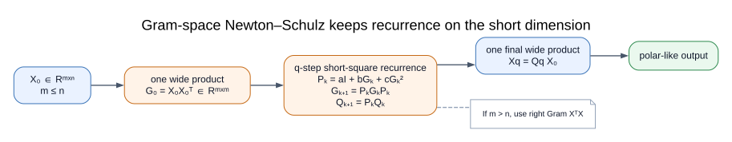

当 $X_k\in\mathbb R^{m\times n}$ 且 $m\le n$，Direct NS 可写成

$$
G_k=X_kX_k^\top,\qquad
P_k=a_kI+b_kG_k+c_kG_k^2,\qquad
X_{k+1}=P_kX_k.
$$

此处 $G_k$ 专指 $X_k$ 的 Gram 矩阵，不是前文表示 loss gradient 的 $G$；$a_k,b_k,c_k$ 是第 $k$ 轮系数，$P_k$ 是由 $G_k$ 构造的短边方阵多项式。

由此必须有

$$
\boxed{G_{k+1}=X_{k+1}X_{k+1}^\top
=P_kX_kX_k^\top P_k^\top
=P_kG_kP_k^\top}.
$$

定义累计变换 $C_0=I,\ C_{k+1}=P_kC_k$，则最终只需一次 $X_K=C_KX_0$。复杂度从 Direct NS 的 $O(Km^2n)$ 变为

$$
O(m^2n+Km^3),
$$

即一次形成/应用宽矩阵，$K$ 轮递推只在 $m\times m$ 的短边方阵中进行。

> 来源：[DMuon](https://arxiv.org/html/2606.27153v1)，§3.3 / Equation 4；累计矩阵 $C_k$ 为本文展开

<!-- notes:
因为 $G_k$ 对称且 $P_k$ 是 $G_k$ 的多项式，$P_k^\top=P_k$；正文保留转置以展示推导来源。exact arithmetic 下该 recurrence 与相同 polynomial Direct NS 等价；低精度乘法次序改变后只要求 tolerance 与训练行为一致。

m>n 时使用右 Gram XᵀX，始终把 cubic term 放在短维。
-->

---

## DMuon 报告的加速来源：48% + 32% + 16%

在 Wall-OSS-0.5、128 张 A800 的消融中，作者通过逐项关闭组件，把优化器耗时的减少归因于：

| 组件 | 作者报告的占比 | 它减少什么 |
|---|---:|---|
| 对称 Gram 计算核（kernel） | **48%** | 降低短边方阵递推的计算成本 |
| owner 调度与负载均衡 | **32%** | 缩短最慢 owner 决定的完工时间（makespan） |
| 自动调优与小矩阵 NS 批处理（batching） | **16%** | 改善计算核选择和大量小矩阵利用率 |

三项报告值合计 96%；论文没有给剩余部分单独命名，而且“逐项关闭”的贡献不应被当成严格可加的因果分解。

在完成负载均衡与计算—通信重叠后，作者报告残余开销由最大的 owner 侧矩阵 NS 主导；这是该训练负载的实测结果，与前述“最大单矩阵是不可约下界”相呼应。

> 来源：[DMuon](https://arxiv.org/html/2606.27153v1)，§5.2 / Table 2；作者消融

<!-- notes:
这些百分比来自单一模型、GPU 规模和逐项关闭实验，不是跨硬件可直接套用的普遍定律。
-->

---

<!-- layout: comparison -->

## DMuon 的大幅加速是相对朴素“先聚合、再计算”Muon 的特定训练负载结果

| 优化器计算 | 端到端吞吐 |
|---|---|
| 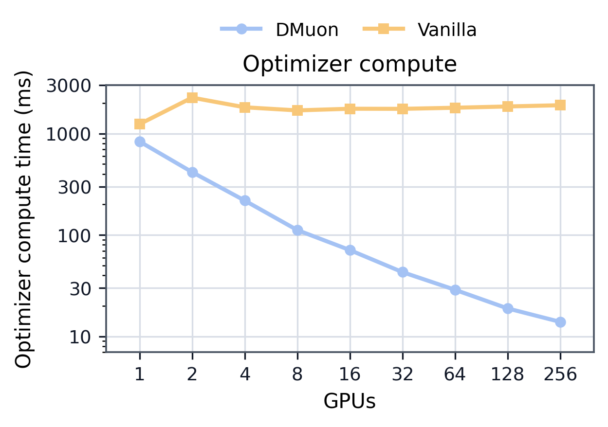 | 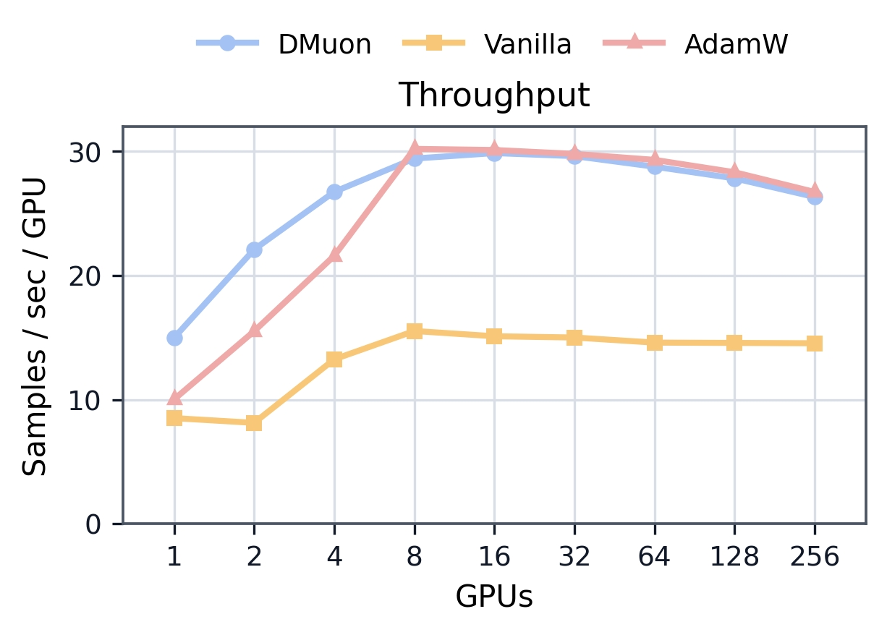 |

作者在四个训练负载上报告：优化器步骤加速 **6.85–163.82×**、端到端训练步骤加速 **1.48–3.01×**；Figure 8 展示 Wall-OSS 在 1–256 张 A800 上的规模扩展结果。

> 来源：[DMuon](https://arxiv.org/html/2606.27153v1#S5.F8)，Figure 8 / Table 1；作者报告

<!-- notes:
baseline 是论文定义的 vanilla gather-then-compute Muon，不是 AdamW。near-Adam overhead 不是跨硬件、shape、并行模式的常数。
-->

---

<!-- layout: comparison -->

## Megatron 提供语义—成本开关；DMuon 以完整矩阵等价为目标

| 轴 | Megatron 固定版本 | DMuon 论文方案 |
|---|---|---|
| DP 状态 | 每个完整 TP 本地参数由唯一 owner 管理 | 权威 owner + 打包布局 |
| TP 语义 | `blockwise` / `duplicated` / `distributed` 三种开关 | 嵌套 ownership 与完整矩阵重建 |
| NS 后端 | Direct NS；`distributed` 模式每轮构造全局 Gram | Gram-space + 对称计算核 |
| 计算—通信重叠 | DDP 缓冲区支持梯度/参数通信重叠；owner 侧优化器计算本身未与训练计算重叠 | 细粒度路由与异步参数发布 |
| 主要边界 | 语义 metadata、TP-owner 对齐、reference 覆盖、按计算量调度 | 最大矩阵 NS 下界；单 GPU 收益较小；当前主要面向论文所测全分片数据并行（FSDP2）/混合分片数据并行（HSDP）与硬件负载 |

真正的验收标准是：**同一全局矩阵的 update、可控误差、进程数不变性（world-size invariance）与达到目标 loss 的时间（time-to-loss）同时成立。**

<!-- notes:
DMuon 不是“下一代 Muon 算法”；更准确的定位是 mathematically equivalent reformulation 加系统 runtime 优化。Megatron 的 blockwise mode 则明确改变算法语义。
-->

---

<!-- layout: statement -->

## 第五部分｜Muon 的下一步，也许不是另一个优化器

Muon 已经迫使我们把矩阵视为完整对象；MuonR 又进一步问：

> 如果优化器不再自由修改权重的奇异值谱，模型设计是否必须先回答“每个矩阵应该长什么样”？

这把研究视角从参数更新推向三者的共同设计：

$$
\text{优化器}
\longleftrightarrow
\text{参数化与初始化}
\longleftrightarrow
\text{模型结构}.
$$

<!-- notes:
这一部分是研究议程，不是成熟结论。明确区分 source-reported observation、可检查推导和开放问题。
-->

---

<!-- layout: figure -->

## “模型需要什么奇异值谱”必须先说清是哪一个对象

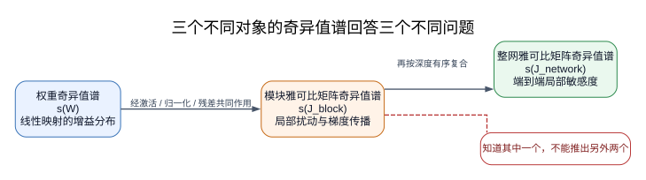

这里的 spectrum（谱）均指**奇异值谱**：一组按大小排列的奇异值及其分布。Jacobian（雅可比矩阵）是输出每个分量对输入每个分量的偏导数组成的矩阵。记 $s(A)=\{\sigma_i(A)\}$ 为矩阵 $A$ 的奇异值序列。三个常被混写的谱对象是

$$
s(W),
\qquad
s\!\left(J_{\mathrm{block}}(h_\ell)\right),
\qquad
s\!\left(J_{\mathrm{network}}(h_0)\right),
$$

其中 $J_{\mathrm{block}}(h_\ell)=\partial h_{\ell+1}/\partial h_\ell$，$J_{\mathrm{network}}(h_0)=\partial h_L/\partial h_0$。

- 权重谱描述一个参数矩阵的增益分布；
- 模块 Jacobian 描述一个模块在当前输入附近怎样放大微小扰动；
- 整网 Jacobian 描述从输入到输出的端到端扰动传播。

它们是不同层级的对象，知道其中一个一般不能推出另外两个。局部信号与梯度传播由 Jacobian 更直接描述；整体训练稳定性仍不能由 Jacobian 单独推出。

> 来源：[Resurrecting the Sigmoid through Dynamical Isometry](https://arxiv.org/abs/1711.04735)；[A Spectral Condition for Feature Learning](https://arxiv.org/abs/2310.17813)

<!-- notes:
Jacobian（雅可比矩阵）是输出每个分量对输入每个分量的偏导数矩阵。RMSNorm、activation/gating、residual path 与相邻矩阵缩放都会共同改变它。
-->

---

## 奇异值能量熵（SVD entropy）衡量能量是否集中在少数方向

令 $W\ne0$ 且 $q=\min(m,n)>1$，Moonlight 使用的是包含零奇异值在内的**归一化奇异值能量**：

$$
p_i=\frac{\sigma_i^2}{\sum_{j=1}^q\sigma_j^2},
\qquad
H_{\mathrm{SVD}}
=-\frac1{\log q}\sum_{i=1}^q p_i\log p_i.
$$

其中 $H_{\mathrm{SVD}}\in[0,1]$：

- 若能量都集中在一个方向，$p=(1,0,\ldots)$，则 $H_{\mathrm{SVD}}=0$；
- 若 $q$ 个方向能量完全相等，$p_i=1/q$，则 $H_{\mathrm{SVD}}=1$。

所以“高熵（high entropy）”表示**奇异值平方所占能量更均匀**，不是特征值更大，也不是矩阵元素更随机。

> 来源：[Muon is Scalable](https://arxiv.org/html/2502.16982v1#S3.SS4)，§3.4，Figure 4 前的定义

<!-- notes:
论文按短边维度的 \log q 归一化。零奇异值按极限约定贡献 0 log 0 = 0。注意文献中另一类 effective-rank entropy 会用 sigma_i/sum sigma_j；本页严格采用 Moonlight 的平方奇异值能量定义。
-->

---

<!-- layout: figure -->

## Moonlight 观察到 Muon 权重能量更分散；这不是“越平越好”的定理

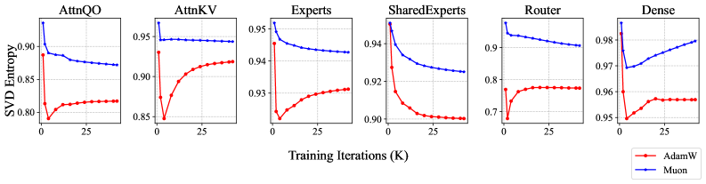

作者报告：各权重组的等权平均在所示训练检查点（checkpoint）上均更高；在 1.2T checkpoint，超过 90% 的单矩阵熵高于 AdamW。保守的读法是：**在该指标与该实验设置下，Muon 训练出的权重具有比 AdamW 基线更均匀的平方奇异值能量分布。** 端点统计不能反推出任一优化器逐步“把权重变成了什么”。

一个可能的直觉是：理想 Muon 更新 $U_rV_r^\top$ 的非零奇异值全为 1，因此单次更新会把谱范数预算分配到每个由动量支撑的非零奇异方向。但权重是许多步更新的累积，方向对齐、weight decay、初始化与有限步 NS 都会影响最终谱；目前没有定理从“单次更新等奇异值”推出“最终权重高熵”。

> 来源：[Muon is Scalable](https://arxiv.org/html/2502.16982v1#S3.SS4)，Figure 4；作者观察

<!-- notes:
这是相关性而非因果性。expert 统计只抽取 64 个 experts 中的 3 个。后续研究至少还要同时控制 overall scale、condition number、effective rank、tail shape 与 outliers，并按 Q/K/V/O、expert、router 等角色分组。
-->

---

<!-- layout: comparison -->

## “更好的初始化”可能要控制模块 Jacobian，而不只控制单个权重

令 $h_\ell$ 是第 $\ell$ 个残差块的输入，$F_\ell$ 是该块的残差分支。则

$$
h_{\ell+1}=h_\ell+F_\ell(h_\ell),
\qquad
J_\ell=I+\frac{\partial F_\ell}{\partial h_\ell}.
$$

$J_\ell$ 才直接描述该模块对微小信号和梯度的放大。不同初始化思想控制的对象并不相同：

| 思路 | 主要控制对象 | 不能自动保证什么 |
|---|---|---|
| Xavier / He | 激活与梯度的平均方差 | 每个方向都稳定 |
| 正交初始化（orthogonal initialization） | 单个 $W$ 的奇异值 | 整个带残差、归一化、非线性的模块 |
| 动力学等距性（dynamical isometry） | 模块/整网 Jacobian 的奇异值接近 1 | 任意 Transformer recipe 都适用 |
| $\mu$P（maximal update parametrization，最大更新参数化）/ 谱缩放 | 宽度改变时参数与 update 尺度可迁移 | 最终权重谱已最优 |
| MuonR 式参数化 | 固定 $\{\sigma_i(W)\}$，更新等谱旋转自由度 | 预设的奇异值谱就是正确答案 |

因此更可信的问题不是“有没有一个统一的更好初始化”，而是：能否针对模块角色，同时控制初始权重谱、模块 Jacobian 与跨宽度的更新尺度。

<!-- notes:
orthogonal initialization 和 dynamical isometry 的收益都有架构与假设范围，不能宣传为 Transformer 通用答案。MLP 宽度的替代结构需要独立的架构证据，本次不展开。
-->

---

<!-- layout: statement -->

## Muon 最重要的遗产，可能不是一个更快的优化器

1. **数学上**：梯度到更新之间必须选择几何；
2. **工业上**：尺度、稳定性、语义矩阵与分布式运行时共同定义优化器；
3. **未来上**：当优化器尊重矩阵，模型结构与初始化也需要回答矩阵应具有怎样的结构。

> 模型的基本对象不只是一堆标量参数，而是具有几何结构、功能角色与分布式语义的矩阵。

<!-- notes:
回扣开场：研究 optimizer 不是为多一个 class name，而是重新分配有限训练预算、稳定性余量和系统成本。

讨论题可以留给现场：如果只允许选择一个可观测量来指导下一代初始化，应该是 weight entropy、block Jacobian condition number，还是 feature covariance？
-->

---

## Appendix A｜如何阅读这套 slides 中的证据

| 页面措辞 | 含义 |
|---|---|
| **公式 / 本文推导** | 可从已写假设直接检查 |
| **代码行为** | 固定 commit 下的静态或运行检查 |
| **作者报告** | 论文或技术报告在其 workload 上给出的结果 |
| **跨论文比较** | baseline、预算与实现可能不同，不形成直接排名 |
| **早期构想 / 仍待验证** | blog、v1 preprint 或尚无大规模独立复现 |

信息截点：**2026-07-20**。Megatron 分析固定于 `0823c731ed7d793aef047b6a64f2dbbf32bf6e2c`。

<!-- notes:
Appendix 不必在正文逐页讲。把它留作 handout，帮助听众区分“推导成立”和“训练结论已证实”。
-->

---

## Appendix B｜苏剑林博客：最短主线先回答四个问题

1. **它改变了什么？**
   [Muon优化器赏析：从向量到矩阵的本质跨越](https://spaces.ac.cn/archives/10592)
2. **它怎样只用 GEMM 计算？**
   [Newton–Schulz（上）](https://spaces.ac.cn/archives/10922) · [（下）](https://spaces.ac.cn/archives/10996)
3. **它怎样变成 scalable recipe？**
   [Muon续集](https://spaces.ac.cn/archives/10739) · [Muon优化器指南](https://spaces.ac.cn/archives/11416)
4. **它怎样处理大规模 instability？**
   [QK-Clip](https://spaces.ac.cn/archives/11126) · [为什么 Adam 的 Update RMS 是 0.2？](https://spaces.ac.cn/archives/11267)

最短阅读目标：能区分 **矩阵语义、数值近似、scaling recipe、稳定性控制**。

---

## Appendix C｜Muon 直接演化链：2024–2025

**起点与 scale**

- 2024-12：[Muon优化器赏析](https://spaces.ac.cn/archives/10592)
- 2025-02：[Muon续集](https://spaces.ac.cn/archives/10739)
- 2025-03：[高阶MuP：谱条件缩放](https://spaces.ac.cn/archives/10795)

**msign / matrix function**

- 2025-05/06：[Newton–Schulz（上）](https://spaces.ac.cn/archives/10922) · [（下）](https://spaces.ac.cn/archives/10996)
- 2025-06：[mclip（上）](https://spaces.ac.cn/archives/11006) · [msign 的导数](https://spaces.ac.cn/archives/11025) · [mclip（下）](https://spaces.ac.cn/archives/11059)

**stability 与 manifold**

- 2025-07：[QK-Clip](https://spaces.ac.cn/archives/11126)
- 2025-08：[Muon + 正交](https://spaces.ac.cn/archives/11215) · [Muon + Stiefel](https://spaces.ac.cn/archives/11221) · [Muon + 谱球面](https://spaces.ac.cn/archives/11241)
- 2025-09：[重新思考学习率与 Batch Size（三）：Muon](https://spaces.ac.cn/archives/11285)
- 2025-11：[对偶梯度下降](https://spaces.ac.cn/archives/11388) · [Muon优化器指南](https://spaces.ac.cn/archives/11416)

---

## Appendix D｜Muon 直接演化链：2026

**scale 与流式 numerical backend**

- [为什么我们偏爱各向同性？](https://spaces.ac.cn/archives/11549)
- [MuP之上：2. 线性层与最速下降](https://spaces.ac.cn/archives/11605)
- 流式幂迭代：[1](https://spaces.ac.cn/archives/11654) · [2](https://spaces.ac.cn/archives/11673) · [3](https://spaces.ac.cn/archives/11697) · [4](https://spaces.ac.cn/archives/11710) · [5](https://spaces.ac.cn/archives/11719)

**控制 weight 与 spectrum**

- [MuP之上：4. 坚守参数的稳定性](https://spaces.ac.cn/archives/11729)
- [如何更科学地估计矩阵的谱范数？](https://spaces.ac.cn/archives/11736)
- [矩阵参数的奇异值熵越高越好吗？](https://spaces.ac.cn/archives/11767)
- [官方版 Muon 为什么多一个 `max(1,·)`？](https://spaces.ac.cn/archives/11772)
- [Muon + 双旋转](https://spaces.ac.cn/archives/11777)
- [矩阵函数近似中的暴力美学](https://spaces.ac.cn/archives/11787)

> 上述后半部分以推导、分析与新提案为主，不等同于大规模训练共识。

---

## Appendix E｜Adam、learning rate 与训练稳定性路线

**Adam 与 adaptive update**

- [从 Hessian 近似看自适应学习率优化器](https://spaces.ac.cn/archives/10588)
- [为什么 Adam 的 Update RMS 是 0.2？](https://spaces.ac.cn/archives/11267)
- AdamW Weight RMS：[上](https://spaces.ac.cn/archives/11307) · [下](https://spaces.ac.cn/archives/11404)
- [Adam 的最优超参数是 $\beta_1=\beta_2$？](https://spaces.ac.cn/archives/11593)

**LR、batch size、decay 与 clipping**

- [Batch Size 增大时，学习率如何变化？](https://spaces.ac.cn/archives/10542)
- [Adam 的 epsilon 如何影响 LR Scaling Law？](https://spaces.ac.cn/archives/10563)
- [为什么 gradient clipping 默认模长是 1？](https://spaces.ac.cn/archives/10657)
- [重新思考学习率与 Batch Size（一）](https://spaces.ac.cn/archives/11260)
- [滑动平均视角下的 weight decay 和 learning rate](https://spaces.ac.cn/archives/11459)

---

## Appendix F｜MuP、谱范数与 initialization 路线

- [初探MuP：超参数的跨模型尺度迁移规律](https://spaces.ac.cn/archives/10770)
- [MuP之上：1. 好模型的三个特征](https://spaces.ac.cn/archives/11340)
- [高阶MuP：谱条件缩放](https://spaces.ac.cn/archives/10795)
- [MuP之上：2. 线性层与最速下降](https://spaces.ac.cn/archives/11605)
- [MuP之上：3. 特殊情况特殊处理](https://spaces.ac.cn/archives/11647)
- [随机矩阵的谱范数快速估计](https://spaces.ac.cn/archives/11335)
- [从谱范数梯度到新式 weight decay](https://spaces.ac.cn/archives/10648)
- [SVD 的导数](https://spaces.ac.cn/archives/10878)
- [为什么我们偏爱各向同性？](https://spaces.ac.cn/archives/11549)

扩展入口：[数学分类](https://spaces.ac.cn/category/Mathematics) · [Muon 标签归档](https://spaces.ac.cn/content.html?tag=muon) · [优化器标签归档](https://spaces.ac.cn/tag/%E4%BC%98%E5%8C%96%E5%99%A8/) · [全站归档](https://spaces.ac.cn/content.html)

<!-- notes:
Scientific Spaces 的标签并不完全一致，Muon 标签页也曾存在缓存滞后。这里交叉使用分类、标签与年月归档，检索截点为 2026-07-20；仍可能漏掉标题与标签都未指向 optimizer、但思想相邻的文章。
-->

---

## Appendix G｜Megatron 代码走读从这五个入口开始

- [`optimizer_config.py`](https://github.com/NVIDIA/Megatron-LM/blob/0823c731ed7d793aef047b6a64f2dbbf32bf6e2c/megatron/core/optimizer/optimizer_config.py#L250-L335)：Muon flags 与默认 TP mode；
- [`emerging_optimizers.py`](https://github.com/NVIDIA/Megatron-LM/blob/0823c731ed7d793aef047b6a64f2dbbf32bf6e2c/megatron/core/optimizer/emerging_optimizers.py)：parameter routing、QKV split、TP-aware NS；
- [`layer_wise_optimizer.py`](https://github.com/NVIDIA/Megatron-LM/blob/0823c731ed7d793aef047b6a64f2dbbf32bf6e2c/megatron/core/optimizer/layer_wise_optimizer.py)：whole-tensor layout、owner state、parameter sync；
- [`param_and_grad_buffer.py`](https://github.com/NVIDIA/Megatron-LM/blob/0823c731ed7d793aef047b6a64f2dbbf32bf6e2c/megatron/core/distributed/param_and_grad_buffer.py)：reduce-scatter / all-gather 如何落到 buffers；
- [`test_emerging_optimizers.py`](https://github.com/NVIDIA/Megatron-LM/blob/0823c731ed7d793aef047b6a64f2dbbf32bf6e2c/tests/unit_tests/test_emerging_optimizers.py)：当前 tests 真正断言了什么。

建议按一条 invariant 贯穿代码：

> 同一个 semantic matrix 在不同 TP/DP layout 下，重建后的 update 是否匹配 reference？
