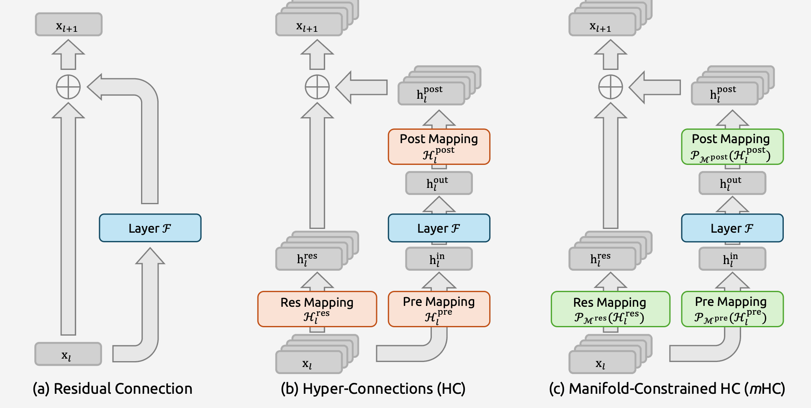
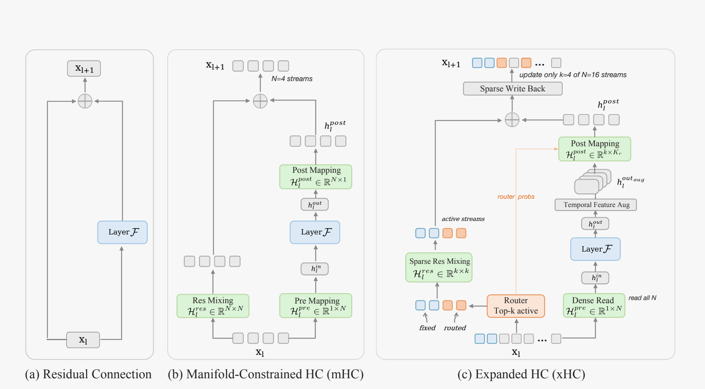
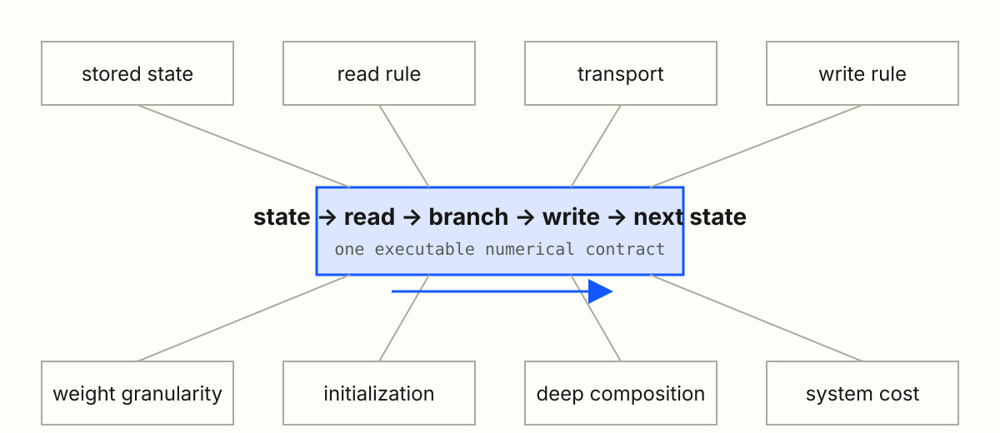
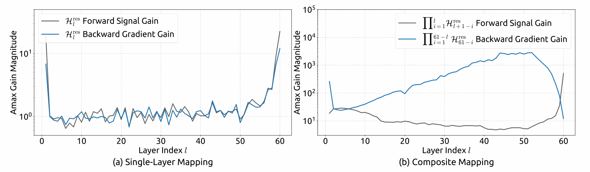
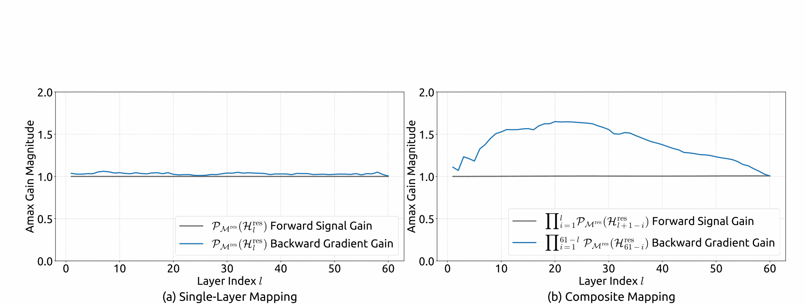
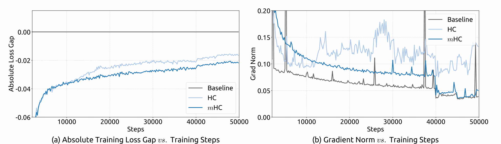
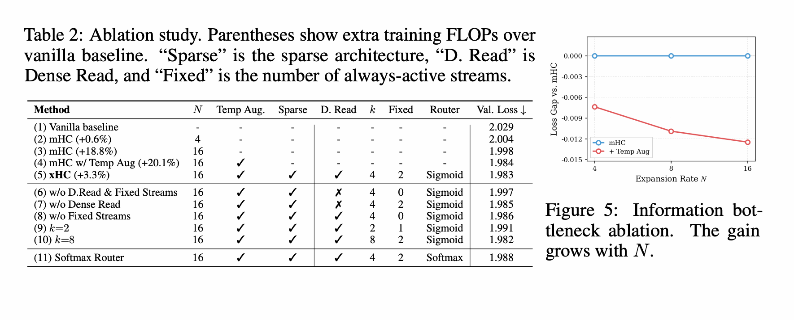
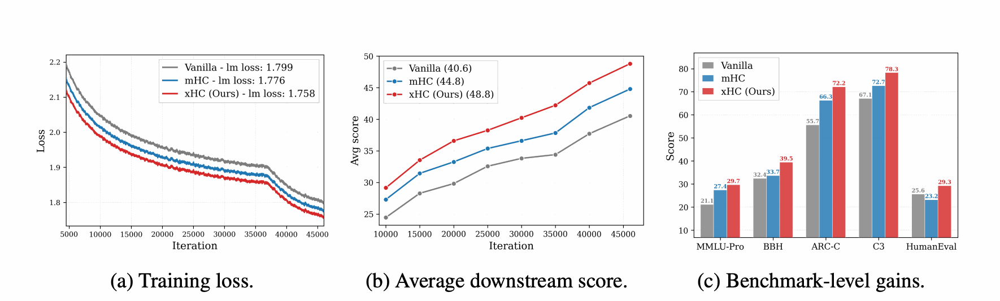

<!-- layout: title -->

# 从固定加法到深度记忆

HC、mHC、AttnRes 与 xHC 的 residual topology

<!-- notes:
0.5 分钟。只报题目、四篇论文与分享目标：把 residual connection 当作沿 depth 运行的 memory policy。

[Sources]
- https://arxiv.org/abs/2409.19606v3
- https://arxiv.org/abs/2512.24880v2
- https://arxiv.org/abs/2603.15031v1
- https://arxiv.org/abs/2607.14530v1
-->

---

<!-- layout: figure -->

## 一次加法其实规定了 memory policy

令 $v_0=h_1,\ v_i=f_i(h_i)$：

$$
h_l=\sum_{i=0}^{l-1}v_i
$$

- **stored state**：一条累计表示
- **read / write**：全部读取、系数 1 写入
- **retrieval**：不能单独访问历史 source

> **Derived** · Attention Residuals, arXiv:2603.15031v1, Fig. 1(a), PDF p.1；Eq. 1–2

<!-- notes:
1.5 分钟。先问：如果 residual 是 memory，它的 eviction policy 是什么？答案是没有显式 eviction，也不能单独检索 source。

[Sources]
- https://arxiv.org/abs/2603.15031v1
- https://github.com/J-shang/residual
-->

---

<!-- layout: comparison -->

## 标准 residual 是固定 depth mixing

direct path 帮助信息与梯度跨层传播；同一个固定权重也限制了按内容选择历史 source 的能力。

> **Reported + Derived** · Attention Residuals, arXiv:2603.15031v1, Fig. 1(a), PDF p.1；Eq. 1–2

<!-- notes:
1.5 分钟。identity path、identity initialization 和训练后学成 identity 是三件事；本页只建立共同起点。

[Sources]
- https://arxiv.org/abs/2603.15031v1
-->

---

<!-- layout: figure -->

## 用 operational contract 比较连接方法

同一张 contract 必须能落到 reference code、correctness test 与 distributed layout。

<!-- notes:
1.5 分钟。此页是全场坐标系：后续每种方法都回答同一组问题，而不是各讲一套术语。

[Sources]
- https://github.com/J-shang/residual
-->

---

<!-- layout: figure -->

## 四篇论文回应四类设计压力

| HC | mHC | AttnRes | xHC |
|---|---|---|---|
| topology | stability | retrieval | large-state cost |

> **Derived** · HC Fig. 2 · mHC Fig. 1 · Attention Residuals Fig. 1 · xHC Fig. 3

<!-- notes:
0.5 分钟。快速预告：capacity、stability、retrieval、large-state cost。

[Sources]
- https://arxiv.org/abs/2409.19606v3
- https://arxiv.org/abs/2512.24880v2
- https://arxiv.org/abs/2603.15031v1
- https://arxiv.org/abs/2607.14530v1
-->

---

<!-- layout: figure -->

## HC 扩张的是 residual state

$$
[B,S,d]\ \longrightarrow\ [B,S,n,d],
\qquad \text{branch}:d\to d
$$

> **Reported** · Hyper-Connections, arXiv:2409.19606v3, Fig. 2, PDF p.2；§2

<!-- notes:
2 分钟。用 n=2 的最小例子说明：扩的是跨 depth 持久 state，不是 FFN hidden size。

[Sources]
- https://arxiv.org/abs/2409.19606v3
-->

---

<!-- layout: figure -->

## HC 把连接拆成 read、mix、write

$$
u_l=H_l^\top A_m,\qquad
y_l=F_l(\operatorname{Norm}(u_l)),\qquad
H_{l+1}=A_r^\top H_l+B^\top y_l^\top.
$$

`A_m:[n,1]` read · `A_r:[n,n]` transport · `B:[1,n]` write

> **Reported** · Hyper-Connections, arXiv:2409.19606v3, Fig. 2(b), PDF p.2；Eq. 1–8

<!-- notes:
1.5 分钟。矩阵转置取决于存储 convention；不变的是 source-to-target 语义与 shapes。

[Sources]
- https://arxiv.org/abs/2409.19606v3
-->

---

<!-- layout: figure -->

## DHC 从熟悉函数出发，再学习 token 路由

| 初始化时 | 训练后 |
|---|---|
| 动态投影为 0 | 每个 token 生成不同 mapping |
| $A_r=I$ | $A_r(x)$ 学 transport |
| $B=\mathbf 1$ | $B(x)$ 学 write |
| $A_m$ 按层轮换 one-hot | $A_m(x)$ 学 read |

这是一种 **PreNorm-compatible 多流函数**；不等于每层 hidden 都与普通 PreNorm 完全相同。

> **Reported** · Hyper-Connections, arXiv:2409.19606v3, Fig. 2(b), PDF p.2；§2 与 Appendix

<!-- notes:
1.5 分钟。只讲 optimizer-owned 参数如何生成运行时 mapping，不展开全部 DHC 参数化。

[Sources]
- https://arxiv.org/abs/2409.19606v3
-->

---

<!-- layout: comparison -->

## HC 的算术很轻，状态并不轻

7B dense DHC×4：V2 loss `2.581 → 2.559`，下游平均 `70.1 → 71.0`；训练显存增幅约 **9.7%–28.3%**。

> **Reported** · Hyper-Connections, arXiv:2409.19606v3, Fig. 1, PDF p.1；Table 9, PDF p.16。token efficiency ≠ wall-clock speedup。

<!-- notes:
2 分钟。质量和显存分别读；不同模型设置不能拼成一条严格 Pareto curve。大模型结果无多 seed/error bar。

[Sources]
- https://arxiv.org/abs/2409.19606v3
-->

---

<!-- layout: comparison -->

## HC 的风险藏在深层 transport 乘积

$$
H_L=\left(\prod_{l=1}^{L-1}A_{r,l}^{\top}\right)H_1+\text{writes}.
$$

> **Reported + Derived** · mHC, arXiv:2512.24880v2, Fig. 2–3, PDF p.7。Amax common-mode gain ≠ spectral norm。

<!-- notes:
1.5 分钟。先用 scalar gain 连乘建立直觉，再切回矩阵。PreNorm-compatible 初始化不保证训练全过程。

[Sources]
- https://arxiv.org/abs/2409.19606v3
- https://arxiv.org/abs/2512.24880v2
-->

---

<!-- layout: figure -->

## mHC 约束的是 transport，不是主变换

$$
\mathcal B_n=\{H\ge 0\mid H\mathbf1=\mathbf1,\ \mathbf1^\top H=\mathbf1^\top\}.
$$

自由 logits 经 `exp + 20-step Sinkhorn` 生成近似双随机 `H_res`；主 Attention/MLP 仍保持原宽度。

> **Reported** · mHC, arXiv:2512.24880v2, Fig. 1, PDF p.1；Eq. 6–9。Birkhoff polytope 是凸多面体。

<!-- notes:
2 分钟。20 次 Sinkhorn 是有限步近似；运行时 row/column error 决定保证离精确条件有多远。

[Sources]
- https://arxiv.org/abs/2512.24880v2
-->

---

<!-- layout: figure -->

## 双随机约束保的是共同模式与均值

| 精确条件下 | 一行推导 | 含义 |
|---|---|---|
| common mode | $H\mathbf1=\mathbf1$ | equal-stream state 不变 |
| stream mean | $\mathbf1^\top H=\mathbf1^\top$ | stream sum / mean 守恒 |
| non-expansive | $\|H\|_2\le\sqrt{\|H\|_1\|H\|_\infty}=1$ | Euclidean operator norm 不放大 |
| closure | $H_2H_1\in\mathcal B_n$ | 性质可跨 depth 组合 |

> **Derived** · 没有保证 $H=I$、stream differences 等距；finite Sinkhorn 仅近似满足约束。

<!-- notes:
2 分钟。把 exact matrix property 与 finite-iteration implementation boundary 放在同一页说清。

[Sources]
- https://arxiv.org/abs/2512.24880v2
-->

---

<!-- layout: comparison -->

## mHC 的强证据是稳定性链条

作者 27B MoE 运行中，mHC 的 gradient profile 更接近 baseline；最终 loss 相对 baseline 低 `0.021`，8/8 报告任务更高。

> **Reported** · mHC, arXiv:2512.24880v2, Fig. 3, 5, 7, PDF p.7/12/14。单次运行；Amax ≠ spectral norm。

<!-- notes:
2 分钟。3000 与 1.6 是 approximate composite Amax common-mode gain，不是完整 spectral norm；单次运行也不建立统计显著性。

[Sources]
- https://arxiv.org/abs/2512.24880v2
-->

---

<!-- layout: figure -->

## mHC 把系统优化变成方法的一部分

| 成本边界 | `n=4` 的压力 |
|---|---|
| residual-side I/O | 论文静态 accounting 约 `34C` |
| activation | 持久多流 state |
| PP payload | 完整 state 跨界时近似 `4×` |
| wall-clock | 作者报告 6.7%，setup 不完整 |

> **Reported + Derived** · mHC, arXiv:2512.24880v2, Fig. 4, PDF p.12；Table 2。timeline 是示意，不是精确比例。

<!-- notes:
1.5 分钟。静态 accounting 中 n=4 residual-side I/O 约 34C；它不等于实测 HBM bytes 或 wall-clock。

[Sources]
- https://arxiv.org/abs/2512.24880v2
- https://github.com/deepseek-ai/TileKernels/tree/36d9e45d38e204ebb87e6f6e833821eee0482fe5
-->

---

<!-- layout: figure -->

## AttnRes 把固定求和改成 depth softmax

$$
\underbrace{\sum_i v_i}_{\text{fixed depth mixing}}
\quad\Longrightarrow\quad
\underbrace{\sum_i\alpha_{i\to l}(x)v_i}_{\text{token-dependent depth retrieval}},
$$

$$
\alpha_{i\to l}=\operatorname{softmax}_i\!\left(w_l^\top\operatorname{RMSNorm}(v_i)\right).
$$

softmax 轴是 **depth/source**，不是 sequence token。

> **Reported** · Attention Residuals, arXiv:2603.15031v1, Fig. 1, PDF p.1；Eq. 1–4

<!-- notes:
1.5 分钟。query 是 layer-specific parameter；key/value 来自输入相关历史 source。同一 token 的 channels 默认共享 source 权重。

[Sources]
- https://arxiv.org/abs/2603.15031v1
-->

---

<!-- layout: comparison -->

## Full AttnRes 检索 depth source

source stack 为 $[J,B,T,d]$，logits 与 weights 为 $[J,B,T]$；不同 token 可以选择不同 depth source。

> **Reported** · Attention Residuals, arXiv:2603.15031v1, Fig. 1/8, PDF p.1/13；Eq. 3–4

<!-- notes:
2 分钟。三 source 手算：standard 得 [4,4]，uniform AttnRes 得 [4/3,4/3]，自然引到初始化边界。

[Sources]
- https://arxiv.org/abs/2603.15031v1
-->

---

<!-- layout: figure -->

## zero query 恢复 uniform average

| 标准 residual | $w_l=0$ 的 AttnRes |
|---|---|
| $h_l=\sum_i v_i$ | $h_l=\frac1J\sum_i v_i$ |
| direct term：$I$ | direct term：$\alpha_iI=\frac1J I$ |
| 固定单位权重求和 | 均匀凸组合 |

RMSNorm 可能减弱统一 scale 的影响，但不能推出函数与 Jacobian 完全等价。

> **Derived** · 由 Attention Residuals, arXiv:2603.15031v1, Fig. 1, PDF p.1；Eq. 3–4 直接推得

<!-- notes:
1.5 分钟。zero query 是明确定义的 special case，不是 baseline-preserving identity initialization。

[Sources]
- https://arxiv.org/abs/2603.15031v1
-->

---

<!-- layout: figure -->

## Block AttnRes 用结构约束压缩历史

completed block 保存 $\sum_{j\in B_n}f_j(h_j)$；当前 block 的 branch output 则累加到可变 partial。

`all layer sources` → `embedding + completed block summaries + current partial`

> **Reported** · Attention Residuals, arXiv:2603.15031v1, Fig. 1(c), PDF p.1；Eq. 5–6

<!-- notes:
2 分钟。把 Block 解释为 depth mixing columns 的 block tying；它是结构化压缩，不是无损压缩。

[Sources]
- https://arxiv.org/abs/2603.15031v1
-->

---

<!-- layout: figure -->

## two-phase 是精确执行，PP cache 是状态协议

$$
m=\max(m_h,m_c),\qquad
s=e^{m_h-m}s_h+e^{m_c-m}s_c
$$

$$
n=e^{m_h-m}n_h+e^{m_c-m}n_c,\qquad y=n/s
$$

cache key 至少包含 microbatch、virtual stage、block 与方向。

> **Reported** · Attention Residuals, arXiv:2603.15031v1, Fig. 3, PDF p.6；Algorithm 1、Appendix B

<!-- notes:
1.5 分钟。算法精确等价不等于系统无开销。作者报告 PP training overhead <4%，但配置不足以跨系统外推。

[Sources]
- https://arxiv.org/abs/2603.15031v1
- https://github.com/MoonshotAI/Attention-Residuals/tree/85e22310fe5ee860b4a023de312d791de8a5a5e6
-->

---

<!-- layout: figure -->

## Block 版本保留了大部分 scaling 收益

| 最大 activated 点 | validation loss |
|---|---:|
| Baseline | 1.719 |
| Block | 1.693 |
| Full | 1.692 |

**1.25× 是 fitted compute-equivalence，不是实测 speedup。**

> **Reported** · Attention Residuals, arXiv:2603.15031v1, Fig. 4, PDF p.9。single run；无 fit uncertainty、多 seed 或公开验证数据。

<!-- notes:
2 分钟。五个报告点均优于对应 baseline；无多 seed、fit uncertainty、公开数据或 validation protocol。

[Sources]
- https://arxiv.org/abs/2603.15031v1
-->

---

<!-- layout: comparison -->

## xHC 从 mHC 的 large-N 饱和出发

`one write direction` 是有实验支持的 mechanism hypothesis；`NC × N² = O(N³C)` 是明确的 generator scaling。

> **Reported** · xHC, arXiv:2607.14530v1, Fig. 1/3, PDF p.1/4；§3

<!-- notes:
1.5 分钟。不要把信息供给不足说成已证明的容量定理；论文用 ablation 支持这个诊断。

[Sources]
- https://arxiv.org/abs/2607.14530v1
-->

---

<!-- layout: figure -->

## Temporal augmentation 扩展写回

默认 kernel sizes 为 $\{4,8,12\}$，得到 $K_r=4$ 个 write-back components；新增的是 $24C$ depthwise-conv 参数，不是四次大 MLP。

`original` · `DWConv-4` · `DWConv-8` · `DWConv-12`

> **Reported** · xHC, arXiv:2607.14530v1, Fig. 3(c), PDF p.4；Eq. 7–10

<!-- notes:
1.5 分钟。components 仍线性来自同一 sequence；局部正交化不保证语义独立或 unit norm。

[Sources]
- https://arxiv.org/abs/2607.14530v1
-->

---

<!-- layout: figure -->

## Dense read 解耦 $N$ 与 $k$

$N=16$ 控制 persistent memory capacity；fixed-2 + routed Top-2 组成 $k=4$ active streams；inactive streams exact carry。

> **Reported** · xHC, arXiv:2607.14530v1, Fig. 3(c), PDF p.4；Algorithm 1。只更新四条 ≠ 只读取四条。

<!-- notes:
2 分钟。只更新四条不等于只使用四条。hard Top-k indices 不可微；本次只有 selected routed scores 收到 routing gradient。

[Sources]
- https://arxiv.org/abs/2607.14530v1
-->

---

<!-- layout: comparison -->

## ablation 分开了质量与成本角色

`mHC N=16: 1.998 / 18.8%` → `+TempAug: 1.984 / 20.1%` → `xHC: 1.983 / 3.3%`

> **Reported** · xHC, arXiv:2607.14530v1, Table 2 & Fig. 5, PDF p.10；Fig. 2, PDF p.2。FLOPs counting ≠ wall-clock。

<!-- notes:
2 分钟。mHC N16：1.998/18.8%；+TempAug：1.984/20.1%；xHC：1.983/3.3%。单一设置、无多 seed。

[Sources]
- https://arxiv.org/abs/2607.14530v1
-->

---

<!-- layout: figure -->

## xHC-Flash 局部精确，整体是近似架构

固定 routing / pre-mapping window 内：

$$
\operatorname{read}(X+\alpha\,\Delta X)
=\operatorname{read}(X)+\alpha\,\operatorname{read}(\Delta X).
$$

| exact correction | architectural approximation |
|---|---|
| 已知 scalar-vector increment | routing 刷新频率改变 |
| 固定 window 内代数等价 | pre-mapping 依赖状态改变 |
| reduction contract 可对照 | residual mixing 位置改变 |

> **Reported + Derived** · xHC, arXiv:2607.14530v1, Table 5, PDF p.14；§4。I/O 是抽象 element traffic。

<!-- notes:
1.5 分钟。静态 accounting 从 full xHC 73.5C 降到 Flash-4sub 40C；不是实际 HBM bytes 或 speedup。

[Sources]
- https://arxiv.org/abs/2607.14530v1
-->

---

<!-- layout: comparison -->

## 没有一种方法统治所有设计轴

| 方法 | stored state | read | transport / write | 主要压力 |
|---|---|---|---|---|
| Standard | 单条累计 state | fixed | identity + add | retrieval 弱 |
| HC | $n$ streams | learned | unconstrained mix + multiwrite | activation / 深层乘积 |
| mHC | $n$ streams | learned | constrained transport | I/O / Sinkhorn / PP |
| AttnRes | 历史 sources | depth softmax | persist + append | history / cache |
| xHC | $N$ streams | dense | sparse active mutation | persistent state / routing |

选择方法，本质是在 capacity、retrieval、stability 与 system cost 上选 Pareto 点。

<!-- notes:
2 分钟。要多流可组合 transport 看 mHC；要按内容取历史看 AttnRes；要扩大 N 并控制 mutation 看 xHC。

[Sources]
- https://arxiv.org/abs/2409.19606v3
- https://arxiv.org/abs/2512.24880v2
- https://arxiv.org/abs/2603.15031v1
- https://arxiv.org/abs/2607.14530v1
-->

---

<!-- layout: comparison -->

## 开放问题应该被写成测试

| 开放问题 | 最小 CPU check | distributed check |
|---|---|---|
| 深层 transport 稳定吗？ | compose 60 层并记录 singular values | mixed precision + recompute |
| 多流形成分工吗？ | cosine / effective rank / perturb | per-stage stream statistics |
| source 到底存什么？ | hand-built state machine | cache schema + lifetime |
| 初始化恢复 baseline 吗？ | output + JVP 对照 | checkpoint migration |
| bytes 在哪里增长？ | tensor elements × dtype bytes | PP payload + collectives |
| 优化路径等价吗？ | gradcheck + direct/recompute | fallback + determinism |

先固定 correctness contract，再进入 GPU scaling。

<!-- notes:
2 分钟。把“以后要研究”改写成可证伪测试；主学习路线不需要 GPU。

[Sources]
- https://github.com/J-shang/residual
-->

---

<!-- layout: statement -->

## Residual path 是 depth memory

$$
\boxed{
\text{state}
+\text{read}
+\text{transport}
+\text{write}
+\text{system contract}
}
$$

连接方法的核心不是多加一个算子，而是重新定义信息沿 depth 的**保存、访问、变换与消亡方式**。

> **Synthesis** · HC Fig. 2 · mHC Fig. 1 · Attention Residuals Fig. 1 · xHC Fig. 3

<!-- notes:
1.5 分钟。回收三点：先写 operational contract；稳定性与 stream/source 有效性分开；activation、I/O、通信和数值边界都是方法定义。进入 Q&A。

[Sources]
- https://github.com/J-shang/residual
-->

---

<!-- layout: figure -->

## Appendix A｜双随机为何 non-expansive

对精确双随机矩阵 $H\ge0$：

$$
\|H\|_1=1,\qquad \|H\|_\infty=1,
$$

因此

$$
\|H\|_2\le\sqrt{\|H\|_1\|H\|_\infty}=1.
$$

只做 row-stochastic 不足以得到相同结论；finite Sinkhorn 还需报告 row/column error 与深层 product drift。

<!-- notes:
备份页。听众追问 norm guarantee 时展开。

[Sources]
- https://arxiv.org/abs/2512.24880v2
-->

---

<!-- layout: comparison -->

## Appendix B｜reference shape 与 dtype

| 方法 | logical state | mapping / active state | correctness-first 边界 |
|---|---|---|---|
| HC / mHC | $[B,S,n,C]$ | $[n,n]$ 或 per-token mapping | mapping stats 用 FP32 检查 |
| Full AttnRes | $[J,B,T,d]$ | weights $[J,B,T]$ | online-softmax stats 用 FP32 |
| Block AttnRes | summaries + partial | source count 随 block 增长 | commit/reset 做状态机测试 |
| xHC | $[B,S,N,C]$ | active $[B,S,k,C]$ | routing、SK、scatter 对照 |

dtype 是 correctness-first 建议；并非每一项都是论文规定。

<!-- notes:
备份页。用于实现讨论；logical state、local shard、dtype、layout 与 ownership 要分开写。

[Sources]
- https://arxiv.org/abs/2409.19606v3
- https://arxiv.org/abs/2512.24880v2
- https://arxiv.org/abs/2603.15031v1
- https://arxiv.org/abs/2607.14530v1
-->

---

<!-- layout: comparison -->

## Appendix C｜四篇论文的证据成熟度不同

| 来源 | method / math | quality | system | artifact | statistics |
|---|---|---|---|---|---|
| HC | 强 | 中 | 中 | 弱 | 弱 |
| mHC | 强 | 中 | 中 | 中 | 弱 |
| AttnRes | 强 | 中 | 中 | 弱 | 弱 |
| xHC | 强 | 中 | 弱 | 弱 | 弱 |

“弱”表示公开材料难以完整审计，**不表示方法无效**；大模型结果普遍缺多 seed 与 error bar。

<!-- notes:
备份页。mHC 有后续 TileKernels artifact；AttnRes/xHC 官方 artifact 仍缺完整训练实现与 kernel。

[Sources]
- https://arxiv.org/abs/2409.19606v3
- https://arxiv.org/abs/2512.24880v2
- https://arxiv.org/abs/2603.15031v1
- https://arxiv.org/abs/2607.14530v1
- https://github.com/MoonshotAI/Attention-Residuals/tree/85e22310fe5ee860b4a023de312d791de8a5a5e6
- https://github.com/aHapBean/xHC/tree/7890266d5cd648811b6783029ee6b5031cd209db
-->

---

<!-- layout: comparison -->

## Appendix D｜系统成本数字不可直接横比

| 类型 | 数字示例 | counting boundary |
|---|---|---|
| residual-side 静态 I/O | mHC $\approx34C$ | mapping generation/application |
| residual-side 静态 I/O | AttnRes $24d/5.5d$ | two-phase residual mechanism |
| residual-side 静态 I/O | xHC $73.5C/40C$ | 抽象 element traffic |
| 端到端 memory | HC +9.7%–28.3% | 论文具体训练设置 |
| 端到端 overhead | mHC 6.7%、AttnRes <4% | 硬件/并行分解不完整 |

当前公开证据不足以给出跨论文 wall-clock 排名。

<!-- notes:
备份页。每个成本数字必须保留 setup、是否实测、是否含 branch I/O，以及 resident cache/payload 的边界。

[Sources]
- https://arxiv.org/abs/2409.19606v3
- https://arxiv.org/abs/2512.24880v2
- https://arxiv.org/abs/2603.15031v1
- https://arxiv.org/abs/2607.14530v1
-->
