<!-- layout: title -->
<!-- section-header: cover || ACADEMIC SHARING · 130 MIN || 01 / 64 -->

# 从固定加法到深度记忆

HC · mHC · xHC · Attention Residuals

  
Standard PreNorm residual

  

    persistent recurrent state
    <strong>HC</strong><i>→</i><strong>mHC</strong><i>→</i><strong>xHC</strong>
  

  

    named historical sources
    <strong>Attention Residuals</strong>
  

<!-- notes:
开场先给一个承诺：不从论文名和大公式开始，而从一次熟悉的 residual add 开始。目标是最后能亲手画出每种方法的一层状态更新。

[Sources]
- https://arxiv.org/abs/2409.19606v3
- https://arxiv.org/abs/2512.24880v2
- https://arxiv.org/abs/2603.15031v1
- https://arxiv.org/abs/2607.14530v1
-->

---

<!-- layout: statement -->
<!-- section-header: depth || 01 · 共同起点 / DEPTH MEMORY · 1/7 || 02 / 64 -->

## 一次 residual add 是一次状态更新

$$
x_{l+1}=x_l+F_l(\operatorname{Norm}(x_l))
$$

  <strong>state</strong><code>x_l</code>
  <b>→</b>
  <strong>read</strong><code>x_l</code>
  <b>→</b>
  <strong>branch</strong><code>y_l</code>
  <b>→</b>
  <strong>write</strong><code>x_l+y_l</code>

PreNorm 同时规定了：当前层读什么、branch 产生什么增量、下一层保存什么。

<!-- notes:
先暂时忘掉 skip connection 这个标签，只看运行时状态。进入这一层只有 x_l；branch 读取它，产生新方向，仍写回同一个容器。

[Sources]
- https://arxiv.org/abs/2603.15031v1
- https://arxiv.org/abs/2409.19606v3
-->

---

<!-- layout: split -->
<!-- section-header: depth || 01 · 共同起点 / DEPTH MEMORY · 2/7 || 03 / 64 -->

## 展开三层后，历史被压进一条累计状态

  <code>x₁ = v₀ + v₁</code>
  <code>x₂ = v₀ + v₁ + v₂</code>
  <code>x₃ = v₀ + v₁ + v₂ + v₃</code>
  <strong>一般地：$x_l=\sum_{i=0}^{l-1}v_i$</strong>

  

    1000
    1100
    1110
    1111
  

  <small>row = current layer · column = historical source</small>

<!-- notes:
逐行展开。每个 v_i 都是历史 sublayer 产生的新信息，但下一层只看见它们的固定系数求和。全 1 带来简单 direct path，也锁定了 depth mixing。

[Sources]
- https://arxiv.org/abs/2603.15031v1
-->

---

<!-- layout: statement -->
<!-- section-header: depth || 01 · 共同起点 / DEPTH MEMORY · 3/7 || 04 / 64 -->

## 单一累计 state 同时限制 capacity 与 addressability

  

    <small>capacity / topology pressure</small>
    <strong>只有一个 recurrent container</strong>
    每层持续复用同一个 <code>[B,T,d]</code> state；若希望跨 depth 保存多条并行路径，必须先改变 persistent topology。
  

  

    <small>source addressability pressure</small>
    <strong>历史身份被固定求和压缩</strong>
    <code>(v₁,v₂)</code> 与 <code>(v₁+δ,v₂−δ)</code> 得到同一累计 state，后层通常不能点名重读其中一个 source。
  

> **复原推导** · one stored state creates two distinct design pressures

这不表示 hidden width 不足或 baseline 无法表达；问题只在于 residual path 选择了怎样的跨层 state 语义。

<!-- notes:
不要把这页讲成 hidden dimension 不够，也不要宣称 baseline 无表达能力。这里只把两类压力分开：persistent containers 有多少，以及历史 source 能否被直接点名。

[Sources]
- https://arxiv.org/abs/2409.19606v3
- https://arxiv.org/abs/2603.15031v1
-->

---

<!-- layout: statement -->
<!-- section-header: depth || 01 · 共同起点 / DEPTH MEMORY · 4/7 || 05 / 64 -->

## 改造 depth memory 的两条路线

  
Standard residual

  

    capacity / topology
    <strong>HC</strong><i>→</i><strong>mHC</strong><i>→</i><strong>xHC</strong>
  

  

    source addressability
    <strong>Attention Residuals</strong>
  

这是本次分享的统一问题空间：两条路线回应不同压力，不表示论文动机相同、代码继承、数学等价、发布时间或实验排名。

<!-- notes:
HC、mHC、xHC 从 capacity/topology 压力出发，内部形成连续设计链；AttnRes 从 addressability 出发改变 stored-state semantics。统一的是讲述框架，不是作者动机。

[Sources]
- https://arxiv.org/abs/2409.19606v3
- https://arxiv.org/abs/2512.24880v2
- https://arxiv.org/abs/2603.15031v1
- https://arxiv.org/abs/2607.14530v1
-->

---

<!-- layout: comparison -->
<!-- section-header: depth || 01 · 共同起点 / DEPTH MEMORY · 5/7 || 06 / 64 -->

## 全场只用一个可手算的 toy world

  
<small>h⁽¹⁾ / v₀</small><strong>[2, 0]</strong>

  
<small>h⁽²⁾ / v₁</small><strong>[0, 3]</strong>

  
<small>branch y / v₂</small><strong>[2, 1]</strong>

B = 1 · T = 1 · d = 2　|　HC/mHC: n = 2　|　xHC: N = 4, k = 2　|　AttnRes: J = 3

压掉 batch 与 token 轴，只为盯住 stream/source 轴；每种方法的操作语义仍然保留。

<!-- notes:
三个向量后面会反复出现。颜色固定：蓝色表示 persistent state/source，绿色 read，紫色 transport，橙色 write。

[Sources]
- https://github.com/J-shang/residual
-->

---

<!-- layout: statement -->
<!-- section-header: depth || 01 · 共同起点 / DEPTH MEMORY · 6/7 || 07 / 64 -->

## 后续始终回答同一组 operational questions

  <strong>state</strong>跨层保存什么？
  <strong>read</strong>当前 branch 看什么？
  <strong>transport</strong>旧信息怎样过层？
  <strong>write</strong>新信息写到哪里？
  <strong>granularity</strong>谁共享 routing？
  <strong>initialization</strong>从哪个 special case 开始？
  <strong>composition</strong>许多层之后怎样？
  <strong>cost</strong>state / I/O / communication 付出什么？

<!-- notes:
这八个问题是后面每章重复使用的框架。参数少不等于 state 便宜；初始化接近 identity 也不等于深层乘积受控。

[Sources]
- https://github.com/J-shang/residual
-->

---

<!-- layout: figure -->
<!-- section-header: hc || 02 · HC / MULTI-STREAM · 1/12 || 08 / 64 -->

## HC 让 residual topology 本身可学习

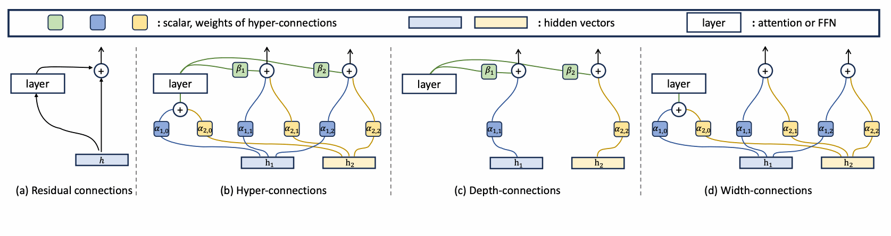

HC 把一条 residual path 扩成多条 persistent streams，并把 **read、旧 state transport、branch write** 都变成可学习连接。

主 Attention / MLP 仍然只处理一次 $d\!\to\!d$；增加的是跨层 state 容器与围绕 branch 的 topology。

> **论文报告** · Hyper-Connections, Fig. 2, PDF p.2

<!-- notes:
先讲教学模型，再把原 Figure 2 当结构锚点。核心不是复制 hidden state，而是让 residual path 的 topology 可学习。

[Sources]
- https://arxiv.org/abs/2409.19606v3
-->

---

<!-- layout: statement -->
<!-- section-header: hc || 02 · HC / MULTI-STREAM · 2/12 || 09 / 64 -->

## 第二条 stream 首先提供的是保存选择

  
<strong>stream 1</strong>read<i>→</i>branch<i>→</i>write

  
<strong>stream 2</strong>exact carry<i>────────────────→</i>unchanged

若 read 第一条、transport 为 identity、write 仅第一条：

$$
h_1'=h_1+F(h_1),\qquad h_2'=h_2
$$

这只证明 topology **允许**保存分工，不宣称训练后一定形成固定语义。

<!-- notes:
先用 n=2 建立直觉，不引入矩阵符号。第二条 stream 可以暂时绕过当前 branch，保留未被改写的信息。

[Sources]
- https://arxiv.org/abs/2409.19606v3
-->

---

<!-- layout: statement -->
<!-- section-header: hc || 02 · HC / MULTI-STREAM · 3/12 || 10 / 64 -->

## HC 扩 state，不扩主 branch

  <strong>[B,S,n,d]</strong><small>persistent state</small>
  <b>— read n → 1 →</b>
  <strong>[B,S,d]</strong><small>branch input</small>
  <b>— Attention / MLP →</b>
  <strong>[B,S,d]</strong><small>branch output</small>
  <b>— write 1 → n →</b>
  <strong>[B,S,n,d]</strong><small>next state</small>

`n = stream axis`　·　`d = hidden width`

多流增加 persistent activation 与 mapping；主干算子仍处理一条 $d$ 维表示。

<!-- notes:
纠正常见误解：扩的是跨深度持久 state，不是 FFN hidden size。后面所有 mapping 都只围绕 n 轴工作。

[Sources]
- https://arxiv.org/abs/2409.19606v3
-->

---

<!-- layout: split -->
<!-- section-header: hc || 02 · HC / MULTI-STREAM · 4/12 || 11 / 64 -->

## Read 决定当前 branch 看见哪种多流组合

  h₁<i>↘ a₁</i>
  <strong>u</strong>
  h₂<i>↗ a₂</i>

$$
u=H^\top A_m
$$

`H:[n,d]`　·　`A_m:[n,1]`　·　`u:[d]`

- `[1,0]ᵀ`：读 stream 1
- `[0,1]ᵀ`：读 stream 2
- `[0.5,0.5]ᵀ`：读平均

<!-- notes:
同一个 read coefficient 作用于整条 d-vector，不是在 channel 内做 attention。A_m 的职责只是从多流 state 得到 branch input。

[Sources]
- https://arxiv.org/abs/2409.19606v3
-->

---

<!-- layout: split -->
<!-- section-header: hc || 02 · HC / MULTI-STREAM · 5/12 || 12 / 64 -->

## Transport 决定旧 streams 怎样跨层存在

  old h₁<i>1.0 →</i>next h₁
  old h₁<i>0.5 ↘</i>next h₂
  old h₂<i>1.0 →</i>next h₂

$$
H'_{\mathrm{old}}=A_r^\top H
$$

在 row-stream convention 下：

`A_r[i,j] = source stream i → target stream j`

转置位置可随代码 convention 改变；source-to-target 语义不能变。

<!-- notes:
这页只讲旧 state carry/mix，不讲 branch write。逐条指出 source 与 target，避免矩阵方向在实现里被悄悄转反。

[Sources]
- https://arxiv.org/abs/2409.19606v3
-->

---

<!-- layout: split -->
<!-- section-header: hc || 02 · HC / MULTI-STREAM · 6/12 || 13 / 64 -->

## Write 决定一个 branch output 注入哪些 streams

  <strong>branch y</strong>
  <i>↗ b₁</i>target 1
  <i>↘ b₂</i>target 2

$$
H'_{\mathrm{write}}=B^\top y^\top
$$

`B:[1,n]`　·　`y:[d]`

`B=[1,0]`：只写 target 1；`B=[1,1]`：两条都写。

每条新增量都位于 $\operatorname{span}\{y\}$。

<!-- notes:
现在只建立 one-to-n write 语义。共线 write bottleneck 会在 xHC 章节成为设计压力。

[Sources]
- https://arxiv.org/abs/2409.19606v3
-->

---

<!-- layout: figure -->
<!-- section-header: hc || 02 · HC / MULTI-STREAM · 7/12 || 14 / 64 -->

## 三个 mapping 合起来才是一层 HC

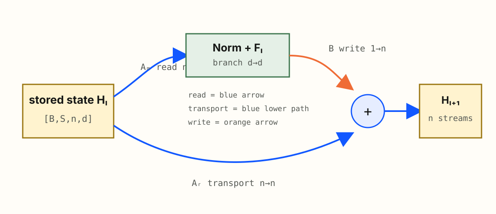

$$
u=H^\top A_m,\qquad
y=F(\operatorname{Norm}(u)),\qquad
H'=A_r^\top H+B^\top y^\top
$$

`A_m` 不保存 state　·　`A_r` 不经过主 branch　·　`B` 不生成新 features

> **论文报告 + 复原推导** · Hyper-Connections, Eq. 1–8

<!-- notes:
沿图从左到右走一遍。三个矩阵角色不同，不能因为都叫 mapping 就在实现或解释里混在一起。

[Sources]
- https://arxiv.org/abs/2409.19606v3
-->

---

<!-- layout: split -->
<!-- section-header: hc || 02 · HC / MULTI-STREAM · 8/12 || 15 / 64 -->

## 一个 $n=2$ 数值例子足以检查矩阵方向

$$
H=\begin{bmatrix}2&0\\0&3\end{bmatrix},\quad
A_m=\begin{bmatrix}1\\0\end{bmatrix}
$$

$$
A_r=\begin{bmatrix}1&0.5\\0&1\end{bmatrix},\quad
B=\begin{bmatrix}1&0\end{bmatrix},\quad y=[2,1]
$$

  <strong>target 1</strong><code>old h₁ + y = [4,1]</code>
  <strong>target 2</strong><code>0.5 old h₁ + h₂ = [1,3]</code>
  <b>H′ = [[4,1], [1,3]]</b>

> **复原推导** · target-by-target calculation

<!-- notes:
按 target 一行一行读，不要求听众心算矩阵乘法。第二条接收 0.5 h1 和 h2，但不接收 branch write。

[Sources]
- https://github.com/J-shang/residual
-->

---

<!-- layout: comparison -->
<!-- section-header: hc || 02 · HC / MULTI-STREAM · 9/12 || 16 / 64 -->

## SHC 学每层 topology，同层 token 共用

  

    <small>token 1</small><small>token 2</small><small>token 3</small>
  

  <b>→</b>
  <strong>Aₘ · Aᵣ · B</strong>
  learned per layer shared across batch / token

<strong>static = input-independent</strong>，不是 frozen；这些 mappings 仍由主任务 loss 端到端更新。

<!-- notes:
这一页只定义 weight granularity。SHC 能学每层不同 topology，但同一层的两个 token 不能选择不同 routing。

[Sources]
- https://arxiv.org/abs/2409.19606v3
-->

---

<!-- layout: split -->
<!-- section-header: hc || 02 · HC / MULTI-STREAM · 10/12 || 17 / 64 -->

## DHC 为每个 token 生成 runtime routing

  <strong>current H[b,t]</strong><small>runtime state</small>
  →
  <strong>route norm</strong>
  →
  <strong>projection + tanh</strong>
  →
  <strong>ΔA(H)</strong>

$$
A_r(H)=A_r^{\mathrm{base}}+s_\alpha\tanh(\operatorname{Norm}_{route}(H)W_r)
$$

  
<strong>optimizer-owned</strong>base · projection · scale

  
<strong>runtime tensors</strong>Aₘ(H) · Aᵣ(H) · B(H)

<!-- notes:
运行时 mapping 不是 optimizer 直接维护的 parameter，而是当前 token forward 生成的 activation；完整 state update 仍沿用 S14。

[Sources]
- https://arxiv.org/abs/2409.19606v3
-->

---

<!-- layout: statement -->
<!-- section-header: hc || 02 · HC / MULTI-STREAM · 11/12 || 18 / 64 -->

## 初始化先关闭动态修正，再恢复熟悉路径

  <strong>dynamic projection = 0</strong><small>关闭 token delta</small>
  <b>→</b>
  <strong>Aᵣ = I</strong><small>旧 state identity carry</small>
  <b>→</b>
  <strong>rotating one-hot Aₘ</strong><small>轮换 read</small>
  <b>→</b>
  <strong>B = 1</strong><small>全流 write</small>

PreNorm compatibility 依赖完整的 read / write / final collapse contract，不是只看 $A_r=I$。

<!-- notes:
避免说每个中间 state 都等于 standard PreNorm。兼容性来自轮换读取、全流写入、branch scale 与最终 collapse 的组合。

[Sources]
- https://arxiv.org/abs/2409.19606v3
-->

---

<!-- layout: comparison -->
<!-- section-header: hc || 02 · HC / MULTI-STREAM · 12/12 || 19 / 64 -->

## HC 证明多流 topology 有效，但 persistent state 并不免费

  

    <strong>方法有效</strong>
    DHC 在论文多组语言与视觉实验中改善 loss / downstream metrics
  

  

    <strong>persistent state</strong>
    $d\to nd$；论文报告训练显存增加约 9.7%–28.3%
  

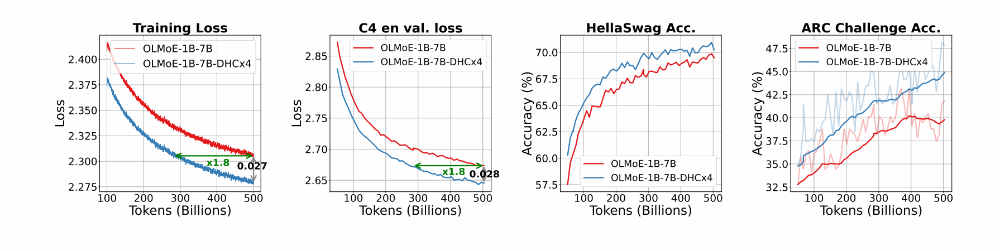
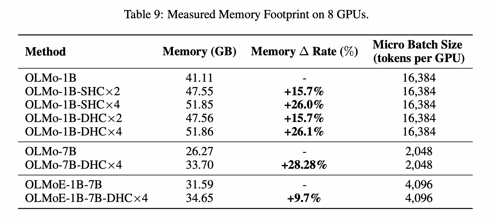

本页只确认 quality evidence 与 measured memory；transport product 的深层风险从下一页开始单独追踪。

<!-- notes:
先肯定多流 topology 的经验价值，再报告 persistent state 的 measured memory。不要在本页提前画 transport product；它属于 mHC 的下一个设计压力。

[Sources]
- https://arxiv.org/abs/2409.19606v3
-->

---

<!-- layout: figure -->
<!-- section-header: mhc || 03 · mHC / STABLE TRANSPORT · 1/11 || 20 / 64 -->

## 深层风险来自许多 transport 的有序乘积

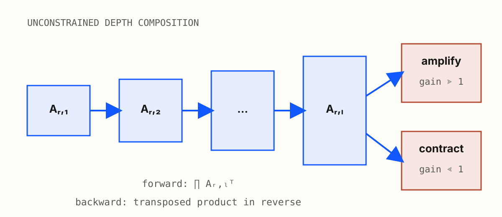

$$
P=T_{L-1}\cdots T_l,\qquad
1.2^{60}\approx5.6\times10^4,\qquad
0.8^{60}\approx1.5\times10^{-6}
$$

Forward 经过 $P$；backward 经过 $P^\top$，共享同一组 singular values。

> **复原推导** · mHC 的设计压力

<!-- notes:
单层只稍微偏离 identity，也可能在很多层后指数放大或衰减。mHC 要控制的是可重复复合的集合，不只是初始化点。

[Sources]
- https://arxiv.org/abs/2512.24880v2
-->

---

<!-- layout: comparison -->
<!-- section-header: mhc || 03 · mHC / STABLE TRANSPORT · 2/11 || 21 / 64 -->

## 论文在训练中观察到 propagation 失控

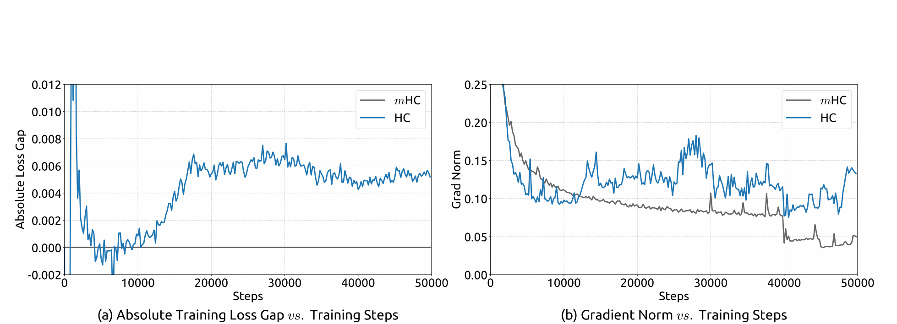
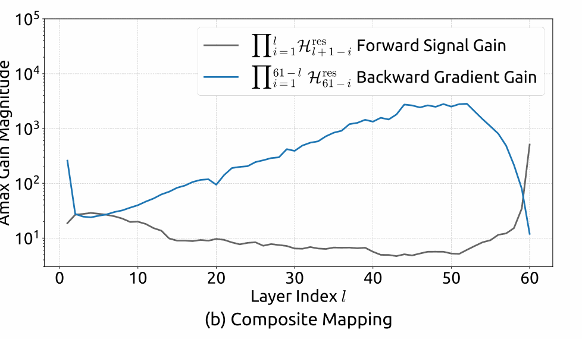

`约 12k step：loss / gradient spike`　·　`composite Amax 峰值接近 3000`

这是现象证据；Amax 是 common-mode gain diagnostic，不是完整 operator norm，也不能单独证明因果。

> **论文报告** · mHC, Fig. 2–3

<!-- notes:
先读训练症状，再与上一页的 transport product 机制连接。相关性支持设计方向，但不把曲线本身讲成因果证明。

[Sources]
- https://arxiv.org/abs/2512.24880v2
-->

---

<!-- layout: split -->
<!-- section-header: mhc || 03 · mHC / STABLE TRANSPORT · 3/11 || 22 / 64 -->

## mHC 限制 transport，不禁止交换

  all real matrices
  

    <strong>doubly stochastic</strong>
    <small>identity · permutation · convex mixing</small>
  

$$
H\mathbf1=\mathbf1,\qquad
\mathbf1^\top H=\mathbf1^\top,\qquad
H\ge0
$$

mHC 缩小可选 transport 的集合，同时保留非平凡 stream exchange。

$H=I$ 很稳定，却会取消 HC 最重要的 cross-stream mixing。

<!-- notes:
设计目标是 stability 与 plasticity 的折中。双随机集合不是 identity 的同义词，而是一组对深层复合友好的 mixing matrices。

[Sources]
- https://arxiv.org/abs/2512.24880v2
-->

---

<!-- layout: comparison -->
<!-- section-header: mhc || 03 · mHC / STABLE TRANSPORT · 4/11 || 23 / 64 -->

## Identity、swap 与 average 都属于稳定候选

  
<strong>identity</strong><code>[[1,0],[0,1]]</code><small>[2,0] · [0,3]</small>

  
<strong>swap</strong><code>[[0,1],[1,0]]</code><small>[0,3] · [2,0]</small>

  
<strong>average</strong><code>½[[1,1],[1,1]]</code><small>[1,1.5] · [1,1.5]</small>

三者都非负，且每行、每列的和为 1。

Uniform average 消除了 difference mode：双随机不保证 stream diversity。

<!-- notes:
identity 不交换，swap 完全交换，average 做凸混合。稳定候选仍有丰富结构，不等于每层只能 identity carry。

[Sources]
- https://arxiv.org/abs/2512.24880v2
- https://github.com/J-shang/residual
-->

---

<!-- layout: figure -->
<!-- section-header: mhc || 03 · mHC / STABLE TRANSPORT · 5/11 || 24 / 64 -->

## Sinkhorn 在 forward 内生成 mapping

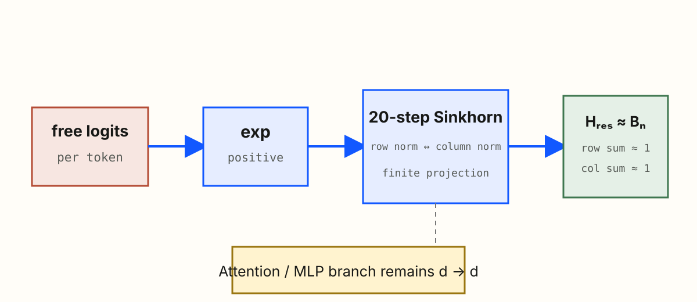

  Z logits→
  exp(Z)→
  column norm→
  row norm→ ×20

<strong>forward 可微计算</strong>，不是 optimizer step 之后的独立 projection；有限迭代得到的是近似双随机 mapping。

> **论文报告** · mHC, Eq. 6–9

<!-- notes:
Backward 穿过 exp 与 normalization 计算图，optimizer 更新 generator；下一次 forward 再生成 mapping。最终 row/column error 应单独验证。

[Sources]
- https://arxiv.org/abs/2512.24880v2
-->

---

<!-- layout: split -->
<!-- section-header: mhc || 03 · mHC / STABLE TRANSPORT · 6/11 || 25 / 64 -->

## 双随机 transport 保住共同模式与均值

  

    <strong>common mode</strong>
    <code>H(1zᵀ) = 1zᵀ</code>
    <small>所有 streams 共享的分量保持不变</small>
  

  

    <strong>stream mean</strong>
    <code>(1/n)1ᵀHX = (1/n)1ᵀX</code>
    <small>每个 feature channel 的 stream 平均保持</small>
  

$H^\top$ 仍双随机，因此 backward 具有对应的共同模式与均值性质。

Common mode 可取等号；difference directions 仍可能被混合或收缩。

<!-- notes:
不要只念公式。共同模式是每条 stream 都相同的部分；stream mean 是不同 streams 在每个 channel 上的平均。

[Sources]
- https://arxiv.org/abs/2512.24880v2
-->

---

<!-- layout: split -->
<!-- section-header: mhc || 03 · mHC / STABLE TRANSPORT · 7/11 || 26 / 64 -->

## Non-expansiveness 与乘法闭包控制深层复合

$$
H=\sum_k\lambda_kP_k
\quad\Longrightarrow\quad
\|H\|_2\le1
$$

双随机矩阵是 permutation matrices 的 convex combination，所以 exact transport 不会放大 operator 2-norm。

$$
H_1,H_2\in\mathcal B_n
\quad\Longrightarrow\quad
H_2H_1\in\mathcal B_n
$$

乘法闭包把单层约束提升成深层结构性质。

Non-expansion 不表示每个方向都保持 norm。

<!-- notes:
先给决定性证明锚点，不展开完整 appendix。实际 finite Sinkhorn 只有近似保证，仍需测 row/column error 与深层 product drift。

[Sources]
- https://arxiv.org/abs/2512.24880v2
-->

---

<!-- layout: comparison -->
<!-- section-header: mhc || 03 · mHC / STABLE TRANSPORT · 8/11 || 27 / 64 -->

## 稳定集合仍不等于 identity 或 stream diversity

  
<strong>精确保证</strong>非负 · 行列和为 1 · common mode · mean · non-expansion · closure

  
<strong>不保证</strong>每层等于 identity · 所有方向保 norm · streams 保持多样 · 总 state 永不增长

  
<strong>实现边界</strong>finite Sinkhorn · clamp · mixed precision · branch write

Uniform average 是最短反例：它双随机，却把两条 stream 的 difference mode 完全抹掉。

<!-- notes:
把 stability 与 stream effectiveness 分成两个研究问题。mHC 约束 residual transport，不自动解决 representation collapse 或 branch growth。

[Sources]
- https://arxiv.org/abs/2512.24880v2
-->

---

<!-- layout: comparison -->
<!-- section-header: mhc || 03 · mHC / STABLE TRANSPORT · 9/11 || 28 / 64 -->

## 作者报告的 gain、gradient 与 loss 与约束方向一致

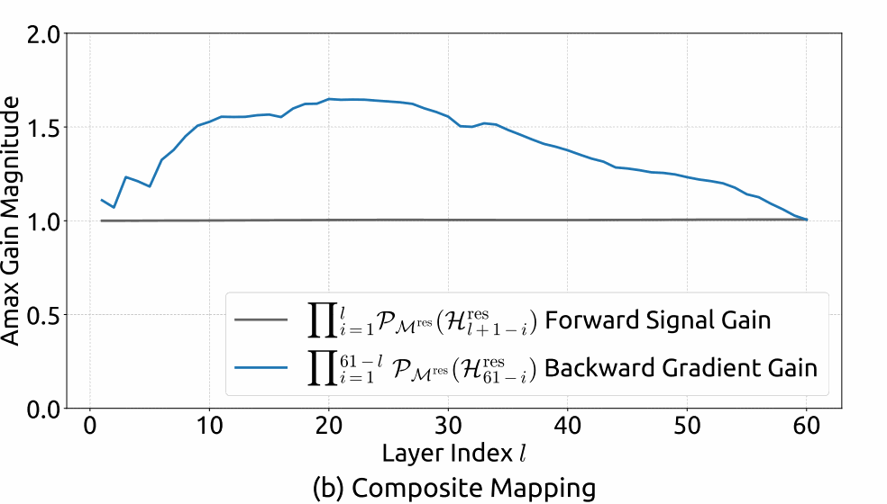

`HC composite Amax ≈ 3000`　→　`mHC ≈ 1.6`

先读绝对值与 y-axis，再读视觉高度；单次大模型运行、无多 seed，不能由 Amax 一项证明完整机制。

> **论文报告** · mHC, Fig. 5, 7, 8

<!-- notes:
数学方向、diagnostic 与训练现象相互一致，但仍保留实验边界。接下来切换到系统问题：多流 state 的 bytes 还在。

[Sources]
- https://arxiv.org/abs/2512.24880v2
-->

---

<!-- layout: statement -->
<!-- section-header: mhc || 03 · mHC / STABLE TRANSPORT · 10/11 || 29 / 64 -->

## 稳定约束不会消除多流 state 的系统成本

  <strong>activation</strong><code>B · S · n · C · bytes(dtype)</code>
  <strong>per-layer movement</strong><code>read + mix + write full multi-stream state</code>
  <strong>PP boundary</strong><code>payload ∝ nC</code>
  <strong>mapping work</strong><code>generation + Sinkhorn + backward / recompute</code>

参数与主干 FLOPs 可以很小，persistent state 仍必须跨很多层保存和搬运。

<!-- notes:
这里只讲成本来源，不承诺 wall-clock 数字。实现还需明确 mapping 是否重算、用什么 dtype 累积、PP 是否传 full state。

[Sources]
- https://arxiv.org/abs/2512.24880v2
-->

---

<!-- layout: figure -->
<!-- section-header: mhc || 03 · mHC / STABLE TRANSPORT · 11/11 || 30 / 64 -->

## Fusion、recompute 与 DualPipe 只是在隐藏新增成本

  <strong>新增工作</strong><small>mapping · Sinkhorn · 多流 I/O</small>
  → place into →
  <strong>已有 schedule</strong><small>compute · communication · pipeline bubbles</small>
  → reduce →
  <strong>critical path</strong><small>work 仍在资源账本中</small>

  
<strong>fusion</strong>减少中间 materialization 与 launch

  
<strong>selective recompute</strong>以算力换 activation memory

  
<strong>DualPipe overlap</strong>跨 microbatch 把新增工作移出 critical path

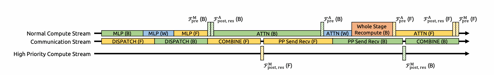

新增 state 与运算没有消失；当 $N$ 继续增大，generator 与 state traffic 仍快速增长。

> **论文报告** · mHC, Fig. 4

<!-- notes:
先说明图的目的，再读 ownership。横轴是 schedule time，不是 layer depth；固定一个 microbatch 追踪 F/B/W，再区分 normal compute、communication 与 latency-critical lanes。色块宽度不能直接当 kernel latency。

[Sources]
- https://arxiv.org/abs/2512.24880v2
-->

---

<!-- layout: figure -->
<!-- section-header: xhc || 04 · xHC / LARGE-N · 1/14 || 31 / 64 -->

## mHC 把 $N$ 增大后，收益与成本同时遇到瓶颈

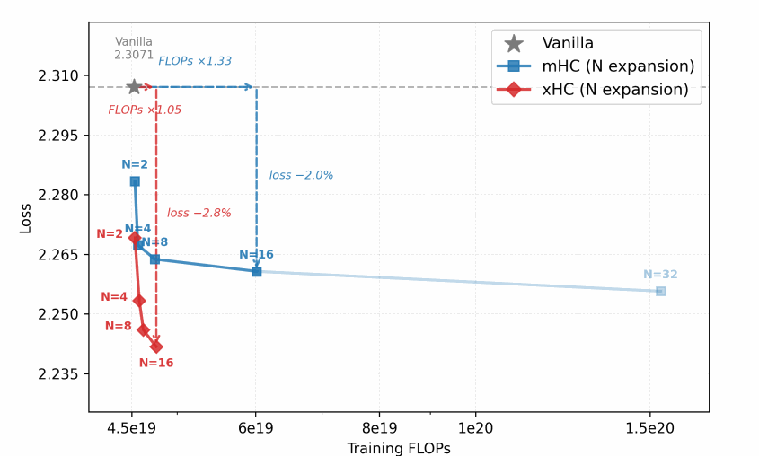

  
<strong>information supply</strong>每层究竟提供了几个新方向？

  
<strong>mapping generator</strong>谁在从 $NC$ state 生成 $N^2$ coefficients？

收益饱和是动机；两个 bottleneck 是论文支持的 mechanism hypotheses，不是已证明定理。

> **论文报告** · xHC, Fig. 1

<!-- notes:
先把 expansion sweep 当设计压力，不把曲线直接等同于机制已经证明。后面分别用 toy vectors 与 shape accounting 解释两项。

[Sources]
- https://arxiv.org/abs/2607.14530v1
-->

---

<!-- layout: split -->
<!-- section-header: xhc || 04 · xHC / LARGE-N · 2/14 || 32 / 64 -->

## 多条 stream 写入不同倍数，仍可能只有一个新方向

  0.2y
  0.8y
  1.1y
  1.7y

$$
y=[2,1]^\top,\qquad
\{0.2y,0.8y,1.1y,1.7y\}\subset\operatorname{span}\{y\}
$$

<strong>different magnitude ≠ different direction</strong>

新增方向的 rank 至多为 1；旧 state 与后续 mixing 仍可能让 streams 保持差异。

<!-- notes:
这是 xHC 动机最关键的 toy example。它支持 information-supply diagnosis，但不是容量定理。

[Sources]
- https://arxiv.org/abs/2607.14530v1
- https://github.com/J-shang/residual
-->

---

<!-- layout: comparison -->
<!-- section-header: xhc || 04 · xHC / LARGE-N · 3/14 || 33 / 64 -->

## Cubic cost 来自生成 mapping，不来自应用 mapping

  

    <small>generate coefficients</small>
    <strong>[NC] → [N²]</strong>
    <code>[NC,N²] projection</code>
    <b>O(N³C)</b>
  

  

    <small>apply coefficients</small>
    <strong>[N,N] @ [N,C]</strong>
    <code>transport × state</code>
    <b>O(N²C)</b>
  

“Cubic” 修饰 input-dependent coefficient generator，不是已有 mapping 的矩阵应用。

<!-- notes:
若只看到 H_res X，很容易误解复杂度来源。xHC 因此限制本层需要动态生成和应用的 active mapping 到 k×k。

[Sources]
- https://arxiv.org/abs/2607.14530v1
-->

---

<!-- layout: statement -->
<!-- section-header: xhc || 04 · xHC / LARGE-N · 4/14 || 34 / 64 -->

## xHC 把 memory capacity $N$ 与 mutation budget $k$ 分开

  
<strong>stream 1</strong>fixed active

  
<strong>stream 2</strong>inactive carry

  
<strong>stream 3</strong>routed active

  
<strong>stream 4</strong>inactive carry

  <strong>memory capacity</strong><code>N = 4</code>
  <strong>mutation budget</strong><code>k = 2</code>
  <strong>paper default</strong><code>N = 16, k = 4</code>

  capacity N<i>→</i>dense read<i>→</i>active selection<i>→</i>active update<i>→</i>write candidates<i>→</i>de-correlation<i>→</i>full next state

<!-- notes:
N 决定跨层保存多少 persistent containers；k 决定本层 transport 和 write-back 的工作集。先分清变量，再看 read 与 update。

[Sources]
- https://arxiv.org/abs/2607.14530v1
-->

---

<!-- layout: statement -->
<!-- section-header: xhc || 04 · xHC / LARGE-N · 5/14 || 35 / 64 -->

## Dense read 让 inactive stream 仍能影响当前 branch

  stream 1<i>↘</i>
  stream 2<i>→</i>
  <strong>branch input</strong>
  stream 3<i>→</i>
  stream 4<i>↗</i>

$$
u=\sum_{i=1}^{N}h_i^{\mathrm{pre}}x_i
$$

`只更新 k 条` ≠ `只读取 k 条`。Inactive stream 可以影响 branch，再通过 branch output 间接影响 active streams。

  capacity N<i>→</i>dense read<i>→</i>active selection<i>→</i>active update<i>→</i>write candidates<i>→</i>de-correlation<i>→</i>full next state

<!-- notes:
强调 sparse mutation 与 sparse access 是两件事。代价是 dense read 及其 generator 仍保留 N 相关工作。

[Sources]
- https://arxiv.org/abs/2607.14530v1
-->

---

<!-- layout: split -->
<!-- section-header: xhc || 04 · xHC / LARGE-N · 6/14 || 36 / 64 -->

## Fixed paths 加 Top-$k$ 决定本层 active set

  
<strong>stream 1</strong>fixed

  
<strong>stream 2</strong>score .31

  
<strong>stream 3</strong>score .84 · Top-1

  
<strong>stream 4</strong>score .22

Toy：`1 fixed + Top-1 routed = k=2`；Default：`2 fixed + Top-2 routed = k=4`。

  
<strong>hard indices</strong>不可微的离散选择

  
<strong>selected scores</strong>参与本次 write gate 的梯度

  capacity N<i>→</i>dense read<i>→</i>active selection<i>→</i>active update<i>→</i>write candidates<i>→</i>de-correlation<i>→</i>full next state

<!-- notes:
这里选的是 persistent residual streams，不与 MoE routing 完全同义。Fixed paths 提供连续活跃 anchors。

[Sources]
- https://arxiv.org/abs/2607.14530v1
-->

---

<!-- layout: statement -->
<!-- section-header: xhc || 04 · xHC / LARGE-N · 7/14 || 37 / 64 -->

## 只有 active subset 被 mixing 和 write-back

  <strong>full state</strong><code>{1,2,3,4}</code>
  <b>— gather →</b>
  <strong>active</strong><code>{1,3}</code>
  <b>— 2×2 mix + write →</b>
  <strong>active′</strong><code>{1′,3′}</code>
  <b>— scatter →</b>
  <strong>next state</strong><code>{1′,2,3′,4}</code>

$$
X'_{I}=H_{\mathrm{res}}X_I+\Delta X_I,\qquad
X'_i=X_i\ \text{for}\ i\notin I
$$

Inactive streams 是 exact carry；完整 persistent state 仍要长期保存。

  capacity N<i>→</i>dense read<i>→</i>active selection<i>→</i>active update<i>→</i>write candidates<i>→</i>de-correlation<i>→</i>full next state

<!-- notes:
先走旧 state，再走新写入。Sparse mutation 把 active generator/update 从 N 缩到 k，但没有让 full state 消失。

[Sources]
- https://arxiv.org/abs/2607.14530v1
-->

---

<!-- layout: figure -->
<!-- section-header: xhc || 04 · xHC / LARGE-N · 8/14 || 38 / 64 -->

## 一次 MLP 可以构造多个 temporal write candidates

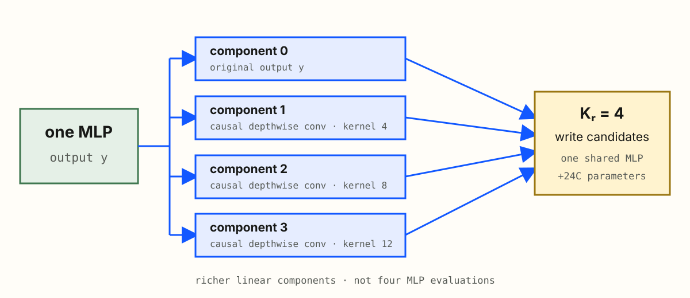

  original
  DWConv-4
  DWConv-8
  DWConv-12

默认 $K_r=4$；新增 $24C$ depthwise-conv parameters，**不是执行四次 MLP**。

卷积沿 token sequence 且 causal；不混 channel，也不是 token self-attention。

  capacity N<i>→</i>dense read<i>→</i>active selection<i>→</i>active update<i>→</i>write candidates<i>→</i>de-correlation<i>→</i>full next state

<!-- notes:
Temporal augmentation 默认放在 MLP side，因为 MLP 本身逐 token。四个 candidates 仍来自同一 output sequence，不自动语义独立。

[Sources]
- https://arxiv.org/abs/2607.14530v1
-->

---

<!-- layout: split -->
<!-- section-header: xhc || 04 · xHC / LARGE-N · 9/14 || 39 / 64 -->

## Gram–Schmidt 去除局部共线，但不创造语义独立

  v₁
  g₂
  <i>remove projection</i>
  <strong>v₂</strong>

$$
v_{j+1}=g_j-\sum_i
\frac{\langle g_j,v_i\rangle}{\langle v_i,v_i\rangle}v_i
$$

  
<strong>做到</strong>当前 token 上消除已有方向的线性投影

  
<strong>做不到</strong>unit norm · 跨 token 正交 · 稳定语义 · 从零创造信息

  capacity N<i>→</i>dense read<i>→</i>active selection<i>→</i>active update<i>→</i>write candidates<i>→</i>de-correlation<i>→</i>full next state

<!-- notes:
这是 supporting 页。实现还需验证近零向量时的数值策略；论文展示公式里没有额外 epsilon 项。

[Sources]
- https://arxiv.org/abs/2607.14530v1
-->

---

<!-- layout: figure -->
<!-- section-header: xhc || 04 · xHC / LARGE-N · 10/14 || 40 / 64 -->

## 一次完整 xHC 更新由 dense read 与 sparse mutation 组成

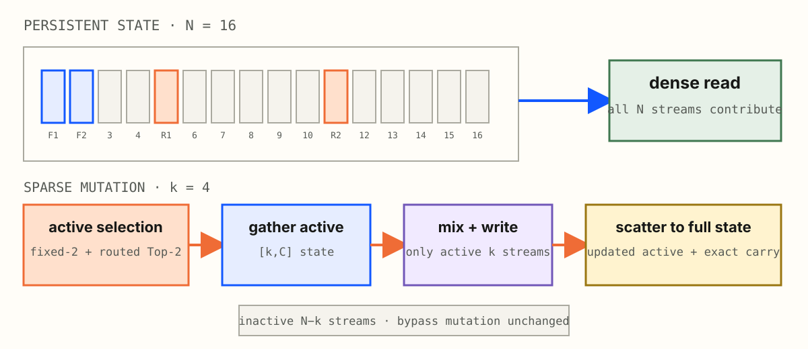

full [B,S,N,C] → read/router [B,S,N] → active [B,S,k,C] → mix [B,S,k,k] + write [B,S,k,Kᵣ] → full [B,S,N,C]

绿色路径决定 branch input；紫色/橙色路径决定 state mutation；inactive state 原样回到 next full state。

  capacity N<i>→</i>dense read<i>→</i>active selection<i>→</i>active update<i>→</i>write candidates<i>→</i>de-correlation<i>→</i>full next state

> **论文报告 + 复原推导** · xHC, Algorithm 1

<!-- notes:
只串联前面已经解释过的局部操作，不再引入新概念。最后检查输入输出 full-state shape 都是 [B,S,N,C]。

[Sources]
- https://arxiv.org/abs/2607.14530v1
-->

---

<!-- layout: split -->
<!-- section-header: xhc || 04 · xHC / LARGE-N · 11/14 || 41 / 64 -->

## xHC 只近似继承 active-set 的稳定 contract

  H₁₁0H₁₃0
  0100
  H₃₁0H₃₃0
  0001

Ideal：active $k\times k$ 双随机 block + inactive identity → full $N\times N$ transport 仍双随机。

Actual boundary：

- finite Sinkhorn
- row-sum clamp
- token-dependent active set
- baseline-equivalent initialization 未完整公开

<!-- notes:
理想 exact block embedding 能继承 mHC 式 closure；实际实现只能作近似结论，不能替作者补齐 initialization。

[Sources]
- https://arxiv.org/abs/2607.14530v1
-->

---

<!-- layout: figure -->
<!-- section-header: xhc || 04 · xHC / LARGE-N · 12/14 || 42 / 64 -->

## Ablation 把 quality gain 与 cost recovery 分开归因

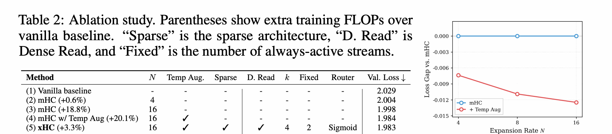

  <strong>mHC N=16</strong><small>1.998 · +18.8%</small>
  → quality
  <strong>+ TempAug</strong><small>1.984 · +20.1%</small>
  → cost
  <strong>full xHC</strong><small>1.983 · +3.3%</small>

第一步主要改善 loss；第二步基本保持 loss，同时回收 dense large-$N$ FLOPs。

> **论文报告** · xHC, Table 2 & Fig. 5

<!-- notes:
只比较相邻两行。单一 in-house setup、无多 seed，因此 ablation 支持归因方向但不是严格因果证明。

[Sources]
- https://arxiv.org/abs/2607.14530v1
-->

---

<!-- layout: figure -->
<!-- section-header: xhc || 04 · xHC / LARGE-N · 13/14 || 43 / 64 -->

## Sparse FLOPs 之后仍留下 $73.5C$ residual-side I/O

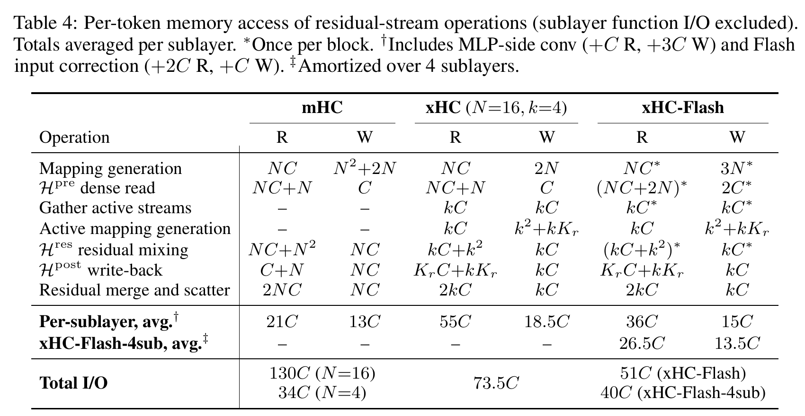

  
<strong role="columnheader">per token · per sublayer</strong><strong role="columnheader">R + W</strong>

  
Vanilla residual merge<code role="cell">2C + C = 3C</code>

  
mHC · N=4<code role="cell">21C + 13C = 34C</code>

  
full xHC · N=16,k=4<code role="cell">55C + 18.5C = 73.5C</code>

Abstract element traffic，不是实测 HBM bytes、Attention/MLP I/O 或 wall-clock。

<!-- notes:
从 vanilla 的三次 element movement 算起。Headline C coefficient 省略小的 coefficient-sized terms。

[Sources]
- https://arxiv.org/abs/2607.14530v1
-->

---

<!-- layout: figure -->
<!-- section-header: xhc || 04 · xHC / LARGE-N · 14/14 || 44 / 64 -->

## Flash 在共享 window 内精确修正，但相对 full xHC 改变模型

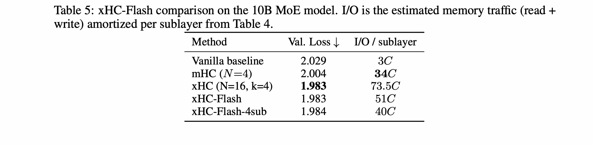

  
<strong role="columnheader">variant</strong><strong role="columnheader">I/O · loss</strong>

  
full xHC<code role="cell">73.5C · 1.983</code>

  
Flash · 2 sublayers<code role="cell">51C · 1.983</code>

  
Flash-4sub<code role="cell">40C · 1.984</code>

<strong>Exact correction within shared routing</strong> ≠ identical to full xHC that reroutes every sublayer.

<!-- notes:
聚焦共享 window 内哪些 full-state work 被分摊。Correction 在固定 contract 内精确，但相对 full xHC 的模型函数已改变。

[Sources]
- https://arxiv.org/abs/2607.14530v1
-->

---

<!-- layout: figure -->
<!-- section-header: attnres || 05 · ATTNRES / DEPTH RETRIEVAL · 1/13 || 45 / 64 -->

## AttnRes 不再扩多流 state，而是保留 named sources

  

    <small>HC family</small>
    <strong>persistent streams</strong>
    每层反复 transport / mix / write
  

  

    <small>Attention Residuals</small>
    <strong>named historical sources</strong>
    embedding + branch outputs 保留身份，未来层重新 read
  

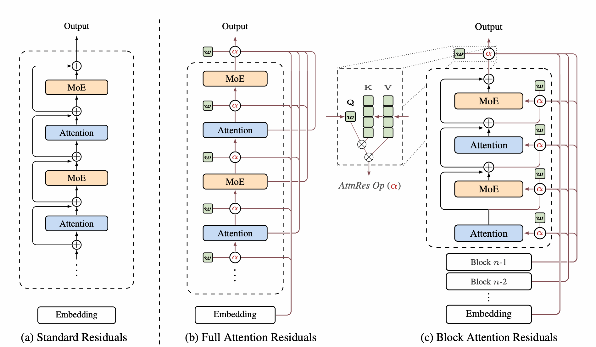

AttnRes 不是 HC 上再加一个 router，也不是 token self-attention 的替代品。

<!-- notes:
明确切换路线。它改变的是跨 depth 保存什么，而不是在多流 recurrent state 上继续加 transport。

[Sources]
- https://arxiv.org/abs/2603.15031v1
-->

---

<!-- layout: comparison -->
<!-- section-header: attnres || 05 · ATTNRES / DEPTH RETRIEVAL · 2/13 || 46 / 64 -->

## 标准 residual 的固定系数 1 既稳定又不可选择

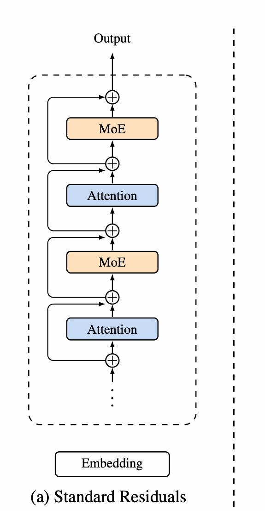
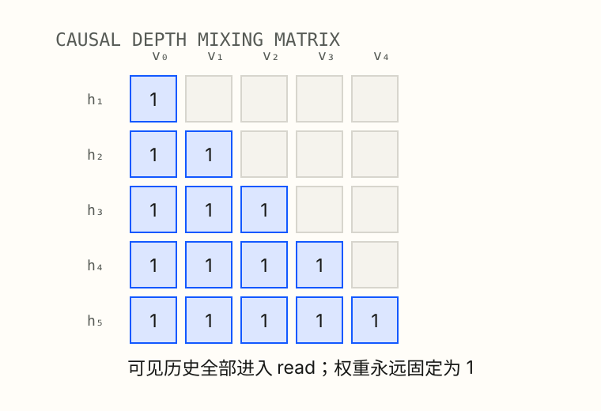

$$
h_l=\sum_{i<l}\color{#1258ff}{1}\cdot v_i
$$

Direct path 很明确；不同未来 sublayers 却无法对历史 source 表达不同偏好。

<!-- notes:
只重访 AttnRes 关心的一面：source weights 不能选择。不重复开场全部推导。

[Sources]
- https://arxiv.org/abs/2603.15031v1
-->

---

<!-- layout: split -->
<!-- section-header: attnres || 05 · ATTNRES / DEPTH RETRIEVAL · 3/13 || 47 / 64 -->

## Full AttnRes 保存 embedding 与所有历史 branch outputs

  <strong>v₀</strong>embedding
  <strong>v₁</strong>branch output 1
  <strong>v₂</strong>branch output 2
  <strong>⋮</strong>named history
  <i>current layer reads all J sources →</i>

$$
v_0=h_1,\qquad v_i=f_i(h_i)
$$

Source stack：

$$
[J,B,T,d]\quad\text{with}\quad J=l
$$

`J = depth/source count`，不是 sequence length。

<!-- notes:
Source 不是每层累计 hidden state，而是 embedding 加 branch outputs；这决定 Block summary、history bytes 与 gradient path 的解释。

[Sources]
- https://arxiv.org/abs/2603.15031v1
-->

---

<!-- layout: comparison -->
<!-- section-header: attnres || 05 · ATTNRES / DEPTH RETRIEVAL · 4/13 || 48 / 64 -->

## 三个二维 source 展示 sum、average 与 selective read

  
<small>fixed sum</small><code>v₀+v₁+v₂</code><strong>[4, 4]</strong>

  
<small>uniform average</small><code>⅓(v₀+v₁+v₂)</code><strong>[4/3, 4/3]</strong>

  
<small>α = [.1,.7,.2]</small><code>.1v₀+.7v₁+.2v₂</code><strong>[0.6, 2.3]</strong>

`v₀=[2,0]`　·　`v₁=[0,3]`　·　`v₂=[2,1]`

Selective read 不是从 `[4,4]` 中恢复历史；它成立是因为 source identity 从未丢失。

<!-- notes:
先比较三个结果的位置，再解释为什么可选。下一页才引入 logits 和 softmax。

[Sources]
- https://arxiv.org/abs/2603.15031v1
- https://github.com/J-shang/residual
-->

---

<!-- layout: statement -->
<!-- section-header: attnres || 05 · ATTNRES / DEPTH RETRIEVAL · 5/13 || 49 / 64 -->

## Depth softmax 为每个 token 在 source 轴分配权重

  <strong>[J,B,T,d]</strong><small>sources / keys</small>
  <b>— dot over d →</b>
  <strong>[J,B,T]</strong><small>logits</small>
  <b>— softmax over J →</b>
  <strong>[J,B,T]</strong><small>α</small>
  <b>— sum over J →</b>
  <strong>[B,T,d]</strong><small>read result</small>

$$
s_{jbt}=w_l^\top\operatorname{RMSNorm}(v_{jbt}),\qquad
h_{lbt}=\sum_j\operatorname{softmax}_J(s)_{jbt}v_{jbt}
$$

Depth/source routing，不是 $T\times T$ token attention，也不是 MoE expert gating。

<!-- notes:
Query w_l 是 layer parameter；key/value 由输入产生，所以 logits 仍 input-dependent。默认同一 token 的 channels 共享 source weight。

[Sources]
- https://arxiv.org/abs/2603.15031v1
-->

---

<!-- layout: statement -->
<!-- section-header: attnres || 05 · ATTNRES / DEPTH RETRIEVAL · 6/13 || 50 / 64 -->

## Zero query 给出均匀 average，不是 residual sum

  <strong>wₗ = 0</strong><b>→</b>
  <strong>all logits = 0</strong><b>→</b>
  <strong>αⱼ = 1/J</strong><b>→</b>
  <strong>uniform average</strong>

  
<small>standard sum</small><strong>[4, 4]</strong><code>direct term = I</code>

  
<small>zero-query average</small><strong>[4/3, 4/3]</strong><code>direct term = (1/J)I</code>

Zero 初始化的是 pseudo-query，不是 activation；论文报告它可减少 training volatility，但不是 baseline-preserving identity。

<!-- notes:
RMSNorm 可能弱化统一 scale 的影响，不能推出 forward 函数与 Jacobian 完全等价。

[Sources]
- https://arxiv.org/abs/2603.15031v1
-->

---

<!-- layout: statement -->
<!-- section-header: attnres || 05 · ATTNRES / DEPTH RETRIEVAL · 7/13 || 51 / 64 -->

## Full history 提供直接访问，也让状态随深度增长

  
layer 1<b>1 source</b><i>•</i>

  
layer 2<b>2 sources</b><i>••</i>

  
layer 3<b>3 sources</b><i>•••</i>

  
layer L<b>L sources</b><i>••••••••</i>

  <strong>stored values</strong><code>O(Ld)</code>
  <strong>source interactions</strong><code>≈ O(L²d)</code>
  <strong>pipeline</strong><code>history / cache pressure</code>

这些是结构性增长，不等于精确 kernel wall-clock。

<!-- notes:
每层新增一个 source，未来很多层都可能再次访问。Block 版本压缩的是历史粒度，不是取消 retrieval。

[Sources]
- https://arxiv.org/abs/2603.15031v1
-->

---

<!-- layout: comparison -->
<!-- section-header: attnres || 05 · ATTNRES / DEPTH RETRIEVAL · 8/13 || 52 / 64 -->

## Block AttnRes 把完成历史压成 block summaries

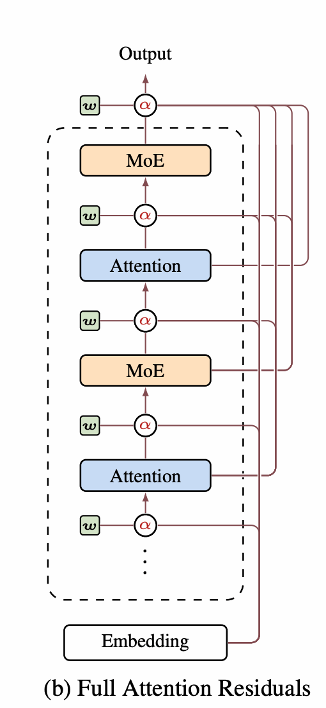
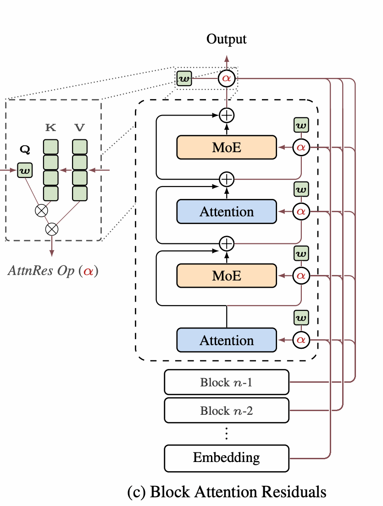

$$
b_n=\sum_{j\in\mathcal B_n}f_j(h_j),\qquad
p_i=\sum_{j\le i}y_j
$$

Read sources = `embedding + completed blocks + current partial`

结构化压缩，不是无损：completed block 内部的逐层 source identity 不再单独可寻址。

<!-- notes:
Full 的逐层 sources 被压成 additive block summary；当前 block 另维护随 sublayer 顺序增长的 partial。

[Sources]
- https://arxiv.org/abs/2603.15031v1
-->

---

<!-- layout: statement -->
<!-- section-header: attnres || 05 · ATTNRES / DEPTH RETRIEVAL · 9/13 || 53 / 64 -->

## 一个四层 block 足以跑通 read 与 write state machine

  
<small>before l₁</small><strong>p₀ = ∅</strong>read history

  
<small>after l₁</small><strong>p₁ = y₁</strong>history + partial

  
<small>after l₂</small><strong>p₂ = y₁+y₂</strong>history + partial

  
<small>after l₃</small><strong>p₃ = y₁+y₂+y₃</strong>history + partial

  
<small>after l₄</small><strong>b₂ = p₄</strong>seal completed block

第一层 partial 为空；之后每层 read 固定 history 加当前 partial，再把 branch output 写进 partial。

<!-- notes:
这页只跑 state machine，不讲 two-phase。完成 block 后，p4 成为未来层可读的 completed source。

[Sources]
- https://arxiv.org/abs/2603.15031v1
-->

---

<!-- layout: figure -->
<!-- section-header: attnres || 05 · ATTNRES / DEPTH RETRIEVAL · 10/13 || 54 / 64 -->

## Block 在作者五个 scaling 点保留了大部分收益

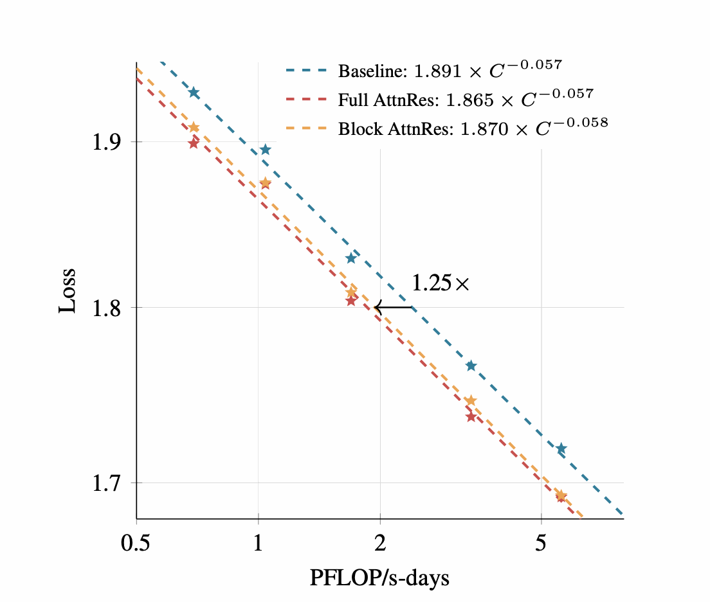

  
<strong role="columnheader">528M activated · 119B tokens</strong><strong role="columnheader">Val. Loss ↓</strong>

  
Baseline<code role="cell">1.719</code>

  
Block AttnRes<code role="cell">1.693</code>

  
Full AttnRes<code role="cell">1.692</code>

五个 matched sizes 中 Full 与 Block 均低于 baseline；约 1.25× 是 fitted compute-equivalence estimate，不是 wall-clock speedup。

> **论文报告** · Attention Residuals, Fig. 4 & Table 2

<!-- notes:
先定义 matched experiment：固定 backbone、tokens、depth/width、expert/MLP 与 baseline-selected hyperparameters，只改变 residual mechanism。Block 在最大点只比 Full 差 0.001；无公开多 seed 与 fit uncertainty。

[Sources]
- https://arxiv.org/abs/2603.15031v1
-->

---

<!-- layout: statement -->
<!-- section-header: attnres || 05 · ATTNRES / DEPTH RETRIEVAL · 11/13 || 55 / 64 -->

## Two-phase 只是同一次 softmax 的 source partition

  
<small>Phase 1 · fixed history</small><strong>N_hist / D_hist</strong><code>completed sources</code>

  <b>+</b>
  
<small>Phase 2 · evolving partial</small><strong>N_part / D_part</strong><code>current block</code>

  <b>→</b>
  
<small>exact merge</small><strong>same one-shot softmax</strong><code>(N_hist+N_part)/(D_hist+D_part)</code>

$$
h=\frac{N_{\mathrm{hist}}+N_{\mathrm{part}}}
{D_{\mathrm{hist}}+D_{\mathrm{part}}}
$$

不是两个训练阶段，也不是两个 outputs 再平均；$m/\ell/o$ 只是 max-shift 的数值稳定实现。

<!-- notes:
先写 one-shot numerator/denominator，再按 source set 拆成 history 与 partial。History 固定可对多个 layer queries 批量计算，partial 必须等待前一层 branch output。

[Sources]
- https://arxiv.org/abs/2603.15031v1
-->

---

<!-- layout: figure -->
<!-- section-header: attnres || 05 · ATTNRES / DEPTH RETRIEVAL · 12/13 || 56 / 64 -->

## PP cache 只传 receiver 尚未保存的 history

  <small>receiver cache</small><strong>[b₀, b₁]</strong>
  <i>+</i>
  <small>transition payload</small><strong>[b₂]</strong>
  <i>→</i>
  <small>next cache</small><strong>[b₀, b₁, b₂]</strong>

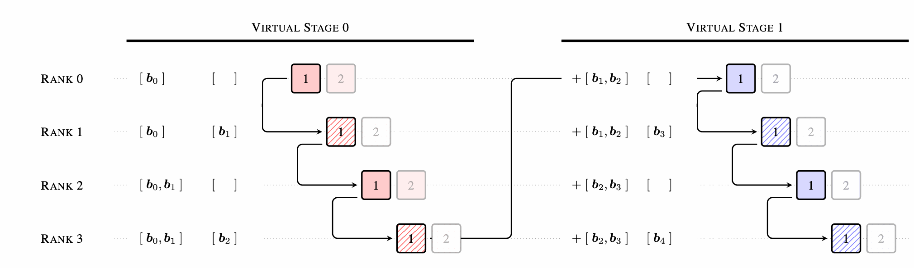

方括号是 receiver 已拥有的 depth/block sources；payload 只写新增项。它不是 token-attention KV cache。

> **论文报告 + 复原读图** · Attention Residuals, Fig. 3

<!-- notes:
先用三-rank 简图固定 ownership，再读四个 physical ranks、每 rank 两个 virtual-stage chunks 的原图。固定一个 VS index 后，同一 microbatch 仍沿 physical ranks 前进；cache lifetime、dtype 与释放时机都属于实现 contract。

[Sources]
- https://arxiv.org/abs/2603.15031v1
- https://github.com/MoonshotAI/Attention-Residuals/tree/85e22310fe5ee860b4a023de312d791de8a5a5e6
-->

---

<!-- layout: split -->
<!-- section-header: attnres || 05 · ATTNRES / DEPTH RETRIEVAL · 13/13 || 57 / 64 -->

## Learned routing 支持“会选择”，但还没有因果解释

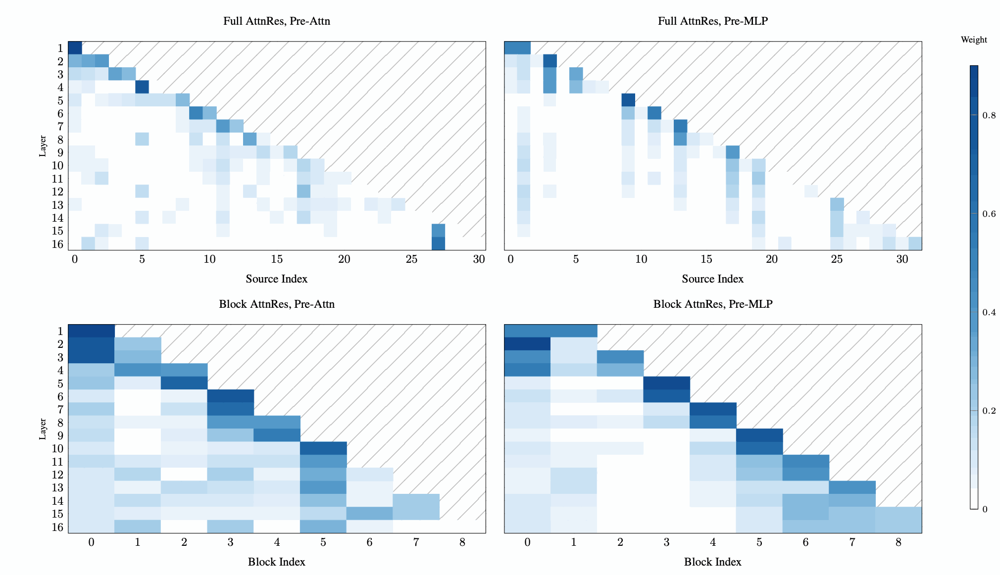

Heatmap 可以支持：

- 权重不再停留在 uniform
- Pre-Attn 与 Pre-MLP pattern 不同
- routing 随 layer / token 变化

不能直接推出：

- 某个 source 有稳定的人类语义
- 大权重等于因果贡献
- routing pattern 可跨模型复用

<!-- notes:
更强证据需要 source ablation、weight intervention 或 counterfactual routing。到这里四篇论文都走完机制、初始化、证据和成本。

[Sources]
- https://arxiv.org/abs/2603.15031v1
-->

---

<!-- layout: comparison -->
<!-- section-header: synthesis || 06 · 综合 / DESIGN & VALIDATION · 1/7 || 58 / 64 -->

## Runtime contract 决定一层究竟怎样更新 state

| 方法 | Stored state | Read | Transport | Write |
|---|---|---|---|---|
| Standard | one cumulative `[B,S,d]` | current state | identity carry | branch delta 加回同一 state |
| HC / DHC | $n$ persistent streams | $A_m:n\to1$ | free $A_r$ mixes all streams | one branch output $\to n$ targets |
| mHC | $n$ persistent streams | positive dynamic $H_{pre}$ | ≈ doubly stochastic $H_{res}$ | positive dynamic $H_{post}$ |
| xHC | $N$ persistent streams | dense read all $N$ | active $k$ mix；inactive exact carry | $K_r$ candidates $\to k$ active streams |
| Full AttnRes | embedding + all branch sources | softmax over $J$ sources | named sources persist | branch output becomes new source |
| Block AttnRes | completed blocks + partial | softmax over blocks + partial | blocks persist；partial accumulates | branch output adds into partial |

若能从每一行重新画出 state machine，运行时 contract 就已完整；训练起点与系统代价留到下一页。

<!-- notes:
按列走，不逐篇复述。Stored state 决定 ownership，read/transport/write 决定一层更新。AttnRes 没有同类 recurrent stream product；Block 的 write 是 current partial 的 additive accumulation。

[Sources]
- https://arxiv.org/abs/2409.19606v3
- https://arxiv.org/abs/2512.24880v2
- https://arxiv.org/abs/2603.15031v1
- https://arxiv.org/abs/2607.14530v1
-->

---

<!-- layout: comparison -->
<!-- section-header: synthesis || 06 · 综合 / DESIGN & VALIDATION · 2/7 || 59 / 64 -->

## 训练与系统 contract 决定方法能否安全落地

| 方法 | Weight granularity | Initialization | Deep composition | Dominant cost |
|---|---|---|---|---|
| Standard | fixed coefficient 1 | exact baseline | identity direct path + branch Jacobians | baseline activation / merge |
| HC / DHC | SHC per-layer；DHC per-token | compatible special case needs full read/write/collapse | unconstrained $A_r$ product | persistent activation / I/O / PP |
| mHC | per-token / sublayer | paper parameterization；$n=1$ special case | exact DS closed；finite Sinkhorn approximate | I/O / Sinkhorn / recompute / PP |
| xHC | per-token + hard Top-$k$ | full baseline-equivalent init not fully specified | ideal active-block closure；actual approximate | $NC$ state / dense read / routing / PP |
| Full AttnRes | per-token / source | zero query $\to$ average, not sum | convex read；direct term $\alpha_iI$ | $O(Ld)$ history / near-$L^2d$ read / cache |
| Block AttnRes | per-token / block / partial | zero query $\to$ average over current set | block-tied depth mixing | $O(Nd)$ history / two-phase / cache lifetime |

Exact guarantee、special case 与 implementation approximation 必须分栏陈述；“动态”也不是统一的 weight granularity。

<!-- notes:
先比较 runtime weights 由谁拥有，再比较初始化究竟恢复什么。Deep composition 只描述具体路径；成本只写 dominant source，不把不同 counting boundaries 拼成速度排名。

[Sources]
- https://arxiv.org/abs/2409.19606v3
- https://arxiv.org/abs/2512.24880v2
- https://arxiv.org/abs/2603.15031v1
- https://arxiv.org/abs/2607.14530v1
-->

---

<!-- layout: statement -->
<!-- section-header: synthesis || 06 · 综合 / DESIGN & VALIDATION · 3/7 || 60 / 64 -->

## Persistent capacity 与 source addressability 是两条不同轴

  historical source addressability ↑
  persistent recurrent capacity →
  <i class="point point--standard">Standard</i>
  <i class="point point--hc">HC / mHC</i>
  <i class="point point--xhc">xHC</i>
  <i class="point point--block">Block AttnRes</i>
  <i class="point point--full">Full AttnRes</i>

`N streams` 不等于 `N named historical layers`；`J sources` 也不等于 `J recurrent streams`。

定性 state-semantics 地图，不是质量、成本或实验排名。

<!-- notes:
横轴是跨每个 sublayer 持续存在并被 transport 的并行 state；纵轴是未来层能否直接点名历史 source。xHC 的 N 与 Full AttnRes 的 J 不应互换解释。

[Sources]
- https://arxiv.org/abs/2409.19606v3
- https://arxiv.org/abs/2512.24880v2
- https://arxiv.org/abs/2603.15031v1
- https://arxiv.org/abs/2607.14530v1
-->

---

<!-- layout: comparison -->
<!-- section-header: synthesis || 06 · 综合 / DESIGN & VALIDATION · 4/7 || 61 / 64 -->

## Deep composition 必须区分 transport product 与 convex read

  

    <small>recurrent transport product</small>
    <strong>HC → mHC → xHC</strong>
    free product → exact DS closure → ideal active-block closure
    <code>finite Sinkhorn / clamp / branch write remain</code>
  

  

    <small>source retrieval</small>
    <strong>Full / Block AttnRes</strong>
    each read is a convex combination of current sources
    <code>direct term αᵢI, not I; sources still come from nonlinear branches</code>
  

没有一个脱离路径、假设与实现细节的笼统“最稳定方法”。

<!-- notes:
AttnRes 单次 read 有 convex-hull 性质，不等于恢复 standard residual 的 identity direct term或得到全网络范数保证；mHC 的 transport 保证也不覆盖 branch write。

[Sources]
- https://arxiv.org/abs/2512.24880v2
- https://arxiv.org/abs/2603.15031v1
- https://arxiv.org/abs/2607.14530v1
-->

---

<!-- layout: figure -->
<!-- section-header: synthesis || 06 · 综合 / DESIGN & VALIDATION · 5/7 || 62 / 64 -->

## 系统成本必须在相同 counting boundary 下讨论

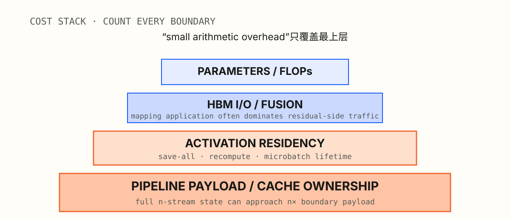

  parameters<i>→</i>FLOPs<i>→</i>activation bytes<i>→</i>abstract I/O<i>→</i>PP payload<i>→</i>wall-clock

Static element traffic ≠ HBM bytes · token efficiency ≠ throughput · fitted compute-equivalence ≠ hardware speedup。

<!-- notes:
任何“只增加很少成本”的说法都要追问：少的是哪一种成本？HC、mHC/xHC 与 AttnRes 报告的边界不同，不能拼成统一速度柱状图。

[Sources]
- https://arxiv.org/abs/2409.19606v3
- https://arxiv.org/abs/2512.24880v2
- https://arxiv.org/abs/2603.15031v1
- https://arxiv.org/abs/2607.14530v1
-->

---

<!-- layout: comparison -->
<!-- section-header: synthesis || 06 · 综合 / DESIGN & VALIDATION · 6/7 || 63 / 64 -->

## 评审新连接方法时，先问八个可证伪问题

  <strong>01 · state</strong>shape 与 ownership 是否明确？
  <strong>02 · operator</strong>read / transport / write 能否用最小 tensor 手算？
  <strong>03 · initialization</strong>恢复 exact function、special case 还是近似？
  <strong>04 · autograd</strong>float64 gradcheck 与 zero/nonzero assertions 是否通过？
  <strong>05 · depth</strong>composition claim 能否构造反例？
  <strong>06 · implementation</strong>direct 与 recompute 路径是否数值一致？
  <strong>07 · distributed</strong>PP boundary 到底传什么、谁缓存？
  <strong>08 · evidence</strong>是否固定 baseline、setup 与 counting boundary？

先固定 correctness contract，再进入 fused kernel、GPU training 与 throughput。

<!-- notes:
这些问题不需要 GPU 就能开始证伪。Reference 与 fused/distributed path 必须共享同一 numerical contract；GPU scaling 后做，shape、初始化、autograd 与 ownership 现在就能检查。

[Sources]
- https://github.com/J-shang/residual
-->

---

<!-- layout: statement -->
<!-- section-header: synthesis || 06 · 综合 / DESIGN & VALIDATION · 7/7 || 64 / 64 -->

## Residual path 定义的是信息在 depth 上的生命史

$$
\boxed{
\text{depth memory}
=
\text{stored state}
+
\text{read}
+
\text{transport}
+
\text{write}
+
\text{system contract}
}
$$

  <strong>HC</strong>multi-stream topology
  <strong>mHC</strong>constrained transport
  <strong>xHC</strong>capacity / mutation separation
  <strong>AttnRes</strong>named-source retrieval

连接方法的核心不是多加一个算子，而是重新定义信息在 depth 上如何保存、被谁读取、怎样搬运、何时改写。

<!-- notes:
按四个关键词各用一句话收束。回到开场承诺：现在应该能画出每种方法的一层更新，也能解释它为什么出现、保证了什么、付出了什么。

[Sources]
- https://arxiv.org/abs/2409.19606v3
- https://arxiv.org/abs/2512.24880v2
- https://arxiv.org/abs/2603.15031v1
- https://arxiv.org/abs/2607.14530v1
- https://github.com/J-shang/residual
-->
