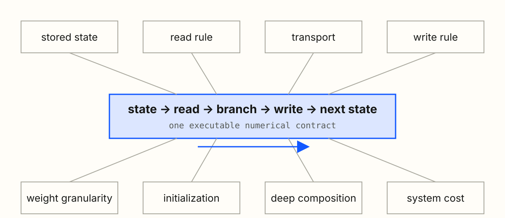
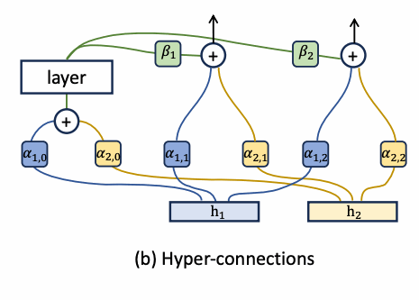
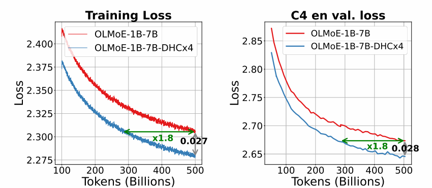
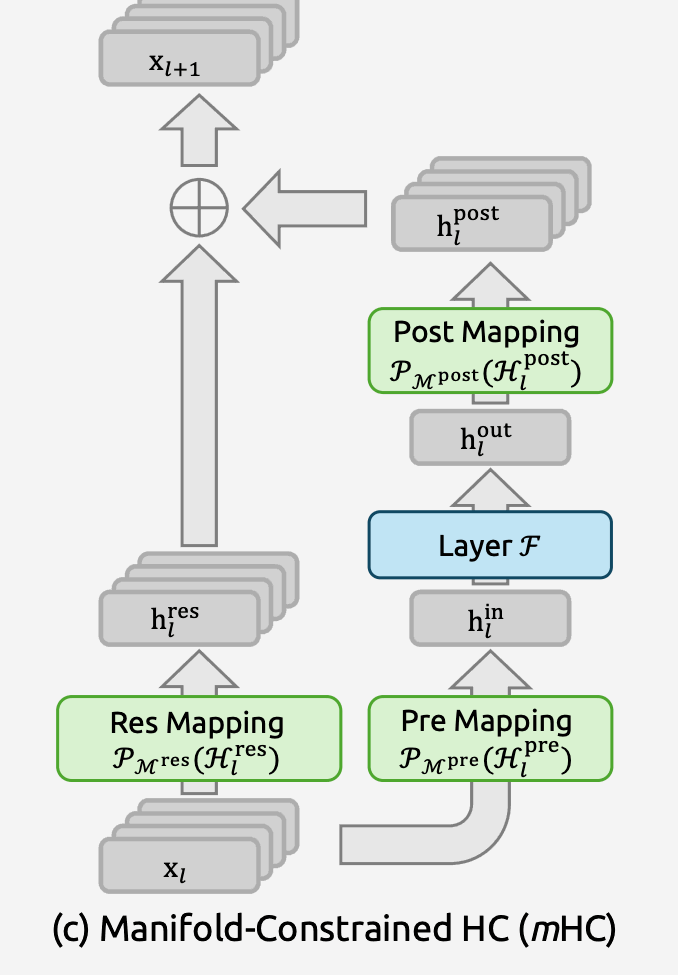
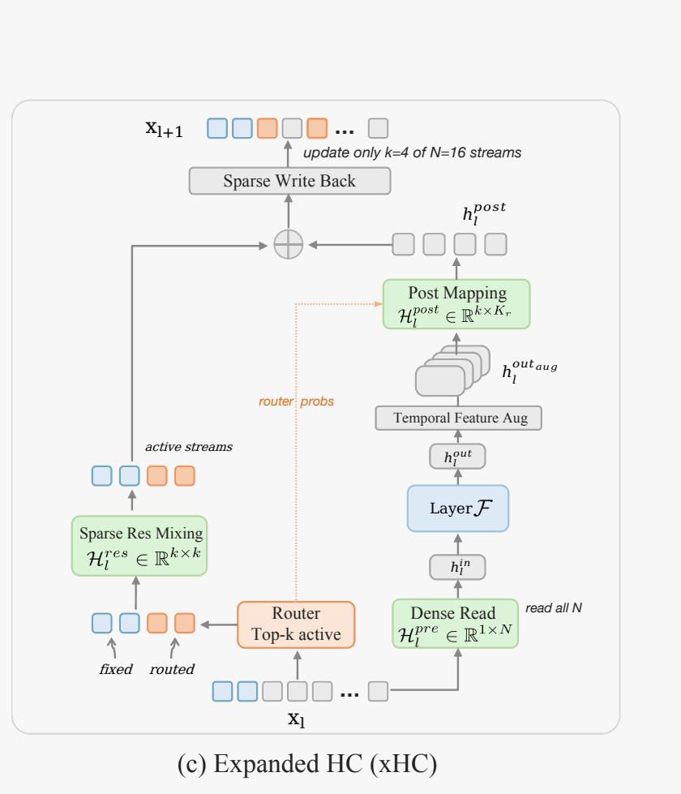

<!-- layout: title -->
<!-- section-header: cover || ACADEMIC SHARING · 60 MIN || 01 / 31 -->

# 从固定加法到深度记忆

Hyper-Connections · Manifold-Constrained HC · Attention Residuals · Expanded HC

<!-- notes:
0.5 分钟。只报题目、四篇论文与分享目标：把 residual connection 当作沿 depth 运行的 memory policy。

[Sources]
- https://arxiv.org/abs/2409.19606v3
- https://arxiv.org/abs/2512.24880v2
- https://arxiv.org/abs/2603.15031v1
- https://arxiv.org/abs/2607.14530v1
-->

---

<!-- layout: figure -->
<!-- section-header: depth || 01 · 深度记忆 / DEPTH MEMORY | MEMORY POLICY · 1/4 || 02 / 31 -->

## 一次加法其实规定了 memory policy

令 $v_0=h_1,\ v_i=f_i(h_i)$：

$$
h_l=\sum_{i=0}^{l-1}v_i
$$

  
<strong>state</strong>一条累计 hidden state

  
<strong>read</strong>下一层只能读取整条 state

  
<strong>write</strong>加上 Attention/MLP 新增量

  
<strong>forget</strong>没有显式遗忘或 source retrieval

> **Derived** · Attention Residuals, arXiv:2603.15031v1, Fig. 1(a), PDF p.1；Eq. 1–2

<!-- notes:
1.5 分钟。先问“如果 residual 是 memory，它的 eviction policy 是什么？”答案是没有显式 eviction，也不能单独检索 source。

[Sources]
- https://arxiv.org/abs/2603.15031v1
- https://github.com/J-shang/residual
-->

---

<!-- layout: comparison -->
<!-- section-header: depth || 01 · 深度记忆 / DEPTH MEMORY | FIXED DEPTH MIXING · 2/4 || 03 / 31 -->

## 标准 residual 是固定 depth mixing

$$
h_l=\sum_{i=0}^{l-1}\color{#1258ff}{1}\cdot v_i
$$

`1 = 每层以相同权重读取该历史 source`。direct path 帮助信息与梯度跨层传播，也限制了按内容选择历史 source 的能力。

> **Reported + Derived** · Attention Residuals, arXiv:2603.15031v1, Fig. 1(a), PDF p.1；Eq. 1–2

<!-- notes:
1.5 分钟。identity path、identity initialization 和训练后学成 identity 是三件事；本页只建立共同起点。

[Sources]
- https://arxiv.org/abs/2603.15031v1
-->

---

<!-- layout: figure -->
<!-- section-header: depth || 01 · 深度记忆 / DEPTH MEMORY | OPERATIONAL CONTRACT · 3/4 || 04 / 31 -->

## 比较方法前，先统一 operational contract

  stored state→
  read→
  branch→
  write→
  next state

同一张 contract 必须能落到 reference code、correctness test 与 distributed layout。

<!-- notes:
1.5 分钟。后续每种方法都回答同一组问题：state、read、write、transport、granularity、initialization、composition、cost。

[Sources]
- https://github.com/J-shang/residual
-->

---

<!-- layout: comparison -->
<!-- section-header: depth || 01 · 深度记忆 / DEPTH MEMORY | RESEARCH MAP · 4/4 || 05 / 31 -->

## 四篇论文回应四种设计压力

  
<strong>Standard residual</strong>固定单流累计 state

  →
  
<strong>HC</strong>怎样扩大 state topology？

  →
  
<strong>mHC</strong>怎样让深层 transport 稳定？

  →
  
<strong>xHC</strong>怎样扩大 N 而不让更新成本失控？

  ↘
  
<strong>AttnRes</strong>怎样检索指定历史 source？

AttnRes 是 baseline 的另一条问题分支；这里表达设计压力关系，不是代码继承或发表时间线。

> **Derived** · HC Fig. 2 · mHC Fig. 1 · Attention Residuals Fig. 1 · xHC Fig. 3

<!-- notes:
0.5 分钟。快速预告四个章节，告诉听众后面始终回到同一个 contract。

[Sources]
- https://arxiv.org/abs/2409.19606v3
- https://arxiv.org/abs/2512.24880v2
- https://arxiv.org/abs/2603.15031v1
- https://arxiv.org/abs/2607.14530v1
-->

---

<!-- layout: figure -->
<!-- section-header: hc || 02 · HC / MULTI-STREAM | STATE EXPANSION · 1/6 || 06 / 31 -->

## HC 扩张的是 residual state

$$
[B,S,d]\longrightarrow[B,S,n,d],
\qquad \text{branch}:d\to d
$$

`B=batch` · `S=sequence` · `n=streams` · `d=hidden size`

> **Reported** · Hyper-Connections, arXiv:2409.19606v3, Fig. 2, PDF p.2；§2

<!-- notes:
2 分钟。用 n=2 的最小例子说明：扩的是跨 depth 持久 state，不是 FFN hidden size。

[Sources]
- https://arxiv.org/abs/2409.19606v3
-->

---

<!-- layout: figure -->
<!-- section-header: hc || 02 · HC / MULTI-STREAM | LAYER UPDATE · 2/6 || 07 / 31 -->

## HC 一层依次完成读取、变换与状态更新

  ① read→
  ② Attention / MLP→
  ③ transport + write

  
<strong><code>A_m:n→1</code> · read</strong><code>u_l=H_l^⊤A_m</code>

  
<strong><code>d→d</code> · branch</strong><code>y_l=F_l(Norm(u_l))</code>

  
<strong><code>A_r:n→n</code> + <code>B:1→n</code></strong><code>H′=A_r^⊤H+B^⊤y^⊤</code>

`h′ⱼ = Σᵢ A_r[i,j]hᵢ + B[1,j]y` · `A_r[i,j] = source i → target j`

> **Reported** · Hyper-Connections, arXiv:2409.19606v3, Fig. 2(b), PDF p.2；Eq. 1–8

<!-- notes:
2 分钟。先沿原图走 read→branch→transport+write，再解释 shape 与 source→target 方向。转置来自本页把每条 stream 存成一行；代码 convention 可以不同，operational role 不变。

[Sources]
- https://arxiv.org/abs/2409.19606v3
-->

---

<!-- layout: comparison -->
<!-- section-header: hc || 02 · HC / MULTI-STREAM | WEIGHT GRANULARITY · 3/6 || 08 / 31 -->

## DHC 让同一套更新随 token 改变

  

    <strong>Static HC / SHC</strong>
    <code>A_m:[n,1]</code> · <code>A_r:[n,n]</code> · <code>B:[1,n]</code> 
    每层一组 learned parameters；同层所有 batch / token 共用
  

  

    <strong>Dynamic HC / DHC</strong>
    当前 token 的 <code>H[b,t]</code> → route norm → projection + tanh → <code>ΔA_m,ΔA_r,ΔB</code> 
    runtime mapping = per-layer base + per-token delta
  

$$
A_r(H_{b,t})=A_r^{\mathrm{base}}+\Delta A_r(H_{b,t})
$$

  read→
  Attention / MLP branch→
  transport + write

<code>static</code> 表示 input-independent，不表示 frozen；optimizer 更新 base、projection 与 scale，forward 再生成 token-dependent mappings。

> **Reported** · Hyper-Connections, arXiv:2409.19606v3, §2.2, Eq. 8–13

<!-- notes:
2 分钟。SHC 与 DHC 执行同一套 S07 state update；差别只在 coefficient granularity。DHC 的运行时 shapes 是 A_m:[B,T,n,1]、A_r:[B,T,n,n]、B:[B,T,1,n]，不是把这些 runtime tensors 直接存进 optimizer。

[Sources]
- https://arxiv.org/abs/2409.19606v3
-->

---

<!-- layout: figure -->
<!-- section-header: hc || 02 · HC / MULTI-STREAM | INITIALIZATION · 4/6 || 09 / 31 -->

## DHC 初始化先关闭动态修正

`DHC = per-layer base + per-token delta`；初始化先令 `token delta = 0`。

  <code>W_m,W_r,W_β=0</code><small>无动态修正</small>→
  <code>A_r=I</code><small>旧 stream 原样 carry</small>→
  <code>A_m=e_(l mod n)</code><small>本层轮换读一条</small>→
  <code>B=1</code><small>写入所有 streams</small>

训练后：主任务 loss 反传 → base / projection / scale 更新 → 不同 token 生成不同 mapping。完整 PreNorm-compatible 起点还依赖最终 stream sum 与 branch-output scale。

> **Reported** · Hyper-Connections, arXiv:2409.19606v3, Fig. 2(b), PDF p.2；§2 与 Appendix

<!-- notes:
1.5 分钟。S08 已经定义 DHC，本页只回答“从哪里开始训练”。不能只凭 A_r=I 就宣称每层 hidden 与普通 PreNorm 完全相同。

[Sources]
- https://arxiv.org/abs/2409.19606v3
-->

---

<!-- layout: figure -->
<!-- section-header: hc || 02 · HC / MULTI-STREAM | QUALITY & MEMORY · 5/6 || 10 / 31 -->

## HC 的算术很轻，状态并不轻

`Micro Batch Size (tokens per GPU) = 每张 GPU 在一个 microbatch 中处理的 token positions`

  
<strong>1B · DHC×4</strong>41.11→51.86 GB · <code>+26.1%</code> <code>16,384 tokens / GPU</code>

  
<strong>7B · DHC×4</strong>26.27→33.70 GB · <code>+28.28%</code> <code>2,048 tokens / GPU</code>

  
<strong>MoE · DHC×4</strong>31.59→34.65 GB · <code>+9.7%</code> <code>4,096 tokens / GPU</code>

7B dense DHC×4：V2 loss `2.581 → 2.559`，下游平均 `70.1 → 71.0`。

> **Reported** · Hyper-Connections, arXiv:2409.19606v3, Fig. 1(a–b), PDF p.1；Table 9, PDF p.16。横轴是 tokens；token efficiency ≠ wall-clock speedup。

<!-- notes:
2 分钟。三张显存卡的模型和 microbatch 设置不同，不能画进同一 Pareto curve。“1.8× faster convergence”是达到同 loss 的 token efficiency。

[Sources]
- https://arxiv.org/abs/2409.19606v3
-->

---

<!-- layout: figure -->
<!-- section-header: hc || 02 · HC / MULTI-STREAM | DEEP PRODUCT RISK · 6/6 || 11 / 31 -->

## HC 的深层风险来自 transport 连乘

<strong>记号桥：</strong>本页统一写 <code>T_l</code>；HC 中 <code>T_l=A_r,l^⊤</code>，mHC 把同一 transport role 写作 <code>H_l^res</code>。它不是 hidden state，也不是 read mapping <code>A_m</code>。

  旧 state 绕过 branch <code>X′=T_lX</code>→
  深度有序乘积 <code>P=T_(L-1)…T_l</code>→
  forward <code>P</code> / backward <code>P^⊤</code> 共同放大或衰减

$$
P_{l\to L}=T_{L-1}\cdots T_l,
\qquad (1.02)^{60}\approx3.28,\quad(0.98)^{60}\approx0.30
$$

`direct path = 不经过 Attention/MLP、只搬运旧 state`。Amax 是最大绝对行和/列和的 propagation diagnostic；右图是现象证据，乘积才是原因解释。

> **Reported + Derived** · mHC, arXiv:2512.24880v2, Fig. 3(b), PDF p.7

<!-- notes:
1.5 分钟。先解决记号冲突：HC 的 A_r^T 与 mHC 的 H_res 承担同一旧-state transport role。再用标量特例建立直觉；上界不代表每次都取等号。

[Sources]
- https://arxiv.org/abs/2409.19606v3
- https://arxiv.org/abs/2512.24880v2
-->

---

<!-- layout: figure -->
<!-- section-header: mhc || 03 · mHC / STABLE TRANSPORT | SINKHORN · 1/4 || 12 / 31 -->

## mHC 用 Sinkhorn 约束 transport

  <strong>FORWARD</strong>state → logits <code>Z</code> → Sinkhorn(20) → <code>H_res</code> → state update
  <strong>BACKWARD</strong>autograd 穿过 exp + normalization；不是 backward 后再投影一次

  free logits <code>Z</code>→
  <code>M⁽⁰⁾ = exp(Z) &gt; 0</code>→
  column norm→
  row norm→
  repeat 20

$$
\begin{aligned}
T_c(M)_{ij}&=\frac{M_{ij}}{\sum_r M_{rj}},&
T_r(M)_{ij}&=\frac{M_{ij}}{\sum_s M_{is}},\\
M^{(t)}&=T_r\!\left(T_c(M^{(t-1)})\right)
\end{aligned}
$$

  
<strong>起点</strong><code>M⁽⁰⁾ = [[4,1],[2,3]]</code>

  
<strong>列归一化</strong><code>[[2/3,1/4],[1/3,3/4]]</code>

  
<strong>再做行归一化</strong><code>[[8/11,3/11],[4/13,9/13]]</code>

第一轮后 row sums = 1，但 column sums ≈ 1.035 / 0.965，所以继续迭代。目标 doubly stochastic = 元素非负且每行/每列和为 1；finite 20-step 只近似满足。

> **Reported + Derived** · mHC, arXiv:2512.24880v2, Eq. 8–9。$H_{pre}=\sigma(\cdot)$，$H_{post}=2\sigma(\cdot)$；Sinkhorn 是可微重参数化，不是额外 loss。

<!-- notes:
2.5 分钟。每个 forward 都从当前 state 生成 logits、现场跑 20 轮 Sinkhorn，再用 H_res 更新 state；backward 对这条计算图求导。它不是 optimizer step 后的独立 projection。再逐步口算第一轮；Birkhoff polytope 是双随机矩阵形成的凸多面体。

[Sources]
- https://arxiv.org/abs/2512.24880v2
-->

---

<!-- layout: figure -->
<!-- section-header: mhc || 03 · mHC / STABLE TRANSPORT | GUARANTEES · 2/4 || 13 / 31 -->

## 双随机约束保的是共同模式与均值

  
<strong><code>H1 = 1</code></strong>所有 streams 相同的 common mode 不变

  
<strong><code>1ᵀH = 1ᵀ</code></strong>stream 总和与均值不漂移

  
<strong><code>||H||₂ ≤ 1</code> + closure</strong>2-norm 不放大，乘积仍双随机

没有保证 <code>H = I</code>；stream differences 可以收缩；finite Sinkhorn 只近似满足约束。

> **Derived** · mHC, arXiv:2512.24880v2, Fig. 1(c), PDF p.1；Eq. 6–9

<!-- notes:
2 分钟。用 common mode 和 stream mean 两个最小向量例子解释，不只读公式。non-expansive 的证明放在备份页。

[Sources]
- https://arxiv.org/abs/2512.24880v2
-->

---

<!-- layout: comparison -->
<!-- section-header: mhc || 03 · mHC / STABLE TRANSPORT | PROPAGATION EVIDENCE · 3/4 || 14 / 31 -->

## mHC 将深层 Amax 从约 3000 压到约 1.6

  
<strong>composite Amax</strong>约 <code>3000 → 1.6</code>

  
<strong>final loss gap</strong><code>-0.021</code> vs baseline

  
<strong>reported tasks</strong><code>8 / 8</code> 提高

左图是 log y-axis；右图是 0–2 linear y-axis。Amax 不是完整 operator norm；结果来自作者的单次 27B MoE 运行。

> **Reported** · mHC, arXiv:2512.24880v2, Fig. 3(b), 5, 7(b), PDF p.7/12/14

<!-- notes:
2 分钟。先定义 Amax，再提醒两图 y 轴不同，最后比较各自报告的绝对峰值。单次运行不建立统计显著性。

[Sources]
- https://arxiv.org/abs/2512.24880v2
-->

---

<!-- layout: comparison -->
<!-- section-header: mhc || 03 · mHC / STABLE TRANSPORT | PIPELINE SCHEDULE · 4/4 || 15 / 31 -->

## mHC 用 DualPipe 重叠 mapping 与通信

<strong>目标：</strong>把 mHC residual-side kernels 放进已有 compute / communication 空隙，而不是证明某个单 kernel 更快。横轴是同一 pipeline rank 的 wall-clock；F/B/W 来自不同在途 microbatches。

  
<strong>Normal compute</strong>主 Attention/MLP + 所有 <code>𝓕_pre</code> + Attention <code>𝓕_post,res</code>

  
<strong>Communication</strong>MoE DISPATCH/COMBINE + PP Send/Recv

  
<strong>High priority</strong>只放 MLP <code>𝓕_post,res(F/B)</code>；这是 latency-critical subset，不是完整 kernel list

`F/B/W = forward / activation-backward / weight-gradient` · `𝓕_pre = branch 前 read` · `𝓕_post,res = transport + write + merge` · `block length = 仅示意`

> **Reported + Derived** · mHC, arXiv:2512.24880v2, Fig. 4, PDF p.12；DeepSeek TileKernels commit `36d9e45`

<!-- notes:
2.5 分钟。较早 microbatch 已进入 backward，较晚 microbatch 仍在 forward，所以 timeline 可以先出现 ATTN(B) 再出现 ATTN(F)；任一单独 microbatch 内仍然先 forward 后 backward。High-priority lane 的两块分别是 MLP post/res 的 forward 与 backward。论文没有标 microbatch ID，不能从色块宽度反推出真实时长。

[Sources]
- https://arxiv.org/abs/2512.24880v2
- https://github.com/deepseek-ai/TileKernels/tree/36d9e45d38e204ebb87e6f6e833821eee0482fe5
-->

---

<!-- layout: figure -->
<!-- section-header: attnres || 04 · ATTNRES / DEPTH RETRIEVAL | ROUTE SWITCH · 1/7 || 16 / 31 -->

## AttnRes 把固定求和改成 depth softmax

  
<strong>HC / mHC</strong>携带不断混合的多流 state

  
<strong>AttnRes</strong>保留有名字的历史 sources

$$
\begin{aligned}
h_l &= \sum_i \alpha_{i\to l}v_i,\\
\alpha_{\cdot\to l} &= \operatorname{softmax}_i(s_{i,l}),\\
s_{i,l} &= w_l^\top\operatorname{RMSNorm}(v_i)
\end{aligned}
$$

softmax 轴是 **historical depth/source**，不是 sequence token。

> **Reported** · Attention Residuals, arXiv:2603.15031v1, Fig. 1, PDF p.1；Eq. 1–4

<!-- notes:
1.5 分钟。query 是 layer-specific parameter；key/value 来自输入相关历史 source。同一 token 的 channels 默认共享 source 权重。

[Sources]
- https://arxiv.org/abs/2603.15031v1
-->

---

<!-- layout: comparison -->
<!-- section-header: attnres || 04 · ATTNRES / DEPTH RETRIEVAL | FULL RETRIEVAL · 2/7 || 17 / 31 -->

## Full AttnRes 让每层直接检索历史 source

`[embedding v₀, layer-1 output v₁, layer-2 output v₂] -- α₀,α₁,α₂ --> current read`

<code>V,K:[J,B,T,d]</code> → dot <code>w_l</code> over <code>d</code> → logits <code>s:[J,B,T]</code> → softmax over <code>J</code> → weights <code>α:[J,B,T]</code> → read <code>h:[B,T,d]</code>

<code>J=历史 sources</code> · <code>B=batch</code> · <code>T=token position</code> · <code>d=hidden width</code>。<code>s/α</code> 属于 AttnRes depth router，不是 token self-attention 的 <code>T×T</code> score，也不是 MoE gate。

> **Reported** · Attention Residuals, arXiv:2603.15031v1, Fig. 1(b)/8, PDF p.1/13；Eq. 3–4

<!-- notes:
2 分钟。先指明 embedding 和每个历史 branch output 都是可单独寻址的 source，再用三个 source 手算。

[Sources]
- https://arxiv.org/abs/2603.15031v1
-->

---

<!-- layout: comparison -->
<!-- section-header: attnres || 04 · ATTNRES / DEPTH RETRIEVAL | INITIALIZATION · 3/7 || 18 / 31 -->

## AttnRes 从均匀 depth read 开始训练

`每个 sublayer 新增 pseudo-query w_l；怎样初始化？论文设 w_l=0。`

  <code>w_l=0</code>→
  all logits <code>s_i=0</code>→
  <code>α_i=1/J</code>→
  <code>h_l=(1/J)Σ_i v_i</code>

  
<strong>forward</strong><code>Σvᵢ</code> vs <code>(1/J)Σvᵢ</code>

  
<strong>direct gradient</strong><code>I</code> vs <code>αᵢI = (1/J)I</code>

<strong>Reported：</strong>zero init 避免 training volatility。<code>J</code> 是当前可读 source 数；RMSNorm 可能减弱统一 scale 的影响，但不能推出函数与 Jacobian 完全等价。

> **Derived** · Attention Residuals, arXiv:2603.15031v1, Fig. 1(a–b), PDF p.1；Eq. 3–4

<!-- notes:
1.5 分钟。zero 是新增 pseudo-query 的初始化选择，不是把 activation 置零。它恢复 equal-weight normalized aggregation，不是 baseline-preserving identity initialization。

[Sources]
- https://arxiv.org/abs/2603.15031v1
-->

---

<!-- layout: comparison -->
<!-- section-header: attnres || 04 · ATTNRES / DEPTH RETRIEVAL | BLOCK COMPRESSION · 4/7 || 19 / 31 -->

## Block AttnRes 把历史压成 block 摘要

`假设每 4 个 sublayers 分一组：4 个 layer sources → 1 个 completed-block summary；当前 block 另保留 partial`

`all layer sources → embedding + completed block summaries + current partial`

这是 depth mixing columns 的结构化压缩，不宣称无损；实际 block size 以论文配置为准。

> **Reported** · Attention Residuals, arXiv:2603.15031v1, Fig. 1(b–c), PDF p.1；Eq. 5–6

<!-- notes:
2 分钟。completed block 保存 branch delta 的和；当前 block 的 branch output 累加到 partial。

[Sources]
- https://arxiv.org/abs/2603.15031v1
-->

---

<!-- layout: figure -->
<!-- section-header: attnres || 04 · ATTNRES / DEPTH RETRIEVAL | TWO-PHASE EXECUTION · 5/7 || 20 / 31 -->

## Two-phase 是同一次 softmax 的精确拆分

$$
h=
\frac{\underbrace{e^{a_0}b_0+e^{a_1}b_1}_{\text{fixed history}}
+\underbrace{e^{a_p}p}_{\text{current partial}}}
{\underbrace{e^{a_0}+e^{a_1}}_{\text{fixed history}}
+\underbrace{e^{a_p}}_{\text{current partial}}}
$$

  
<strong>Phase 1 · once per block</strong><code>S</code> 个 layer queries × fixed <code>[b₀,b₁]</code> → 各自的 <code>N_hist,D_hist</code>

  
<strong>Phase 2 · per layer in order</strong><code>l₁:p=empty</code> · <code>l₂:p=f₁</code> · <code>l₃:p=f₁+f₂</code> → <code>N_part,D_part</code>

$$
h=\frac{N_{\mathrm{hist}}+N_{\mathrm{part}}}{D_{\mathrm{hist}}+D_{\mathrm{part}}}
$$

<strong>exact same softmax</strong>：two-phase 是一次 depth softmax 的 source partition，不是两个训练阶段，也不是两个 attention outputs 取平均。<code>m/o/ℓ</code> 只是在实现中做 max-shift 稳定化。

> **Reported + Derived** · Attention Residuals, arXiv:2603.15031v1, Algorithm 1, PDF p.7；Appendix B

<!-- notes:
2.5 分钟。先用 b0/b1/p 口算分子和分母的拆分。Phase 1 可批量，因为 history 在 block 内固定；Phase 2 必须顺序，因为 partial 等待前一层 branch output。实际实现用 m/ℓ/o 做数值稳定合并，与页面的分子分母加法同义。

[Sources]
- https://arxiv.org/abs/2603.15031v1
- https://github.com/MoonshotAI/Attention-Residuals/tree/85e22310fe5ee860b4a023de312d791de8a5a5e6
-->

---

<!-- layout: figure -->
<!-- section-header: attnres || 04 · ATTNRES / DEPTH RETRIEVAL | PIPELINE CACHE · 6/7 || 21 / 31 -->

## PP cache 只传接收方缺少的 history

  
<strong>二维坐标</strong>固定 VS 后仍是 <code>R0→R1→R2→R3</code>；每个 physical rank 各有 VS0 / VS1 chunks

  
<strong>[复原读法]</strong>左括号 = 本 rank 收到/补齐的 history；右括号 = 本 chunk 新完成的 block；<code>[ ]</code> = 没有 boundary

  
<strong>receiver-relative increment</strong><code>+[b₁,b₂]</code> 只发送该接收方尚未缓存的 completed blocks

`VS0/R0: [b₀]+[ ] → R1` · `VS0/R1: [b₀]+[b₁] → R2` · `VS0/R3 → VS1/R0`

Rank 通常对应一台 GPU 上的逻辑进程，但本质是 physical PP rank；PP cache ≠ token-attention KV cache。<strong>Reported + Derived</strong> · Attention Residuals, Fig. 3, PDF p.6

<!-- notes:
2 分钟。先说 cache 的目的：下游 receiver 保留已经收到的 blocks，后续只补它尚缺的 history。再解释 virtual stage 是每个 rank 所持 model chunk 的编号轴，不是一台设备；Rank3/VS0 完成后回绕 Rank0/VS1。

[Sources]
- https://arxiv.org/abs/2603.15031v1
-->

---

<!-- layout: figure -->
<!-- section-header: attnres || 04 · ATTNRES / DEPTH RETRIEVAL | SCALING EVIDENCE · 7/7 || 22 / 31 -->

## Block 版本保留了大部分 scaling 收益

<strong>experiment contract</strong>同一 size 固定 Kimi Linear-style MoE backbone、tokens、depth/width、expert/MLP 与 baseline-selected hyperparameters；唯一改变 residual mechanism。

  
<strong role="columnheader">528M activated · 119B tokens</strong><strong role="columnheader">Val. Loss ↓</strong>

  
Baseline<code role="cell">1.719</code>

  
Block AttnRes<code role="cell">1.693</code>

  
Full AttnRes<code role="cell">1.692</code>

`五个 size：Full 与 Block 均低于 matched baseline` · `1.25× = 五点 scaling fit 的 compute-equivalence estimate，不是实测 speedup`

17 Transformer blocks = 34 sublayers · context 8192 · activated params 排除 embedding · single run · no fit uncertainty · data / validation protocol not public

> **Reported** · Attention Residuals, arXiv:2603.15031v1, Fig. 4 & Table 2, PDF p.9

<!-- notes:
2.5 分钟。baseline 是五个规模各自对应的 standard PreNorm run，不是一个固定尺寸模型。先读同规模 loss，再解释 activated params 与 fitted compute-equivalence 的边界。

[Sources]
- https://arxiv.org/abs/2603.15031v1
-->

---

<!-- layout: figure -->
<!-- section-header: xhc || 05 · xHC / LARGE-N | TWO BOTTLENECKS · 1/6 || 23 / 31 -->

## 回到多流路线：大 N 有两个瓶颈

  
<strong>write-back information supply</strong>同一个 branch output 只能提供一个新方向

  
<strong>mapping generator cost</strong>从 <code>NC</code> state 生成 <code>N²</code> logits，规模 <code>O(N³C)</code>

`N = persistent stream 数`。信息供给不足是有实验支持的 mechanism hypothesis，不是已证明的容量定理。

> **Reported** · xHC, arXiv:2607.14530v1, Fig. 1, PDF p.1；§3

<!-- notes:
1.5 分钟。先指出 N>4 后 mHC 收益趋缓，再解释两个候选机制。

[Sources]
- https://arxiv.org/abs/2607.14530v1
-->

---

<!-- layout: figure -->
<!-- section-header: xhc || 05 · xHC / LARGE-N | RICHER WRITE · 2/6 || 24 / 31 -->

## xHC 用一次 MLP 构造多个写回方向

  one MLP output sequence→
  current
  DWConv-4
  DWConv-8
  DWConv-12

默认 kernel sizes 为 $\{4,8,12\}$，得到 $K_r=4$ 个 write candidates；新增的是 $24C$ depthwise-conv 参数，**不是计算 4 次 MLP**。

causal convolution 沿 token sequence，只使用当前位置及更早 token；不混合 channel，也不是 token self-attention。

> **Reported** · xHC, arXiv:2607.14530v1, Fig. 3(c), PDF p.4；Eq. 7–10

<!-- notes:
1.5 分钟。components 仍来自同一 sequence；Gram–Schmidt 只消除局部共线，不保证语义独立或 unit norm。

[Sources]
- https://arxiv.org/abs/2607.14530v1
-->

---

<!-- layout: figure -->
<!-- section-header: xhc || 05 · xHC / LARGE-N | DENSE READ · SPARSE UPDATE · 3/6 || 25 / 31 -->

## xHC 让全部 $N$ 条可读、每层只改 $k$ 条

  
<strong>① dense read</strong>全部 <code>N=16</code> streams 都影响 branch input

  
<strong>② sparse mutation</strong>fixed-2 + routed Top-2 只更新 <code>k=4</code> streams

`N = memory capacity` · `k = mutation budget` · `inactive streams = exact carry`

> **Reported** · xHC, arXiv:2607.14530v1, Fig. 3(c), PDF p.4；Algorithm 1。只更新四条 ≠ 只读取四条。

<!-- notes:
2 分钟。hard Top-k 的 indices 不可微，只有 selected routed scores 收到本次 routing gradient。

[Sources]
- https://arxiv.org/abs/2607.14530v1
-->

---

<!-- layout: figure -->
<!-- section-header: xhc || 05 · xHC / LARGE-N | ABLATION · 4/6 || 26 / 31 -->

## TempAug 改善质量，稀疏更新回收成本

  mHC N=16 1.998 · +18.8%→ quality
  + TempAug 1.984 · +20.1%→ cost
  full xHC 1.983 · +3.3%

第一段主要改善 validation loss；第二段主要回收 dense large-N 的额外 FLOPs。

Val. Loss 越低越好；括号为论文 counting boundary 下的 training FLOPs overhead，不等于 wall-clock。

> **Reported** · xHC, arXiv:2607.14530v1, Table 2 & Fig. 5, PDF p.10

<!-- notes:
2 分钟。沿三行一次只比较一个新增组件；单一 in-house setting、无多 seed。

[Sources]
- https://arxiv.org/abs/2607.14530v1
-->

---

<!-- layout: comparison -->
<!-- section-header: xhc || 05 · xHC / LARGE-N | I/O ACCOUNTING · 5/6 || 27 / 31 -->

## 稀疏更新降低 FLOPs，却留下 73.5C I/O

`R = read elements` · `W = write elements` · `C = 一个 token 的 hidden-vector 元素数`

<!-- notes:
2.5 分钟。从 vanilla merge 的 2C reads + C write = 3C 开始，再读 Table 4：mHC N=4 为 21C+13C=34C；full xHC N=16,k=4 为 55C+18.5C=73.5C。headline 省略 coefficient-sized 小项，不是实测 HBM bytes。

[Sources]
- https://arxiv.org/abs/2607.14530v1
-->

---

<!-- layout: figure -->
<!-- section-header: xhc || 05 · xHC / LARGE-N | FLASH AMORTIZATION · 6/6 || 28 / 31 -->

## xHC-Flash 用跨 sublayer 分摊降低 I/O

`Table 4 中带 * 的 full-state work → once per 2-sublayer block / once per 4-sublayer window`

  
<strong>Flash · 2 sublayers</strong><code>36C R + 15C W = 51C</code> 共享 routing / joint pre-read；Attention 不做 <code>H_res</code>，用 exact input correction

  
<strong>Flash-4sub · 4 sublayers</strong><code>26.5C R + 13.5C W = 40C</code> 四层共享；residual mixing / scatter 推迟到最后 MLP

correction 在固定 window contract 内精确；相对每个 sublayer 重新 routing 的 full xHC，routing / pre-mapping / mixing schedule 已改变，因此整体仍是架构近似。<strong>Reported + Derived</strong> · xHC Table 5, PDF p.14

<!-- notes:
1.5 分钟。带星号的 full-state work 在 window 内共享，但 active mapping、write-back、merge/correction 并未全部消失，所以 73.5C 不能机械除以 2 或 4。Table 5 同一 10B setup 下 full/Flash/4sub loss 为 1.983/1.983/1.984。

[Sources]
- https://arxiv.org/abs/2607.14530v1
-->

---

<!-- layout: comparison -->
<!-- section-header: synthesis || 06 · 综合 / DESIGN & VALIDATION | METHOD CHOICE · 1/3 || 29 / 31 -->

## 没有一种方法在所有设计轴上都占优

| 方法 | 能保存多少并行 state？ | 能否直接选择历史 source？ | 深层 transport 有何约束？ | 主要系统负担在哪里？ |
|---|---|---|---|---|
| HC | 中：$n$ streams | 低 | 低：unconstrained | activation / 深层乘积 |
| mHC | 中：$n$ streams | 低 | 高：near doubly stochastic | I/O / Sinkhorn / PP |
| AttnRes | 高：历史 sources | 高：depth softmax | 不适用：sources persist | history / cache |
| xHC | 高：$N$ streams | 中：dense read | 中：active mixing | persistent state / routing |

选择方法，本质是在 state capacity、retrieval expressivity、transport stability 与 system cost 上选 Pareto 点。

定性综合，不是统一实验排名；“低/中/高”只相对同一列的比较对象。

<!-- notes:
2 分钟。逐列比较，不逐方法重讲一遍。要可组合多流 transport 看 mHC；要直接取历史看 AttnRes；要扩大 N 并限制 mutation 看 xHC。

[Sources]
- https://arxiv.org/abs/2409.19606v3
- https://arxiv.org/abs/2512.24880v2
- https://arxiv.org/abs/2603.15031v1
- https://arxiv.org/abs/2607.14530v1
- https://github.com/J-shang/residual
-->

---

<!-- layout: comparison -->
<!-- section-header: synthesis || 06 · 综合 / DESIGN & VALIDATION | TEST AGENDA · 2/3 || 30 / 31 -->

## 开放问题应该被写成测试

**论文未闭合的问题，不用先训练大模型也能部分验证。**

| 问题 | 最小 CPU check | later distributed check |
|---|---|---|
| 深层 transport 会不会漂移？ | compose 60 层，记录 singular values 与 row/column error | mixed precision + recompute |
| 初始化是否等价？ | hand calculation + output/JVP + float64 gradcheck | checkpoint migration |
| reference / fused 是否同一函数？ | direct/recompute/two-phase 对照 | fallback + determinism |

先固定 correctness contract，再进入 GPU scaling。

<!-- notes:
1.5 分钟。逐行回指 S11、S18、S20–S21、S27–S28 的未闭合边界，把研究问题改写成可证伪测试。

[Sources]
- https://github.com/J-shang/residual
-->

---

<!-- layout: statement -->
<!-- section-header: synthesis || 06 · 综合 / DESIGN & VALIDATION | TAKEAWAY · 3/3 || 31 / 31 -->

## Residual path 定义了 depth memory

$$
\boxed{
\text{stored state}
+\text{read}
+\text{transport}
+\text{write}
+\text{system contract}
}
$$

  
<strong>HC</strong>multi-stream state

  
<strong>mHC</strong>stable transport

  
<strong>AttnRes</strong>depth retrieval

  
<strong>xHC</strong>sparse mutation

连接方法的核心不是多加一个算子，而是重新定义信息沿 depth 的**保存、访问、变换与消亡方式**。

`Q&A · 5 MIN`

<!-- notes:
1.5 分钟。按公式五个字段回收全场，不再引入新术语。结束句：连接方法的核心不是多加一个算子，而是重新定义 depth 上的信息生命史。

[Sources]
- https://arxiv.org/abs/2409.19606v3
- https://arxiv.org/abs/2512.24880v2
- https://arxiv.org/abs/2603.15031v1
- https://arxiv.org/abs/2607.14530v1
- https://github.com/J-shang/residual
-->

---

<!-- layout: comparison -->
<!-- section-header: backup || BACKUP / PROOF & IMPLEMENTATION | NON-EXPANSIVE PROOF · 1/4 || B1 / B4 -->

## 备份：双随机为何 non-expansive

  
<strong>条件</strong><code>H ≥ 0, H1 = 1, 1ᵀH = 1ᵀ</code>

  
<strong>induced norms</strong><code>||H||₁ = 1, ||H||∞ = 1</code>

  
<strong>spectral bound</strong><code>||H||₂ ≤ √(||H||₁||H||∞) ≤ 1</code>

只做 row-stochastic 不足以得到相同结论；finite Sinkhorn 还需报告 row/column error 与深层 product drift。

> **Derived** · mHC, arXiv:2512.24880v2, Eq. 6–9

<!-- notes:
备份页。只在听众追问 mHC 的 norm guarantee 时展开；结论依赖非负、行和与列和同时成立。

[Sources]
- https://arxiv.org/abs/2512.24880v2
-->

---

<!-- layout: comparison -->
<!-- section-header: backup || BACKUP / PROOF & IMPLEMENTATION | SHAPE & DTYPE · 2/4 || B2 / B4 -->

## 备份：实现先固定 shape 与 dtype

`B=batch` · `S/T=sequence` · `n/N=streams` · `J=history sources` · `C/d=hidden size`

| 方法 | logical state | read / weights | transport / cache | write / active state |
|---|---|---|---|---|
| HC | `[B,S,n,C]` | `A_m:[B,S,n,1]` | `A_r:[B,S,n,n]` | `B:[B,S,1,n]` |
| mHC | `[B,S,n,C]` | `H_pre:[B,S,1,n]` | `H_res:[B,S,n,n]` | `H_post:[B,S,1,n]` |
| AttnRes | `[J,B,T,d]` | weights `[J,B,T]` | cache owns source lifetime | read `[B,T,d]` |
| xHC | `[B,S,N,C]` | dense read over `N` | active mix `[B,S,k,k]` | active `[B,S,k,C]` |

correctness-first：Sinkhorn、softmax statistics、routing logits 与 direct-vs-optimized 对照先用 FP32 / float64 边界验证。

<!-- notes:
备份页。dtype 是 correctness-first 建议，不全部是论文规定；logical state、local shard、layout 与 ownership 要分开写。

[Sources]
- https://arxiv.org/abs/2409.19606v3
- https://arxiv.org/abs/2512.24880v2
- https://arxiv.org/abs/2603.15031v1
- https://arxiv.org/abs/2607.14530v1
- https://github.com/deepseek-ai/TileKernels/tree/36d9e45d38e204ebb87e6f6e833821eee0482fe5
-->

---

<!-- layout: comparison -->
<!-- section-header: backup || BACKUP / PROOF & IMPLEMENTATION | EVIDENCE AUDIT · 3/4 || B3 / B4 -->

## 备份：四篇论文的证据成熟度不同

`强 / 中 / 弱 = 当前公开材料的可审计程度，不是方法质量评分`

| 来源 | method / math | quality | system | artifact | statistics |
|---|---|---|---|---|---|
| HC | 强 | 中 | 中 | 弱 | 弱 |
| mHC | 强 | 中 | 中 | 中 | 弱 |
| AttnRes | 强 | 中 | 弱 | 弱 | 弱 |
| xHC | 强 | 中 | 弱 | 弱 | 弱 |

“弱”表示公开材料难以完整审计，**不表示方法无效**；四篇论文的大模型结果普遍缺多 seed 与 error bar。

<!-- notes:
备份页。mHC 有后续 TileKernels artifact；AttnRes/xHC artifact 仍缺完整训练实现或 kernel。

[Sources]
- https://arxiv.org/abs/2409.19606v3
- https://arxiv.org/abs/2512.24880v2
- https://arxiv.org/abs/2603.15031v1
- https://arxiv.org/abs/2607.14530v1
- https://github.com/MoonshotAI/Attention-Residuals/tree/85e22310fe5ee860b4a023de312d791de8a5a5e6
- https://github.com/aHapBean/xHC/tree/7890266d5cd648811b6783029ee6b5031cd209db
-->

---

<!-- layout: comparison -->
<!-- section-header: backup || BACKUP / PROOF & IMPLEMENTATION | COUNTING BOUNDARY · 4/4 || B4 / B4 -->

## 备份：系统成本数字不可直接横比

`counting boundary = 一个数字具体统计了哪些 operation、bytes 或时间`

| 类型 | 数字示例 | counting boundary |
|---|---|---|
| residual-side 静态 I/O | mHC $\approx34C$ | mapping generation / application |
| residual-side 静态 I/O | AttnRes $24d / 5.5d$ | two-phase residual mechanism |
| residual-side 静态 I/O | xHC $73.5C / 40C$ | 抽象 element traffic |
| 端到端 memory | HC `+9.7%–28.3%` | 论文具体训练设置 |
| 端到端 overhead | mHC `6.7%`、AttnRes `<4%` | 硬件与并行分解不完整 |

当前公开证据不足以给出跨论文 wall-clock 排名。

<!-- notes:
备份页。每个成本数字必须保留 setup、是否实测、是否含 branch I/O，以及 resident cache/payload 的边界。

[Sources]
- https://arxiv.org/abs/2409.19606v3
- https://arxiv.org/abs/2512.24880v2
- https://arxiv.org/abs/2603.15031v1
- https://arxiv.org/abs/2607.14530v1
-->
